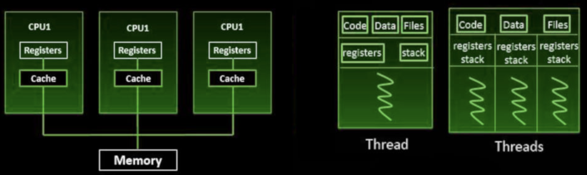
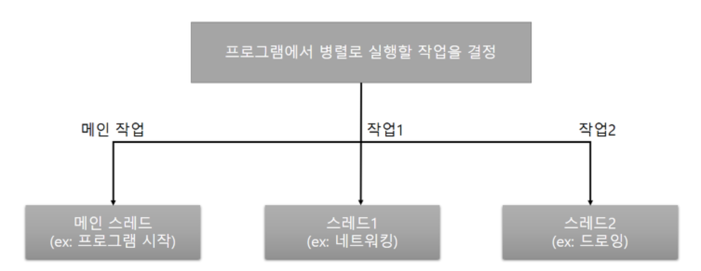
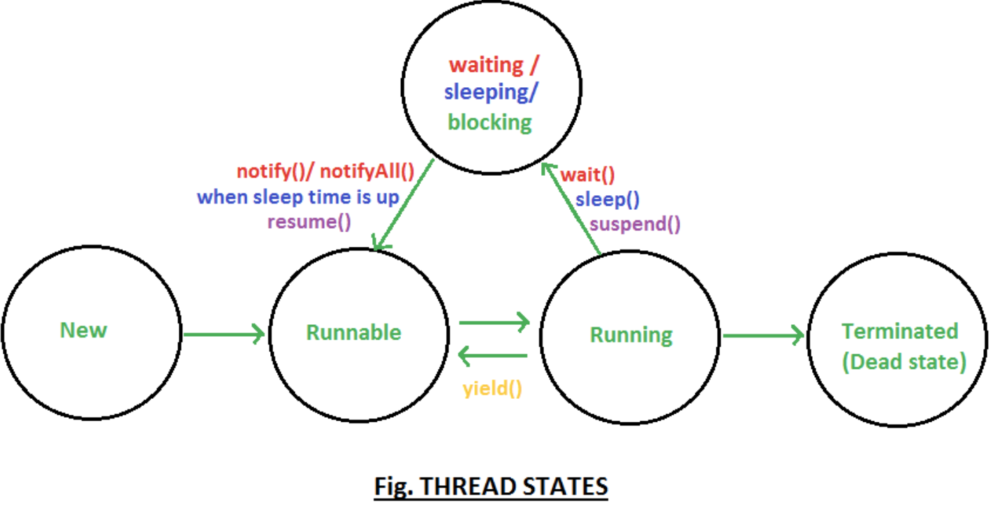
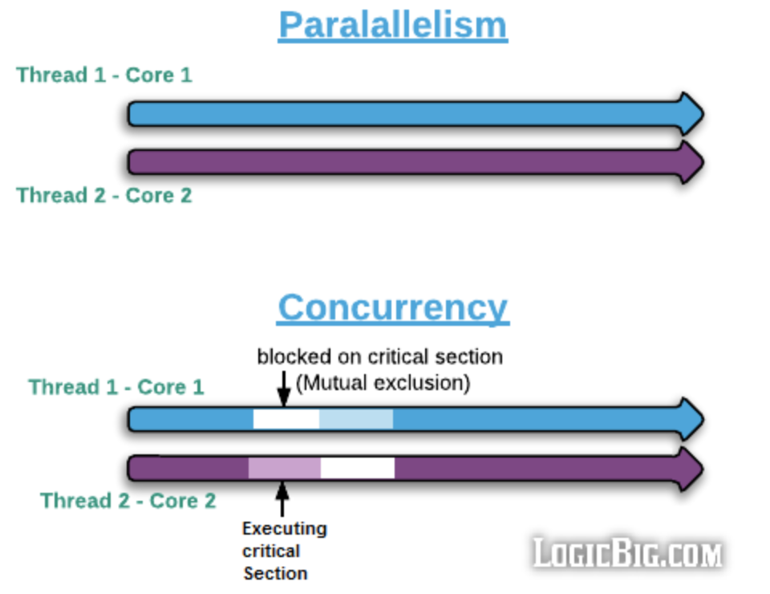
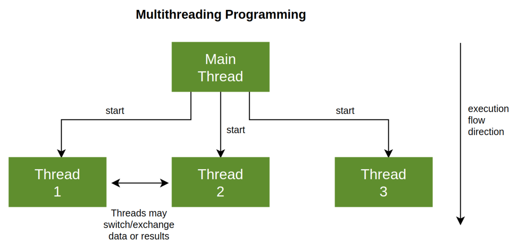
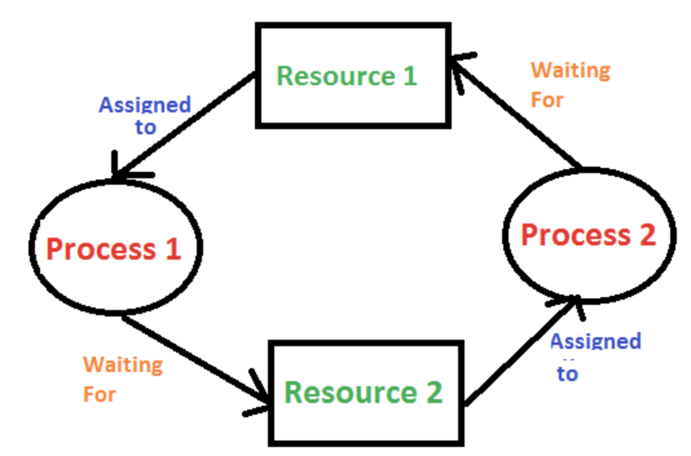

# [10주차 과제] 멀티스레드

### Thread 클래스와 Runnable 인터페이스

### 쓰레드의 상태

### 쓰레드의 우선순위

### Main 쓰레드

### 동기화

### 데드락

# 0. Process와 Thread

### 1. Process

- 실행 중인 하나의 애플리케이션
- 사용자가 애플리케이션을 실행하면 운영체제로부터 실행에 필요한 메모리를 할당받아 애플리케이션의 코드를 실행한다

### 멀티 태스킹 (multi tasking)

- 두 가지 이상의 작업을 동시에 처리하는 것을 의미
- 운영체제는 멀티 태스킹을 할 수 있도록 CPU 및 메모리 자원을 프로세스마다 적절히 할당해주고, 병렬로 실행시킨다
- ex) 워드로 문서 작업을 하면서 동시에 유튜브 뮤직을 이용해 음악을 들을 수 있다
- 멀티 태스킹은 꼭 멀티 프로세스를 뜻하지는 않음
- 한 프로세스 내에서 멀티 태스킹을 할 수 있도록 만들어진 애플리케이션도 있는데, 
  - 하나의 프로세스가 어떻게 두 작업을 동시에 처리할 수 있을까?
  - **멀티 스레드 (multi thread)**를 이용하면 가능하다

### 2. Thread

- 하나의 코드 실행 흐름
- 한 가지 작업을 실행하기 위해 순차적으로 실행할 코드를 실처럼 이어놓았다고 해서 유래된 이름


### Multi Process 와 Multi Thread



*[출처] : https://www.geekboots.com/story/multiprocessing-vs-multithreading*

#### 멀티 프로세스 (multi process)

- 애플리케이션 단위의 멀티 태스킹
- 운영체제에서 할당받은 자신의 메모리를 가지고 실행하기 때문에 서로 독립적이다
- 하나의 프로세스에서 오류가 발생해도 다른 프로세스에게 영향을 미치지 않는다

#### 멀티 스레드 (multi thread)

- 애플리케이션 내부에서의 멀티 태스킹
- 하나의 프로세스 내부에 생성된다
- 하나의 스레드가 예외를 발생시키면 프로세스 자체가 종료될 수 있어서 다른 스레드에게 영향을 미치게 된다
- 멀티 스레드에서는 예외 처리가 중요하다


#### 멀티 스레드로 실행하는 애플리케이션을 개발하려면 몇 개의 작업을 병렬로 실행할지 결정하고, 각 작업별로 스레드를 생성해야 한다



*[출처] : https://palpit.tistory.com/entry/Java-%EB%A9%80%ED%8B%B0-%EC%8A%A4%EB%A0%88%EB%93%9C-%EC%9E%91%EC%97%85-%EC%8A%A4%EB%A0%88%EB%93%9C*

- 어떤 자바 애플리케이션이건 메인 스레드는 반드시 존재하므로, 메인 작업 이외에 추가적인 병렬 작업의 수만큼 스레드를 생성하면 된다
- 자바에서는 작업 스레드도 객체로 생성되기 때문에 클래스가 필요하다


### Thread를 생성하는 방법

1. `java.lang.Thread` 클래스를 직접 객체화해서 생성 (`Runnable` 인터페이스를 사용)
2. `Thread` 클래스를 상속하여 하위 클래스를 작성하여 생성

 아래에서 쓰레드를 생성하는 방법에 대해 알아보자


# 1. Runnable 인터페이스와 Thread 클래스

  본격적으로 쓰레드를 생성하는 방법을 알아보자. Thread를 생성하는 것에는 위에서 말했듯이 크게 두 가지 방법이 있다. 하나는 `Runnable` 인터페이스를 사용하는 것이고, 다른 하나는 `Thread` 클래스를 사용하는 것이다. `Thread` 클래스는 `Runnable` 인터페이스를 구현한 클래스이므로, 어떤 것을 적용하느냐의 차이만 있다.


- `Runnable` 인터페이스와 `Thread` 클래스는 모두 `java.lang` 패키지에 있으므로, 별도로 `import` 할 필요 없다


## 1. Runnable 인터페이스를 이용해 작업 스레드 객체를 직접 생성

- `java.lang.Thread` 클래스로부터 작업 스레드 객체를 직접 생성하려면 `Runnable`으ㄹ 매개값으로 갖는 생성자를 호출해야 한다

```java
Thread thread = new Thread(Runnable target);
```

- `Runnable` 은 작업 스레드가 실행할 수 있는 코드를 가지고 있는 객체라고 해서 붙여진 이름이다
- `Runnable` 은 인터페이스 타입이기 때문에 구현 객체를 만들어 대입해야 한다

### Runnable 인터페이스에 선언되어 있는 메소드

| 리턴 타입 | 메소드 이름 및 매개 변수 | 설명                              |
| --------- | ------------------------ | --------------------------------- |
| void      | run()                    | 쓰레드가 시작되면 수행되는 메소드 |

- 구현 클래스는 `run()` 을 재정의해서 작업 스레드가 실행할 코드를 작성해야 한다


### Runnable 인터페이스를 이용해 작업 스레드를 생성하는 방법

1. **`Runnable`  구현 클래스를 작성**

```java
class Task implements Runnable {
		public void run() {
			// 스레드가 실행할 코드;
		}
}
```

- `Runnable` 은 작업 내용을 가지고 있는 객체이지 실제 스레드는 아니다. 따라서, 2번과 같이 작업 스레드를 따로 생성해야한다

2. **`Runnable` 구현 객체를 생성한 후, 이를 매개값으로 해서 `Thread` 생성자를 호출하여 작업 스레드 생성**

```java
Runnable task = new Task();

Thread thread = new Thread(task);
```

####  + 익명 구현 객체 이용 방법

- 코드를 좀 더 절약하기 위해서, `Thread` 생성자를 호출할 때 `Runnable` 익명 객체를 매개값으로 사용할 수도 있다. **(익명 구현 객체 이용)**

```java
Thread thread = new Thread(new Runnable() {
	public void run() {
		// 스레드가 실행할 코드
	}
});
```

#### + 람다식을 매개값으로 사용 방법

- `Runnable` 인터페이스는 `run()` 메소드 하나만 정의되어 있기 때문에 함수적 인터페이스이다.
- 따라서, 람다식을 매개값으로 사용할 수도 있다

```java
Thread thread = new Thread(() -> {
	// 스레드가 실행할 코드
});
```

#### 작업 스레드의 실행

- 작업 스레드는 생성 즉시 실행되는 것이 아니라, `start()` 메소드를 호출해야만 비로소 실행된다

```java
thread.start();
```

- `start()` 메소드가 호출되면, 작업 스레드는 매개값으로 받은 `Runnable` 의 `run() ` 메소드를 실행하면서 자신의 작업을 처리한다


### Runnable 인터페이스를 이용하여 작업 스레드를 생성한 예제

```java
/* 작업 스레드 생성 - 비프음을 들려주는 작업 정의 */
public class BeepTask implements Runnable {
    public void run() {
        Toolkit toolkit = Toolkit.getDefaultToolkit();

        for (int i=0; i<5; i++) {
            toolkit.beep();
            try {
                Thread.sleep(500);
            } catch (Exception e) {}
        }
    }
}
```

```java
/* 메인 스레드와 작업 스레드가 동시에 실행되는 예제 */
public class BeepPrintExample2 {
    public static void main(String[] args) {
        Runnable beepTask = new BeepTask(); // BeepTask 객체 생성
        Thread thread = new Thread(beepTask); // 작업 스레드 생성
        thread.start(); // 작업 스레드 실행

        for (int i=0; i < 5; i++) {
            System.out.println("띵");
            try {
                Thread.sleep(500);
            } catch (Exception e) {}
        }
    }
}
```

- 아래와 같이 Thread 생성자 호출을 간단하게 작성할 수도 있다

  ```java
  // Runnable 구현 클래스를 작성 할 때 Runnable 익명 객체를 매개값으로 사용하여 Thread 생성자 호출하는 방법
  Thread thread = new Thread(new Runnable() {
      @Override
      public void run() {
          Toolkit toolkit = Toolkit.getDefaultToolkit();
          for (int i=0; i < 5; i++) {
              toolkit.beep();
              try {
                  Thread.sleep(500);
              } catch (Exception e) {}
          }
      }
  });
  ```

  ```java
  // 람다식 이용
  Thread thread = new Thread(() -> {
      Toolkit toolkit = Toolkit.getDefaultToolkit();
      for (int i=0; i < 5; i++) {
          toolkit.beep();
          try {
              Thread.sleep(500);
          } catch (Exception e) {}
      }
  });
  ```

  

## 2. Thread 하위 클래스로부터 작업 스레드 생성

- 작업 스레드가 실행할 작업을 Runnable로 만들지 않고, Thread의 하위 클래스로 작업 스레드를 정의하면서 작업 내용을 포함시킬 수도 있다


1. **`Thread` 클래스를 상속한 후 `run` 메소드를 재정의 (overriding) 해서 스레드가 실행할 코드를 작성**

```java
public class WorkerThread extends Thread {
	@Override
	public void run() {
		// 스레드가 실행할 코드
	}
}
```

2. **작업 스레드 클래스로부터 작업 스레드 객체를 생성**

```java
Thread thread = new WorkerThread();
```

#### + 익명 객체로 작업 스레드 객체 생성

- 코드를 더 절약하기 위해 `Thread` 익명 객체로 작업 스레드 객체를 생성할 수도 있다

```java
Thread thread = new Thread() {
	public void run() {
		// 스레드가 실행할 코드
	}
}
```

#### 작업 스레드의 실행

- 작업 스레드 객체에서 `start()` 메소드를 호출하면 작업 스레드는 자신의 `run() `메소드를 실행하게 됨

```java
thread.start();
```

### Thread 하위 클래스로 작업 스레드를 정의한 예제

```java
import java.awt.Toolkit;

public class BeepThread extends Thread {
    @Override
    public void run() {
        Toolkit toolkit = Toolkit.getDefaultToolkit();
        for (int i=0; i<5; i++) {
            toolkit.beep();
            try {
                Thread.sleep(500);
            } catch (Exception e) {}
        }
    }
}
```

```java
/* 앞에서 정의한 Thread 클래스를 이용하여 작업스레드 객체를 생성하고 실행하는 예제 */
import java.awt.Toolkit;

public class BeepPrintExample3 {
    public static void main(String[] args) {
        Thread thread = new BeepThread();
        thread.start();

        for (int i=0; i<5; i++) {
            System.out.println("띵");
            try {
                Thread.sleep(500);
            } catch (Exception e) {}
        }
    }
}
```


# 2. Thread의 상태

  스레드 객체를 생성하고, start() 메소드를 호출하면 곧바로 스레드가 실행되는 것처럼 보이지만 사실은 실행 대기 상태가 된다.



*[출처] : https://www.javamadesoeasy.com/2015/03/thread-states-thread-life-cycle-in-java.html*

### 실행 대기 상태

- 아직 스케줄링이 되지 않아서 실행을 기다리고 있는 상태
- 실행 대기 상태에 있는 스레드 중에서 스레드 스케줄링으로 선택된 스레드가 CPU를 점유하고 run() 메소드를 실행한다

### 실행 상태

- 스레드 스케줄링으로 선택된 스레드가 CPU를 점유하고 run() 메소드를 실행하는 상태
- 실행 상태의 스레드는 run() 메소드를 모두 실행하기 전에 스레드 스케줄링에 의해 다시 실행 대기 상태로 돌아갈 수 있다

### 종료 상태

- 실행 상태에서 run() 메소드가 종료되면, 더 이상 실행할 코드가 없기 때문에 스레드의 실행이 멈추게 되는 상태

### 일시 정지 상태

- 경우에 따라서는 스레드는 실행 상태에서 실행 대기 상태로 가지 않을 수도 있다. 실행 상태에서 일시 정지 상태로 가기도 하는데, 일시 정지 상태는 스레드가 실행할 수 없는 상태이다. 일시 정지 상태는 WATING, TIMED_WAITING, BLOKED 가 있다. 
- 스레드가 다시 실행 상태로 가기 위해서는 일시 정지 상태에서 실행 대기 상태로 가야 한다


# 3. Thread의 우선순위

  멀티 스레드는 동시성(Concurrency)과 병렬성 (Parallelism)으로 실행된다. 

#### 동시성 (Concurrency)

- 멀티 작업을 위해 하나의 코어에서 멀티 스레드가 변갈아가며 실행하는 성질

#### 병렬성 (Parallelism)

- 멀티 작업을 위해 멀티 코어에서 개별 스레드를 동시에 실행하는 성질



*[출처] : https://www.logicbig.com/quick-info/programming/multi-threading.html*


### Thread Scheduling (쓰레드 스케줄링)

- Thread의 개수가 코어의 개수보다 많을 경우, Thread를 어떤 순서에 의해 동시성으로 실행할 것인가를 결정해야 하는데, 이것을 쓰레드 스케줄링이라고 한다.
- Thread 스케줄링에 의해 스레드들은 아주 짧은 시간에 번갈아가면서 그들의 `run()` 메소드를 조금씩 실행한다


#### 자바의 Thread 스케줄링은 우선순위(Priority) 방식과 순환 할당 (Round-Robin) 방식을 사용한다

#### 1. 우선순위 방식 (Priority)

- 우선 순위가 높은 Thread가 실행 상태를 더 많이 가지도록 스케줄링하는 것
- Thread 객체에 우선 순위 번호를 부여할 수 있기 때문에 개발자가 코드로 제어 가능

#### 2. 순환 할당 (Round-Robin) 방식

- 시간 할당량 (Time Slice)을 정해서 하나의 Thread를 정해진 시간만큼 실행하고 다시 다른 Thread를 실행하는 방식
- JVM에 의해 결정되므로 코드로 제어 불가


### 우선 순위 (Priority)

- 쓰레드의 우선 순위는 1 ~ 10까지 부여된다
  - 1 : 가장 낮은 우선 순위 
  - 10 : 가장 높은 우선 순위
- 우선 순위를 부여하지 않으면 모든 쓰레드들은 기본적으로 5의 우선 순위를 할당 받음

#### 우선 순위의 변경 - setPriority()

```java
thread.setPriority(우선순위);
```

- 우선순위의 매개값으로 1 ~ 10까지의 값을 직접 주어도 되지만, 코드의 가독성을 높이기 위해 `Thread` 클래스의 상수를 사용할 수도 있다

  ```java
  thread.setPriority(Thread.MAX_PRIORITY);
  thread.setPriority(Thread.NORM_PRIORITY);
  thread.setPriority(Thread.MIN_PRIORITY);
  ```


# 4. Main Thread

- 모든 자바 애플리케이션은 메인 스레드 (main thread)가 main() 메소드를 실행하면서 시작된다. 
- 메인 스레드는 main() 메소드의 첫 코드부터 아래로 순차적으로 실행하고, main() 메소드의 마지막 코드를 실행하거나 return문을 만나면 실행이 종료된다

#### 코드의 실행 흐름이 결국 스레드

```java
public static void main(String[] args) {
  String data = null;
  if (...) {
    
  }
  while (...) {
    
  }
  System.out.println(...);
}
```


- 메인 스레드는 필요에 따라 작업 스레드들을 만들어서 병렬로 코드를 실행할 수 있다
- 즉, 멀티 스레드를 생성해서 멀티 태스킹을 수행한다



*[출처] : https://www.baeldung.com/cs/async-vs-multi-threading*

- 싱글 스레드 애플리케이션에서는 메인 스레드가 종료하면 프로세스도 종료된다
- 그러나 멀티 스레드 애플리케이션에서는 실행 중인 스레드가 하나라도 있다면, 프로세스는 종료되지 않는다
- 메인 스레드가 작업 스레드보다 먼저 종료되더라도 작업 스레드가 계속 실행 중이라면 프로세스는 종료되지 않는다


# 5. 동기화

  싱글 스레드 프로그램에서는 한 개의 스레드가 객체를 독차지해서 사용하면 되지만, 멀티 스레드 프로그램에서는 스레드들이 객체를 공유해서 작업해야 하는 경우가 있다. 이 경우, 스레드 A를 사용하던 객체가 스레드 B에 의해 상태가 변경될 수 있기 때문에 스레드 A가 의도했던 것과는 다른 결과를 산출할 수도 있다.

## Synchronized

- 따라서, 스레드가 사용 중인 객체를 다른 스레드가 변경할 수 없도록 하려면 스레드 작업이 끝날 때까지 객체에 잠금을 걸어서 다른 스레드가 사용할 수 없도록 해야한다
- **임계 영역 (critical section)** : 멀티 스레드 프로그램에서 단 하나의 스레드만 실행할 수 있는 코드 영역
  - 자바는 임계 영역을 지정하기 위해 **동기화 (synchronized) 메소드와 동기화 블록을 제공**한다
  - 스레드가 객체 내부의 동기화 메소드 또는 블록에 들어가면 즉시 객체에 잠금을 걸어 다른 스레드가 임계 영역 코드를 실행하지 못하도록 한다

### 동기화 메소드를 만드는 방법

- 메소드 선언에 synchronized 키워드를 붙인다
- 인트턴스와 정적 메소드 어디든 붙일 수 있다

```java
public synchronized void method() {
	임계 영역; // 단 하나의 스레드만 실행
}
```

- 동기화 메소드는 메소드 전체 내용이 임계 영역이므로 스레드가 동기화 메소드를 실행하는 즉시 객체에는 잠금이 일어나고, 스레드가 동기화 메소드를 실행 종료하면 잠금이 풀린다

### 동기화 블록을 만드는 방법

- 메소드 전체가 아니라, 일부 내용만 임계 영역으로 만들고 싶다면, 동기화 블록을 만들면 된다

```java
public void method() {
	// 여러 스레드가 실행 가능 영역
	...
	synchronized(공유객체) {
		임계 영역 // 단 하나의 스레드만 실행
	}
	// 여러 스레드가 실행 가능 영역
}
```

- 동기화 블록의 외부 코드들은 여러 스레드가 동시에 실행할 수 있지만, 동기화 블록의 내부 코드는 임계 영역이므로 한 번에 한 스레드만 실행할 수 있고, 다른 스레드는 실행할 수 없다
- 만약, 동기화 메소드와 동기화 블록이 여러개 있을 경우, 스레드가 이들 중 하나를 실행할 때 다른 스레드는 해당 메소드는 물론이고 다른 동기화 메소드 및 블록도 실행 할 수 없다
  - 일반 메소드는 실행이 가능하다


# 6. Deadlock (교착 상태)

  다중 프로그래밍 시스템에서 프로세스가 결코 일어나지 않을 사건을 기다리는 상태가 된 경우에 deadlock (교착 상태)에 빠졌다고 말한다. 

- 한 개 이상의 프로세스가 교착 상태에 빠지면 작업이 정지되어 더는 명령을 진행하지 못한다
- 운영체제가 교착 상태를 해결하지 못하면, 시스템 운영자나 사용자는 작업을 교체하거나 종료하는 외부 간섭으로 이를 해결해야 한다

### 교착 상태가 발생하는 이유

- 시스템 자원에 요구가 뒤엉킨 상태로, 두 프로세스가 사용하는 자원(비공유)을 서로 기다리고 있을 때 발생한다
- 자원 해제 요청을 받아들일 때까지 프로세스들은 작업을 더 이상 진행할 수 없으며, 자원 해제를 수신할 때까지 현재 보유한 자원도 해제할 수 없다
- 다시 말해서, 다른 하나를 완료하지 않으면 프로세스를 더 이상 진행할 수 없고, 진행하지 않으면 프로세스를 완료할 수 없다
- 따라서, 둘 이상의 작업이 중단되고 프로세스들은 서로 사용할 자원을 기다리고만 있게 된다


### 교착 상태의 발생 조건

- 교착 상태는 시스템에서 네 가지 조건을 만족할 때 발생한다
- 이 중 1 ~ 3만 만족해도 발생할 수 있고, 발생하지 않을 수도 있다. 
- 4번째 조건은 1 ~ 3 조건을 만족할 때 발생할 수 있는 결과이고, 점유와 대기 조건을 포함하므로 네 가지 조건이 모두 독립적인 것은 아니다


#### 1. 상호 배제

- 자원을 최소 하나 이상 비공유해야 한다
- 한 번에 프로세스 하나만 해당 자원을 사용할 수 있어야 한다
- 사용중인 자원을 다른 프로세스가 사용하려면 요청한 자원이 해제될 때까지 기다려야 한다

#### 2. 점유와 대기

- 자원을 최소한 하나 정도는 보유하고, 다른 프로세스에 할당된 자원을 얻으려고 기다리는 프로세스가 있어야 한다

#### 3. 비선점

- 자원은 선점할 수 없다
- 자원을 강제로 빼앗을 수 없고, 자원을 점유하고 있는 프로세스가 끝나야 해제된다

#### 4. 순환 (환형) 대기



*[출처] : https://www.geeksforgeeks.org/introduction-of-deadlock-in-operating-system/*

- 각 프로세스들이 보유한 자원을 다른 프로세스들이 각각 얻으려고 기다리는 상태여야 한다


### Reference

- 신용권, 『이것이 자바다』, 한빛미디어(2015), p.576 ~ p.647
- 이상민, 『자바의 신』, 로드북(2018), p.662 ~ p.699
- 구현회, 『그림으로 배우는 구조와 원리 - 운영체제』, 한빛아카데미(2016), p.188 ~ p.197

- https://www.geekboots.com/story/multiprocessing-vs-multithreading
- https://palpit.tistory.com/entry/Java-%EB%A9%80%ED%8B%B0-%EC%8A%A4%EB%A0%88%EB%93%9C-%EC%9E%91%EC%97%85-%EC%8A%A4%EB%A0%88%EB%93%9C
- https://www.logicbig.com/quick-info/programming/multi-threading.html
- https://www.baeldung.com/cs/async-vs-multi-threading
- https://www.geeksforgeeks.org/introduction-of-deadlock-in-operating-system/