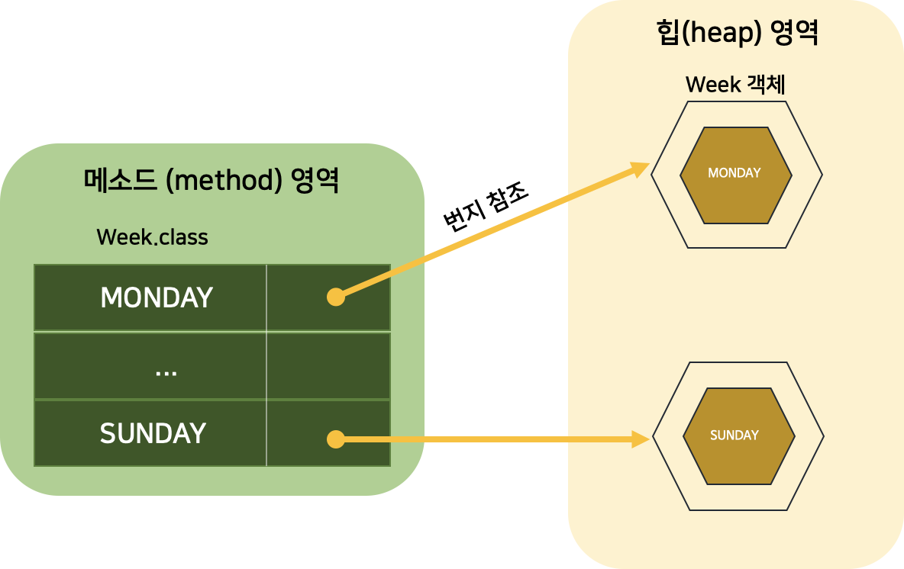
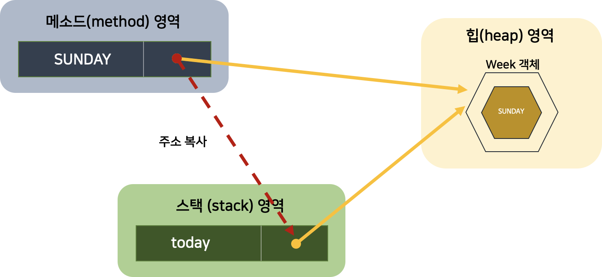
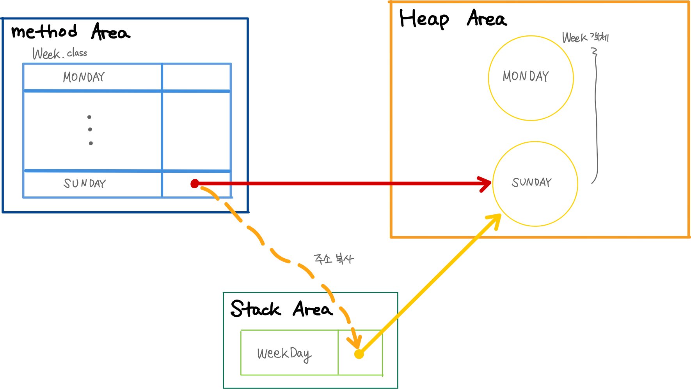
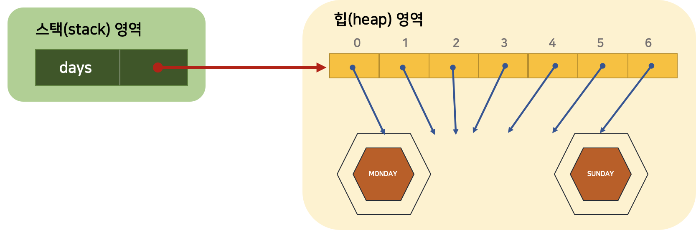
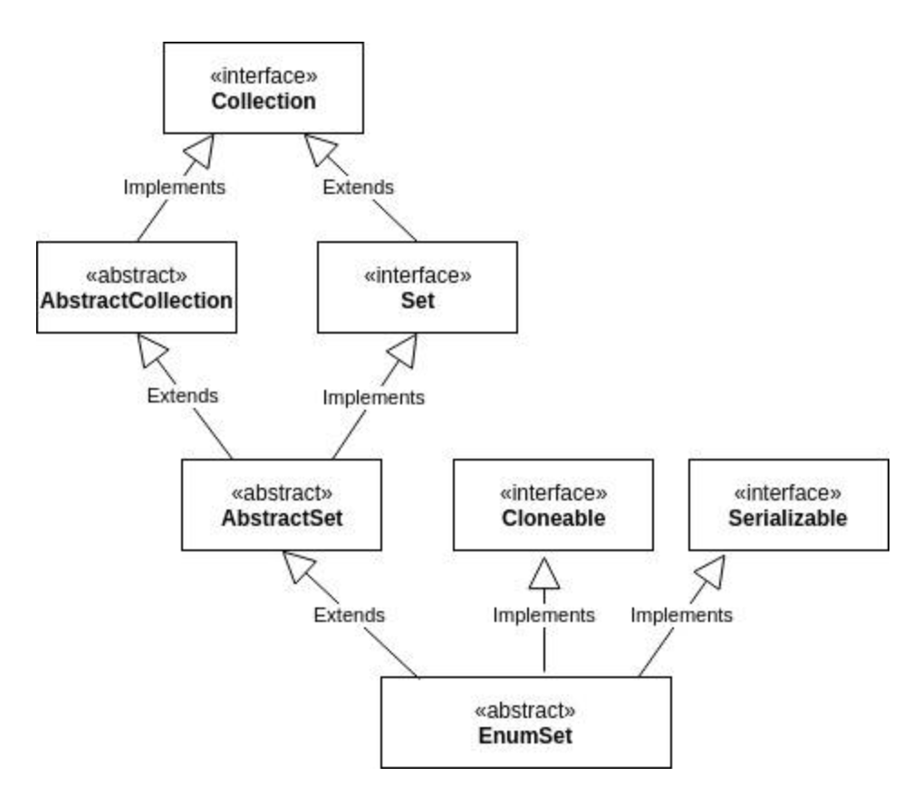

# [11주차 과제] Enum

### Enum 정의하는 방법

### Enum이 제공하는 메소드 (values() 와 valueOf())

### java.lang.Enum

### EnumSet


# 1. Enum 정의하는 방법

## 1. Enum 타입 (Enumeration Type, 열거 타입)

- 한정된 값만을 갖는 데이터 타입
  - 요일에 대한 데이터 (월, 화, 수, 목, 금, 토, 일)
  - 계절에 대한 데이터 (봄, 여름, 가을, 겨울)
- 몇 개의 열거 상수 중 하나의 상수를 저장하는 데이터 타입


## 2. Enum 타입 선언 (열거 타입 선언)

1. 열거 타입의 이름을 정하고, 열거 타입 이름으로 소스 파일 (.java)을 생성한다

```java
public enum 열거타입이름 { ... }
```

- `public enum` : 열거 타입을 선언하기 위한 키워드


- 열거 타입 이름은 첫 문자를 대문자로하고 나머지는 소문자로 구성한다
- 또한, 열거 타입 이름은 소스 파일명과 대소문자가 모두 일치해야 한다


2. 열거 상수 선언하기

```java
public enum Week  { 
  MONDAY, 
  TUESDAY, 
  WEDNESDAY, 
  THURSDAY, 
  FRIDAY, 
  ... 
}
```

- 열거 상수는 열거 타입의 값으로 사용된다

  - 관례적으로, 열거 상수는 모두 대문자로 작성한다

  - 열거 상수가 여러 단어로 구성될 경우, 단어 사이를 밑줄 (_)로 연결한다

    ```java
    public enum LoginResult {
    	LOGIN_SUCCESS,
    	LOGIN_FAILED
    }
    ```

    

## 3. Enum 타입 변수 (열거 타입 변수)

   Enum 타입을 선언했다면, 이제 Enum 타입을 비로소 사용할 수 있다. Enum 타입도 하나의 데이터 타입이므로, 변수를 선언하고 사용해야 한다. 아래는 Enum 타입 변수를 선언하는 방식에 대해 설명한다.

### Enum 타입 변수 선언

```java
열거타입 변수;
```

##### Enum Type - Week 로 변수 선언

```java
Week today;
Week reservationDay;
```

##### Enum 타입 변수를 선언했다면, 아래와 같이 Enum 상수를 저장할 수 있다.

- 열거 상수는 단독으로 사용 불가능하다
- 반드시 **`열거타입.열거상수`** 로 사용해야 한다

```java
열거타입 변수 = 열거타입.열거상수;

// today 라는 Enum 변수에 열거 상수인 SUNDAY를 저장하는 방법
Week today = Week.SUNDAY;
```

- 또한, Enum 타입이 **참조 타입**이기 때문에 **null** 을 저장 가능하다

  ```java
  Week birthday = null;
  ```


  참조 타입 변수는 객체를 참조하는 변수인데, 그럼 열거 상수도 객체일까? 그렇다. 열거 상수는 열거 객체로 생성된다. 아래와 같이, 열거 타입 Week의 경우, `MONDAY` 부터 `SUNDAY` 까지의 열거 상수는 총 7개의 Week 객체로 Heap 영역에 생성된다. 그리고 메소드 영역에 생성된 열거 상수가 해당 Week 객체를 각각 참조하게 된다.

- 열거 상수도 **객체**



*[출처] : 이것이 자바다 - 신용권의 Java 프로그래밍 정복 1권 p.174*


  아래 코드를 이해해보자.

```java
Week today = Week.SUNDAY;
```

- 열거 타입 변수 `today`는 스택 영역에 생성된다

  > JVM Runtime Data Area - JVM Stack Area
  >
  >   각 스레드마다 하나씩 존재하며, 스레드가 시작될 때 할당됨
  >
  > JVM 스택은 메소드를 호출할 때마다 프레임(Frame)을 push하고, 메소드가 종료되면 해당 프레임을 제거(pop) 하는 동작을 수행한다. Frame 내부에는 로컬 변수 스택이 있어서, 로컬 변수 스택에 기본 타입 변수와 참조 타입 변수가 push되거나 pop 된다. 변수가 이 영역에 생성되는 시점은 초기화가 될 때, 즉, 최초로 변수에 값이 저장될 때이다. 변수는 선언된 블록 안에서만 스택에 존재하고, 블록을 벗어나면 스택에서 제거된다.

- `today` 에 저장되는 값 :  `Week.SUNDAY ` 열거 상수가 참조하는 객체의 번지

- 열거 상수 `Week.SUNDAY` 와 `today` 변수는 서로 같은 **Week 객체를 참조**하게 된다



*[출처] : 이것이 자바다 - 신용권의 Java 프로그래밍 정복 1권 p.174*

그러므로, `today` 변수와 `Week.SUNDAY` 상수의 == 연산 결과는 true이다.

```java
today == Week.SUNDAY // true
```

  아래 코드에서 `week1 == week2` 의 결과 또한 true 이다. `week1` , `week2`, ` Week.SATURDAY` 모두 동일한 Week 객체를 참조하기 때문이다.

```java
Week week1 = Week.SATURDAY;
Week week2 = Week.SATURDAY;
System.out.println(week1 == week2); // true
```


# 2. Enum이 제공하는 메소드

  모든 Enum 타입은 컴파일 시에 `java.lang.Enum` 클래스를 상속하게 되어있기 때문에, `java.lang.Enum` 에 선언된 메소드를 이용할 수 있다. Enum 객체가 가지는 메소드는 아래와 같다

## 1. 열거 객체의 메소드 - java.lang.Enum 클래스에 선언된 메소드

| 리턴 타입 | 메소드 (매개변수)    | 설명                                  |
| --------- | -------------------- | ------------------------------------- |
| String    | name()               | 열거 객체의 문자열을 리턴             |
| int       | ordinal()            | 열거 객체의 순번(0부터 시작)을 리턴   |
| int       | compareTo()          | 열거 객체를 비교해서 순번 차이를 리턴 |
| 열거 타입 | valueOf(String name) | 주어진 문자열의 열거 객체를 리턴      |
| 열거 배열 | values()             | 모든 열거 객체들을 배열로 리턴        |


### 1. name() 메소드

- 열거 객체가 가지고 있는 문자열을 리턴한다

  - 리턴되는 문자열 : 열거 타입을 정의할 때 사용한 상수 이름과 동일하다

  ```java
  Week today = Week.SUNDAY;
  String name = today.name(); // name은 SUNDAY
  ```

### 2. ordinal() 메소드

- 전체 열거 객체 중 몇 번째 열거 객체인지 알려준다

- 열거 타입을 정의 할 때 주어진 순번을 리턴한다

  ```java
  Week today = Week.SUNDAY;
  int ordinal = today.ordinal(); // ordinal은 6
  ```

### 3. compareTo() 메소드

- 매개값으로 주어진 열거 객체를 비교해서 순번 차이를 리턴한다

- 열거 객체가 매개값의 열거 객체보다 순번이 빠르다 → 음수를 리턴

- 열거 객체가 매개값의 열거 객체보다 순번이 늦다     → 양수를 리턴

  ```java
  Week day1 = Week.MONDAY; // 0
  Week day2 = Week.WEDNESDAY; // 2
  int result1 = day1.compareTo(day2); // -2
  int result2 = day2.compareTo(day1); // 2
  ```

### 4. valueOf() 메소드

- 매개값으로 주어지는 문자열과 동일한 문자열을 가지는 열거 객체를 리턴한다

  ```java
  Week weekDay = Week.valueOf("SUNDAY"); // weekDay 변수는 Week.SUNDAY 열거 객체를 참조하게 됨
  ```
  
  

### 5. values() 메소드

- 열거 타입의 모든 열거 객체들을 배열로 만들어 리턴한다

  ```java
  Week[] days = Week.values();
  for (Week day : days) {
  		System.out.println(day);
  }
  ```

- Week 배열은 다음과 같이 생성된다

  - 배열의 인덱스는 열거 객체의 순번과 같고,
  - 각 인덱스 값은 해당 순번의 열거 객체 번지이다

  

  *[출처] : 이것이 자바다 - 신용권의 Java 프로그래밍 정복 1권 p.179*

  

#### Enum values() 예제

```java
/* 열거 객체의 메소드 */
public class EnumMethodExample {
    public static void main(String[] args) {
        // name() 메소드
        Week today = Week.SUNDAY;
        String name = today.name();
        System.out.println(name);

        int ordinal = today.ordinal();
        System.out.println(ordinal);

        Week day1 = Week.MONDAY;
        Week day2 = Week.WEDNESDAY;
        int result1 = day1.compareTo(day2);
        int result2 = day2.compareTo(day1);
        System.out.println(result1);
        System.out.println(result2);

        if (args.length == 1) {
            String strDay = args[0];
            Week weekDay = Week.valueOf(strDay);
            if (weekDay == Week.SATURDAY || weekDay == Week.SUNDAY) {
                System.out.println("주말");
            } else {
                System.out.println("평일");
            }
        }

        Week[] days = Week.values();
        for (Week day : days) {
            System.out.println(day);
        }
    }
}
/*Result
    SUNDAY
    6
    -2
    2
    주말
    MONDAY
    TUESDAY
    WEDNESDAY
    THURSDAY
    FRIDAY
    SATURDAY
    SUNDAY
 */
```


# 3. java.lang.Enum

 Enum 클래스는 무조건 `java.lang.Enum` 이라는 클래스의 상속을 받는다. 즉, Enum 클래스를 선언할 때 `extends java.lang.Enum` 을 사용하지는 않지만, 컴파일러가 알아서 이 문장을 추가해서 컴파일한다.


## 1. Enum 클래스의 생성자

| 접근 제어자 | 메소드                         | 설명                                                         |
| ----------- | ------------------------------ | ------------------------------------------------------------ |
| protected   | Enum(String name, int ordinal) | 컴파일러에서 자동으로 호출되도록 해놓은 생성자다.<br />하지만, 개발자가 이 생성자를 호출할 수는 없다. |

- name : Enum (열거)상수의 이름
- ordinal : Enum의 순서, 상수가 선언된 순서대로 0부터 증가한다


- Enum 클래스의 부모 클래스는 Object 클래스이기 때문에, Object 클래스의 메소드들은 모두 사용할 수 있다. 하지만, Enum 클래스는 개발자들이 Object 클래스 중 4개의 메소드를 오버라이딩하지 못하도록 막아놓았다.

| 메소드     | 내용                                                         |
| ---------- | ------------------------------------------------------------ |
| clone()    | 객체를 복제하기 위한 메소드<br />하지만, 이 메소드는 enum 클래스에서 사용하면 안된다.<br />만약 호출될 경우엔 `CloneNotSupportedException` 이라는 예외를 발생시키도록 되어있다 |
| finalize() | GC가 발생할 때 처리하기 위한 메소드다                        |
| hashCode() | int 타입의 해시 코드 값을 리턴하는 메소드다                  |
| equals()   | 두 개의 객체가 동일한지를 확인하는 메소드다                  |

- 여기서 `clone()` 을 제외한 세 개의 메소드는 모두 final로 선언되어 있으므로, 개발자들이 오버라이딩할 수 없다


# 4. EnumSet

EnumSet 은 Enum 클래스에 특화된 Set collection이라고 할 수 있다. Set interface를 구현하고, AbstractSet 클래스를 상속한다.



*[출처] : https://www.baeldung.com/wp-content/uploads/2018/10/EnumSet-1-2.jpg*

#### EnumSet의 특징

1. Enum 값만 포함할 수 있다
2. Null 값을 추가하는 것을 허용하지 않는다
   - null 값을 추가하면, `NullPointerException` 을 발생시킨다
3. Thread-Safe 하지 않다
   - Thread-safe 하지 않은 특성을 가지므로, 필요하다면 동기화를 해야한다
4. 각 요소들은 Enum에 선언했던 순서대로 저장된다


## Reference

- 신용권, 『이것이 자바다』, 한빛미디어(2015), p.171 ~ p.180
- 이상민, 『자바의 신』, 로드북(2018), p.327 ~ p.336
- https://www.baeldung.com/java-enumset