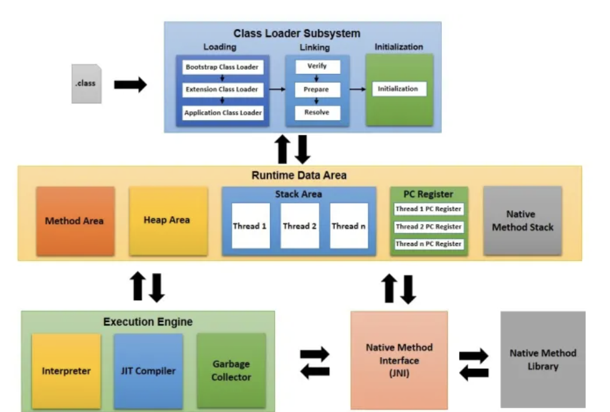

# [1주차 과제] JVM은 무엇이며 자바 코드는 어떻게 실행하는 것인가

## 학습 목표

### 1. JVM 이란 무엇인가

### 2. 컴파일 하는 방법

### 3. 실행하는 방법

### 4. 바이트코드란 무엇인가

### 5. JIT 컴파일러란 무엇이며 어떻게 동작하는가

### 6.  JVM의 구성요소

### 7. JDK와 JRE의 차이


## 1. JVM 이란 무엇인가

### JVM : Java Virtual Machine (자바 가상 기계)

- 실 운영체제를 대신해서 자바 프로그램을 실행하는 가상의 OS 역할
  - 운영체제는 자바 프로그램을 바로 실행할 수 없고, 자바 프로그램은 완전한 기계어가 아닌 중간 단계의 바이트 코드이기 때문에 이를 해석하고 실행할 수 있는 가상의 운영체제가 필요하다.
  - 이를 가능케 해주는 것이 JVM
    -  JVM 은 Java와 OS 사이에서 자바 프로그램을 실행하는 중계자 역할을 한다.

#### JVM 은 왜 있는 것인가? ⇒ OS에 독립적인 Java 프로그램을 위하여

- 운영체제별로 프로그램을 실행하고 관리하는 방법이 다르기 때문에 운영체제별로 자바 프로그램을 별도로 개발하는 것보단, 운영체제와 자바 프로그램을 중계하는 JVM을 둔다.
- 그 결과, JVM을 통해 하나의 자바 프로그램을 여러 운영체제에서 실행하더라도 동일한 실행 결과가 나오게 된다.

### 특징

- 개발자는 OS와 관계없이 자바 프로그램을 개발할 수 있음
- 바이트 코드는 모든 JVM에서 동일한 실행 결과를 보장함
-  JVM은 운영체제에 종속적임
  - 자바 프로그램을 운영체제가 이해하는 기계어로 번역해서 실행해야 하므로, JVM은 운영체제에 맞게 설치되어야 함
- 바이트 코드는 하나지만, JVM에 의해 번역되는 기계어는 운영체제에 따라 달라짐
- JVM은 JDK 또는 JRE를 설치하면 자동으로 설치됨
- 스택 기반의 가상 머신


## 2. 컴파일 하는 방법

### 운영체제와 JVM 그리고 자바 프로그램의 실행 단계

- 자바 프로그램의 JVM을 통한 컴파일, 실행 단계는 아래와 같다.


**.java (java source code) ⇒ .class (byte code) ⇒ .exe**

1. 개발자는 **.java** 파일을 작성 (소스파일)
2. 소스파일을 컴파일러로 (javac.exe) 컴파일하면 확장자가 **.class** 인 바이트 코드 파일이 생성 *(1차 컴파일)*
3. 바이트 코드 파일은 JVM 구동 명령어 (java.exe)에 의해 JVM에서 해석되고 해당 운영 체제에 맞게 기계어로 번역됨 *(2차 컴파일)*


### 컴파일 방법

- Hello.java 라는 자바 소스 파일을 컴파일러(javac.exe) 로 컴파일

  

  - terminal에서 아래와 같이 `Hello.java` 컴파일

    ```
    $ javac Hello.java
    ```

  

  - 컴파일 성공 시 확장명이 `.class` 인 바이트 코드 파일이 생성됨

    

    

## 3. 실행하는 방법

### 바이트코드 파일을 java.exe로 실행

- 컴파일 결과 생성된 .class 확장자의 바이트 코드 파일은 완전한 기계어가 아니므로 단독으로 실행할 수 없고, JVM이 실행되어야 한다.

  - JVM을 구동시키는 명령어 : `java.exe`

  - terminal에서 아래와 같이 `Hello.class` 파일 실행

    ```shell
    $ java Hello
    ```


- java.exe 명령어 실행시 JVM은 바이트 코드 파일을 메모리로 로드하고, 최적의 기계어로 번역함

  - 이후, main() 메소드를 찾아 실행시킴

  

## 4. 바이트코드란 무엇인가

### Java Bytecode

- JVM이 이해할 수 있는 언어로 변환된 자바 소스 코드
- 기계가 바로 실행할 수 있는 언어보다는 비교적 인간이 보기 편한 형태로 기술된 형태
- 실행 엔진이 한 번 더 JVM 내부에서 인식할 수 있는 형태로 변환함


## 5. JIT 컴파일러란 무엇이며 어떻게 동작하는가

### JIT (Just In Time) Compiler

- 프로그램을 실제 실행하는 시점에 (실시간에) 기계어로 번역하는 컴파일 기법
- 인터프리터 방식의 단점을 보완하기 위해 도입
- 인터프리터 방식으로 실행하다가, 적절한 시점에 바이트 코드 전체를 컴파일하여 네이티브코드로 변경하고 그 이후에는 네이티브 코드를 직접 실행함
- 네이티브 코드를 캐시에 보관하게되어, 인터프리터 방식보다 빠르게 실행됨
- JIT 컴파일러는 JVM 내부적으로 해당 메소드가 얼마나 자주 수행되는지 체크하고, 일정 정도가 넘을 때에만 컴파일을 수행함


## 6. JVM 구성 요소

  JVM 구성 요소는 아래 그림과 같다.



### Class Loader (클래스 로더)

- JVM 내로 클래스 (.class) 파일을 로드하고, 링크를 통해 배치하는 작업 수행
- Runtime 시에 동적으로 Runtime Data Area 에 로드

### Runtime Data Area


#### Method Area (메소드 영역)

##### JVM이 시작할 때 생성되고 모든 스레드가 공유하는 영역

- 코드에서 사용 되는 클래스 (.class) 를 클래스 로더로 읽어서, 클래스별로
  - 런타임 상수풀 (runtime constant pool)
  - 필드(field) 데이터
  - 메소드 (method) 데이터
  - 메소드 코드
  - 생성자 (constructor) 코드

등을 분류해서 저장한다.


#### Heap Area (힙 영역)

##### 객체와 배열이 생성되는 영역

- 힙 영역에 생성된 객체와 배열은 JVM 스택 영역의 변수나 다른 객체의 필드에서 **참조**
- 만약, 참조하는 변수나 필드가 없으면, 의미 없는 **객체가** 되어 쓰레기로 취급 —> JVM은 **Garbage Collector**를 실행시켜, 쓰레기 객체를 **Heap area 내에서 자동으로 제거**
- GC 덕분에, 개발자는 별도 객체 제거 위한 별도 코드 작성 필요 X —> (자바는 코드로 객체를 직접 제거시키는 방법을 제공하지 않음)


#### JVM Stack Area (JVM 스택 영역)

##### 각 스레드마다 하나씩 존재하며, 스레드가 시작될 때 할당됨

- 자바 프로그램 내에서 추가적으로 스레드 생성하지 않았으면
  - main 스레드만 존재 → JVM Stack도 한 개
- JVM 스택은 메소드 호출할 때 마다,
  - **프레임 (Frame)**을 추가 (push)
  - **메소드 종료 시, 해당 프레임 제거 (pop)**
- 예외 발생 시, printStackTrace() 메소드로 보여주는 Stack Trace의 각 라인 → 하나의 프레임을 표현함
- 프레임 내부
  - 로컬 변수 스택
    - 기본 타입 변수나 참조 타입 변수가 추가 되거나 제거됨
    - 언제 추가 및 제거?
      - 변수 초기화 시에 추가 **(최초로 변수에 값이 저장될 때)**
      - 선언된 블록을 벗어나면 스택에서 제거
    - 기본 타입 변수
      - 스택 영역에 직접 값을 가짐
    - 참조 타입 변수
      - 힙 영역이나 메소드 영역의 객체 주소를 가짐


### Execution Engine (실행 엔진)

- 클래스를 실행시키는 역할을 함
- 클래스 로더가 JVM 내의 런타임 데이터 영역에 바이트 코드를 배치
- 자바 바이트 코드를 실행함

#### Interpreter

- 자바 바이트코드를 명령어 단위로 읽어서 실행함
- 한 줄 한 줄 실행됨

#### JIT Compiler

- 인터프리터 방식의 단점을 보완하기 위해 도입된 방식
- 인터프리터 방식으로 실행하다가, 적절한 시점에 바이트 코드 전체를 컴파일하여 네이티브코드로 변경하고 그 이후에는 네이티브 코드를 직접 실행함
- 네이티브 코드를 캐시에 보관하게되어, 인터프리터 방식보다 빠르게 실행됨
  - 한 번만 실행되는 코드라면 인터프리터 방식으로 실행하는 것이 더 유리함
- JIT 컴파일러는 JVM 내부적으로 해당 메소드가 얼마나 자주 수행되는지 체크하고, 일정 정도가 넘을 때에만 컴파일을 수행함

#### Garbage Collector

- GC를 수행하는 모듈 (스레드)


## 7. JDK와 JRE의 차이

  자바 프로그램을 개발하기 위해서는 먼저 Java SE(Standard Edition)의 구현체인 JDK를 설치해야 한다. Java SE의 구현체는 자바 개발 키트 (JDK : Java Development Kit) 와 자바 실행 환경 (JRE : Java Runtime Environment) 라는 두 버전이 있다.


### JDK (Java Development Kit)

##### JRE + 개발에 필요한 도구

-  자바 개발 도구(Java Development Kit)의 약자로 프로그램 개발에 필요한 JVM, 라이브러리 API, 컴파일러 등의 개발도구가 포함되어 있음
- 자바 프로그램 개발 시 필요

### JRE (Java Runtime Environment)

##### JVM + 표준 클래스 라이브러리

- 프로그램 실행에 필요한 JVM, 라이브러리 API만 포함되어 있음
- 자바 프로그램을 개발하고자 하는 게 아니라, 이미 개발된 프로그램만 실행한다면 JRE만 설치하면 됨


#### [Reference]

http://javalearningonline.weebly.com/java-program-compile-and-execution-flow.html

https://www.javatpoint.com/java-bytecode#:~:text=Java%20bytecode%20is%20the%20instruction,class%20file

https://medium.com/@ahn428/java-jit-%EC%BB%B4%ED%8C%8C%EC%9D%BC%EB%9F%AC-c7d068e29f45

https://bloofer.tistory.com/21

https://blogitwithsatyam.com/2018/06/19/jvm-architecture-in-depth/

https://www.quora.com/What-is-difference-between-JDK-JRE-and-JVM

https://www.notion.so/yegenieee/8-83329a0b00d94bb79c76206037cca731

