# [2주차 과제] 자바 데이터 타입, 변수 그리고 배열

[TOC]

## 학습 목표

### 1. 프리미티브 타입의 종류와 값의 범위 그리고 기본값

### 2. 프리미티브 타입과 레퍼런스 타입

### 3. 리터럴

### 4. 변수 선언 및 초기화하는 방법

### 5. 변수의 스코프와 라이프타임

### 6. 타입 변환, 캐스팅 그리고 타입 프로모션

### 7. 1차 및 2차 배열 선언하기

### 8. 타입 추론, var


# 1. 프리미티브 타입의 종류와 값의 범위 그리고 기본값

  자바의 데이터 타입은 Primitive 타입과 Non-Primitive 타입으로 나뉜다. 먼저 프리미티브 타입 (기본 타입) 부터 살펴보자.

## 데이터 타입

- 모든 변수에는 타입이 있으며, 타입에 따라 저장할 수 있는 값의 종류와 범위가 달라짐

- 변수를 선언할 때 주어진 타입은 변수를 사용하는 도중에 변경할 수 없음

1. 기본 (원시 : primitive) 타입
2. Non-Primitive 타입

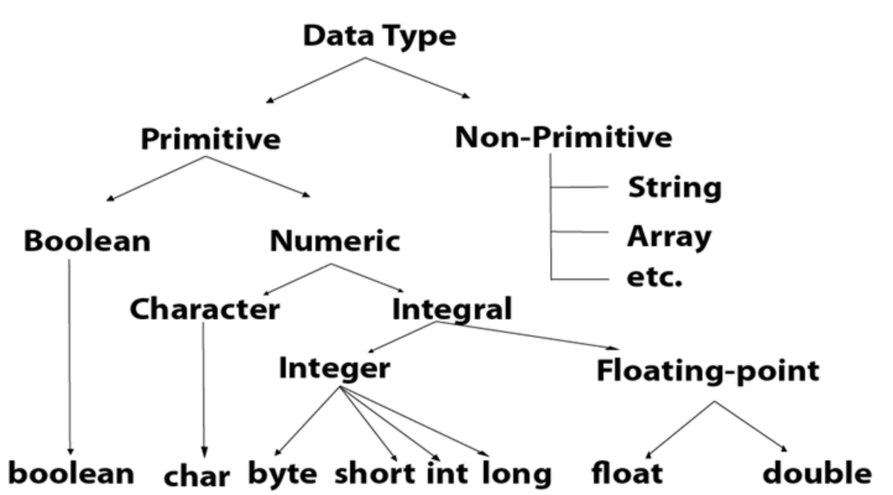

[출처] https://www.javatpoint.com/java-data-types

## 1. 기본 (원시 : primitive) 타입

- 정수 , 실수 , 문자 , 논리 리터럴을 직접 저장하는 타입

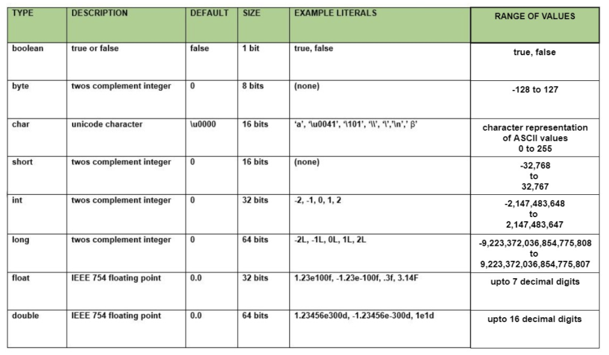

[출처] https://www.geeksforgeeks.org/data-types-in-java/

>  **메모리 단위**
>
>  - 0과 1을 저장하는 최소 기억 단위인 비트 (bit)
>  - 8개의 비트를 묶어서 바이트 (byte)

- 기본 타입은 정해진 메모리 사용 크기 (byte)로 값을 저장하는데, 바이트 크기가 클수록 표현하는 값의 범위가 큼

## 1.1. 정수 타입 (byte, char, short, int, long)

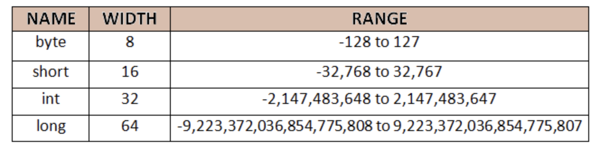

[출처] https://www.codingeek.com/java/primitive-data-types-in-java-integers-floating-point-character-and-boolean/

  Java는 기본적으로 정수 연산을 int 타입으로 수행한다. byte 와 short 가 int 보다는 메모리 사용 크기가 작아서 메모리를 절약할 수는 있지만, 값의 범위가 작은 편이라 연산 시에 범위를 초과하면 잘못된 결과를 얻기 쉽다.

###1.1.1. byte 타입

- 색상 정보 및 파일 또는 이미지 등의 이진(바이너리) 데이터를 처리할 때 주로 사용됨

- 표현 할 수 있는 값의 범위는 -128 ~ 127 (-2^7 ~ 2^7 - 1) (양수가 2^7 -1 인 경우는 0이 포함되기 때문)

- 범위 초과 값이 들어오면 ⇒ **컴파일 에러** `(Type mismatch: cannot convert from int to byte)`

- 실행 도중 저장할 수 있는 값의 **범위를 초과하면 최소값부터 다시 반복 저장됨**

  - byte의 경우
  - -128부터 시작해서, 127을 넘으면 다시 -128부터 시작하게 됨
    - 저장할 수 있는 값의 범위를 초과해서 값이 저장될 경우, 엉터리 값이 변수에 저장됨 ⇒ **쓰레기값**

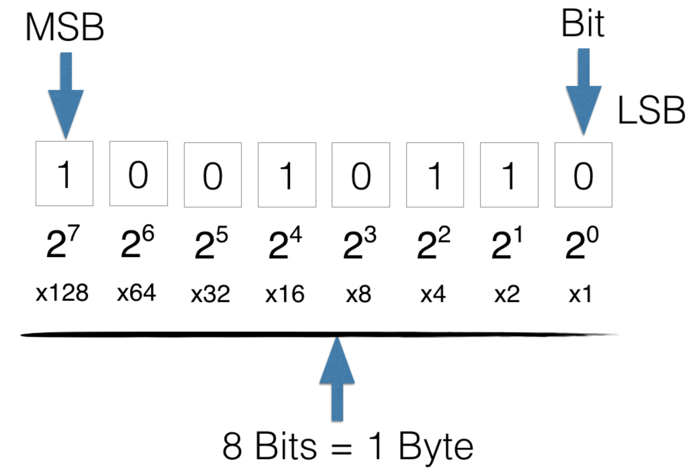

[출처] https://knowthecode.io/labs/basics-of-digitizing-data/episode-5

- MSB (최상위 비트, Most Significant Bit)
  - MSB가 0이면 양의 정수
  - MSB가 1이면 음의 정수

### 1.1.2. char 타입

- 자바는 모든 문자를 **유니코드 (Unicode)**로 처리함

> **유니코드 (Unicode)**
>
> - 세계 각국의 문자들을 코드값으로 매핑한 국제 표준 규약
> - 하나의 문자에 대해 하나의 코드값을 부여하므로 영문 'A' 와 한글 '가' 도 하나의 코드 값을 가짐
> - 0 ~ 65536 범위의 2byte 크기를 가진 정수값
> - 0 ~ 127 까지는 아스키 (ASCII) 문자 (특수기호 및 영어 알파벳) 가 할당되어 있고, 44032 ~ 55203 까지는 한글 11172 자가 할당되어 있음

- 자바는 하나의 유니코드를 저장하기 위해 2byte 크기인 char 타입을 제공함

- 유니코드는 음수가 없기 때문에 char 타입의 변수에는 음수 값을 저장할 수 없음

- char 타입에 저장할 수 있는 값은 0 ~ 65536까지 2^16개

- char 타입의 변수에 어떤 문자를 대입하지 않고 단순히 초기화를 할 목적으로 '' 을 이용한 빈 문자를 대입하면 컴파일 에러가 발생

  ```java
  char c = ''; //  컴파일 에러
  char ch = ' '; // 공백 하나를 포함하여 초기화해야함
  ```

- 이에 비해, String 변수는 큰 따옴표 두 개를 연달아 붙인 빈 문자를 대입해도 괜찮음

  ```java
  String str = "";
  ```

### 1.1.3. short 타입

- 2 byte (16bit)로 표현되는 정수값을 저장할 수 있는 데이터 타입
- 저장할 수 있는 값의 범위 : -32768 ~ 32767 (-2^15 ~ (2^15 - 1))
- C 언어의 호환을 위해 사용되며, 비교적 자바에서는 잘 사용되지 않음

### 1.1.4. int 타입

- 4 byte (32 bit)로 표현되는 정수값을 저장할 수 있는 데이터 타입
- 저장할 수 있는 값의 범위 : (-2^31 ~ (2^31 - 1))
- **int 타입은 자바에서 정수 연산을 하기 위한 기본 타입**
- byte 타입 또는 short 타입의 변수를 + 연산하면 int 타입으로 변환된 후 연산되고 연산의 결과 역시 int 타입이 됨
  - 자바에서 정수 연산을 4 byte로 처리하기 때문
  - byte 타입이나 short 타입으로 변수를 선언한 것과 int 타입으로 변수를 선언한 것의 성능 차이는 거의 없음

```java
int number = 10; // 10진수
int octNumber = 012; // 8진수
int hexNumber = 0xA; // 16진수
```

- 변수에 어떤 진수로 입력을 하더라도 동일한 값이 2진수로 변환되어 저장됨
- int타입 변수에 저장된 25

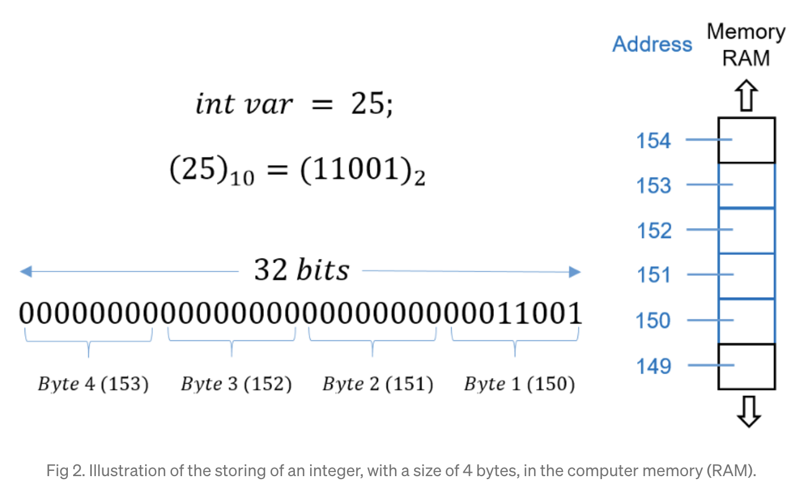

[출처] https://medium.com/@luischaparroc/integer-numbers-storage-in-computer-memory-47af4b59009

- int가 **4 byte**의 크기를 가지기 때문에 32 bit로 표현할 수 있다

### 1.1.5. long 타입

- long 타입은 8 byte (64 bit)로 표현되는 정수값을 저장할 수 있는 데이터 타입
- 저장할 수 있는 값의 범위 : (-2^63 ~ (-2^63 - 1))
- 수치가 큰 데이터를 다루는 프로그램에서는 long 타입이 필수
  - 은행 & 우주와 관련된 프로그램
- long 타입의 변수를 초기화할 때에는 정수값 뒤에 소문자 l 이나 대문자 L을 붙여 초기화
  - 4 byte가 정수 데이터가 아닌 8 byte 정수 데이터임을 컴파일러에게 알려주기 위한 목적
  - 안붙이면 컴파일 에러

## 1.2. 실수 타입 (float, double)

### 실수 타입

- 소수점이 있는 실수 데이터를 저장할 수 있는 타입


#### 메모리 사용 크기에 따른 float / double

| 실수 타입 | 바이트 수 |
| --------- | --------- |
| float     | 4 byte    |
| double    | 8 byte    |


- 정수 타입과는 다른 저장 방식을 가지므로, 정수 타입보다 훨씬 더 큰 범위의 값을 저장할 수 있음

- 실수는 정수와 달리 **부동 소수점 (floating-point) 방식으로 저장**됨

  >  **부동 소수점 (지수 : Exponent, 가수 : Mantissa)**
  >
  > - 가수 m 은 0 < m < 1 범위의 실수이어야 함
  > - 1.2345 ⇒ 0.12345 * 10^1 (가수는 0.12345, 지수는 1)

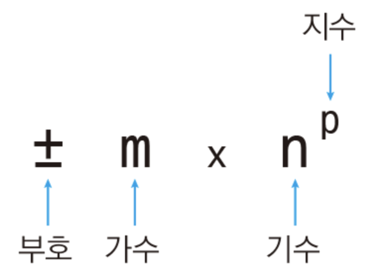

[출처] https://dojang.io/mod/page/view.php?id=45

### Float와 Double 타입이 전체 bit를 사용하는 방식

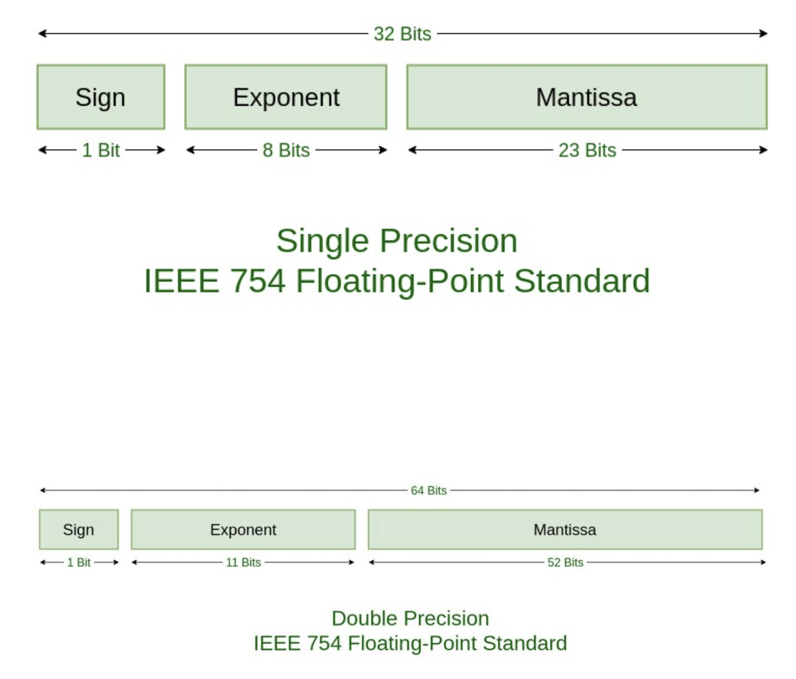

[출처] https://www.geeksforgeeks.org/ieee-standard-754-floating-point-numbers/

- **가수**를 표현하는 데 있어서, float에 비해 double이 **약 두 배의 자릿수가 배정되어 있음**

- float보다 double이 더 정밀한 값을 저장할 수 있기 때문에 , 더 높은 정밀도를 요구하는 계산에서는 **double을** 사용해야함

- 자바는 실수 리터럴의 기본 타입을 double로 간주

- **실수 리터럴을 float 타입 변수에 그냥 저장할 수 없음!!!**

  - 실수 리터럴을 float 타입에 저장하려면, 리터럴 뒤에 소문자 f 나 대문자 F를 붙여야 함

    ```java
    double var1 = 3.14;
    float var2 = 3.14 // 컴파일 에러 (Type mismatch : cannot convert from double to float)
    float var2 = 3.14F;
    ```

- 만약, 정수 리터럴에 10의 지수를 나타내는 E 또는 e를 포함하고 있으면, 정수 타입 변수에 저장할 수 없고, 실수 타입 변수에 저장해야 함

  ```java
  int var6 = 3000000;  // 3000000
  double var7 = 3e6;   // 3000000
  float var8 = 3e6f;   // 3000000
  double var9 = 2e-3;  // 0.002
  ```

##1.3. 논리 타입 (boolean)

### 논리 타입 (boolean)

- 1 byte (8 bit)로 표현되는 논리값 (true / false)을 저장할 수 있는 데이터 타입
- 두 가지 상태값을 저장할 필요성이 있을 경우에 사용
- 상태값에 따라 조건문과 제어문의 실행 흐름을 변경하는데 주로 이용됨


# 2. 프리미티브(Primitive) 타입과 레퍼런스(Reference) 타입

### 1. 기본 타입 (원시 타입 :  primitive type)

- 정수, 실수, 문자, 논리 리터럴을 저장하는 타입

### 2. 참조 타입 (reference type)

- 객체 (Object)의 번지를 참조하는 타입 (배열, 열거, 클래스, 인터페이스)
- 주소를 통해 객체를 참조한다

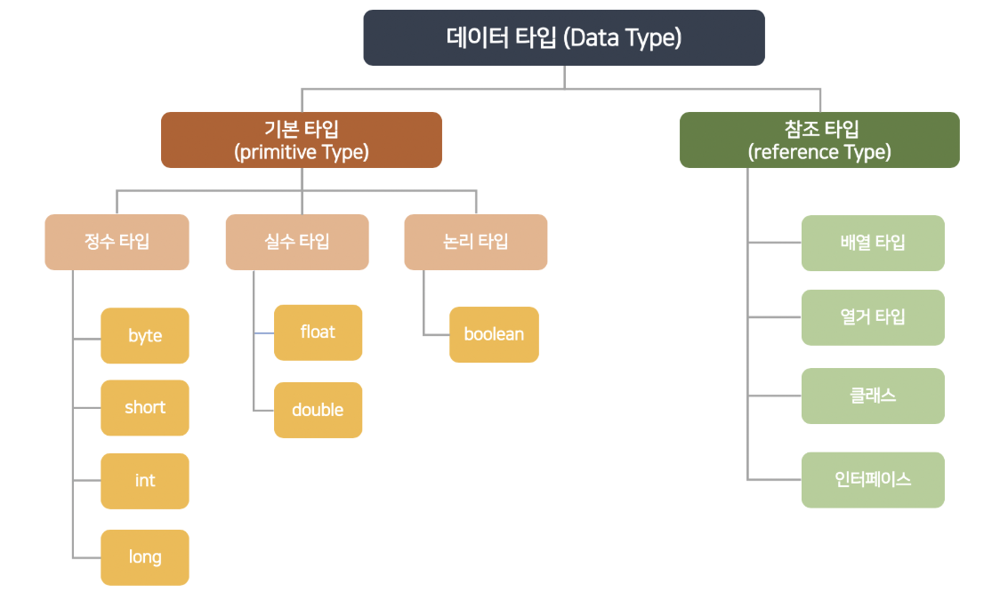

[출처] : [이것이 자바다 - 신용권의 Java 프로그래밍 정복 1권](https://www.hanbit.co.kr/store/books/look.php?p_code=B1460673937) - p.138 (그림은 제가 직접 작성했습니다.)

### 기본 타입과 참조 타입으로 선언된 변수의 차이 (참조 타입 : 번지를 통해 객체를 참조)

- 저장되는 값이 무엇인가

  - 기본 타입을 이용하여 선언된 변수 ⇒ **실제 값**을 변수 안에 저장

  - 참조 타입을 이용하여 선언된 변수 ⇒ **메모리의 번지**를 값으로 가짐

    

    [출처] : [이것이 자바다 - 신용권의 Java 프로그래밍 정복 1권](https://www.hanbit.co.kr/store/books/look.php?p_code=B1460673937) - p.139 (그림은 제가 직접 작성했습니다.)
    
    

## 1. 메모리 사용 영역

#### JVM이 사용하는 메모리 영역 (Runtime Data Area) - 운영체제에서 할당 받음

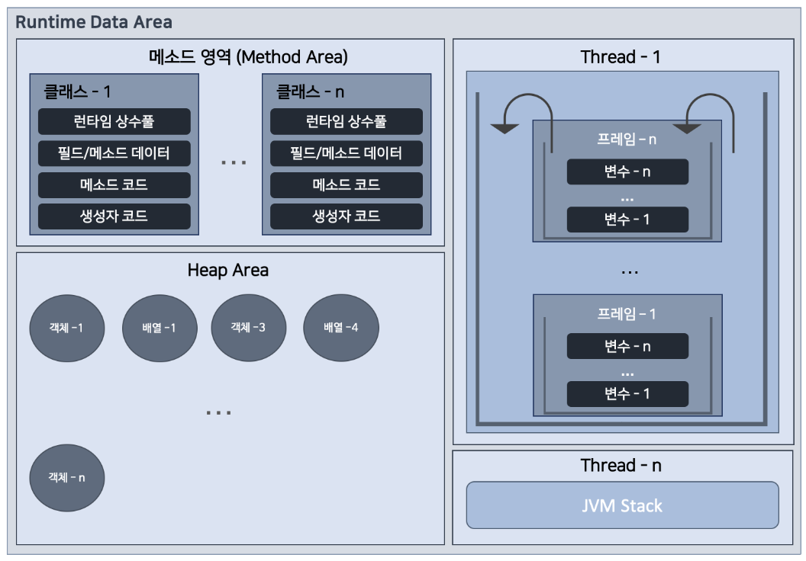

[출처] : [이것이 자바다 - 신용권의 Java 프로그래밍 정복 1권](https://www.hanbit.co.kr/store/books/look.php?p_code=B1460673937) - p.140 (그림은 제가 직접 작성했습니다.)

##2. 참조 변수의 ==, != 연산

#### 참조 타입 변수들 간의 ==, !=연산은 동일한 객체를 참조하는지, 다른 객체를 참조하는지 알아볼 때 사용

- 참조 타입 변수의 값 ⇒ **힙 영역의 객체 주소**
  - 결국 **주소 값의 비교**
  - 동일한 주소 값을 가진다 = 동일한 객체를 참조한다

### null과 NullPointerException

- 참조 타입 변수 → 힙 영역의 객체를 참조하지 않는다는 뜻으로 null 값을 가질 수 있음

- null 값도 초기값으로 사용할 수 있으므로 → null 로 초기화 된 참조 변수
  - **Stack 영역에 생성**

##### NullPointerException

- 참조 타입 변수가 null을 가지고 있는데, 참조 타입 변수를 사용 (객체를 사용) 하려고 하는 경우에 발생

  ```java
  int[] intArray = null;
  intArray[0] = 0; // NullPointerException 발생 (intArray변수가 참조하는 배열 객체가 없기 때문)
  ```

  ```java
  String str = null;
  System.out.println("문자의 길이 : " + str.length()); // NullPointerException 발생 (str 변수가 참조하는 String 객체가 없기 때문)
  ```
  
  

##3. String 타입

#### 문자열 저장

```java
String 변수;
변수 = "문자열"; // String 변수에 문자열 저장 (문자열 리터럴 대입)
String 변수2 = "문자열"; // 변수 선언과 동시에 문자열 저장
String name = "영희";
String name2 = "영희";
// 동일한 문자열 리터럴을 참조하므로 String 객체를 공유
// name == name2 는 true
```

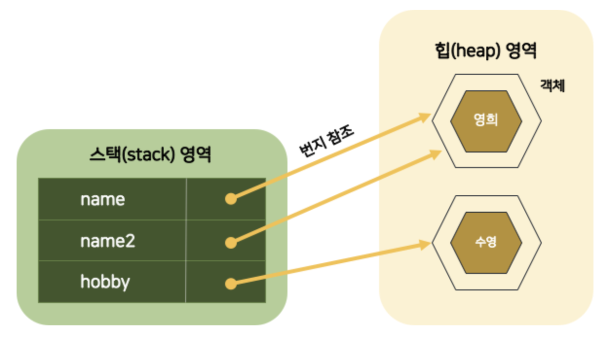

[출처] : [이것이 자바다 - 신용권의 Java 프로그래밍 정복 1권](https://www.hanbit.co.kr/store/books/look.php?p_code=B1460673937) - p.146 (그림은 제가 직접 작성했습니다.)

- 변수는 **Stack 영역**에 생성
- 문자열 리터럴은 **Heap Area**에 **String 객체로 생성**됨
- name, name2, hobby 변수에는 String **객체 주소 값 저장**
- 자바는 **문자열 리터럴이 동일**하면 → **String 객체를 공유**함

#### new 연산자 → Heap Area에 새로운 객체 만들 때 사용하는 연산자 (객체 생성 연산자)

But, **new 연산자를 통해 생성된 String 객체 → 서로 다른 String  객체 참조**

```java
String name = new String("영희");
String name2 = new String("영희");
// new 연산자를 통해 String 객체를 생성했으므로, 서로 다른 String 객체를 참조
// name == name2 는 false
```

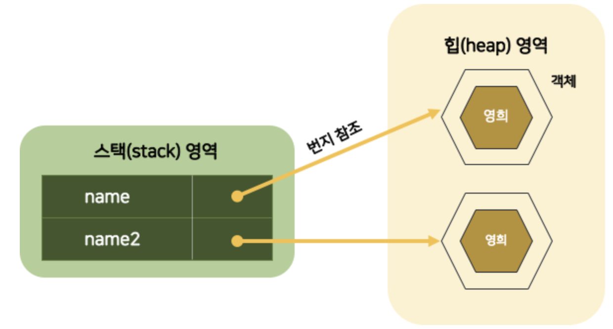

>  == 연산자
>
> - 변수에 저장된 객체 번지가 동일한지를 검사

### 동일한 String 객체이건, 다른 String 객체이건 상관없이 문자열만을 비교 → equals() 메소드 사용

>  equals() 메소드
>
> -  https://docs.oracle.com/javase/8/docs/api/java/lang/Object.html#equals-java.lang.Object-

- String 변수에 null 을 대입

  ```java
  String hobby = null; // 초기값으로 null 대입 가능
  String hobby2 = "여행";
  hobby2 = null; // String 객체를 참조하였으나, null 대입함으로써 더 이상 String 객체를 참조하지 않게 할 수 있음
  ```

  - **참조를 잃은 객체**

    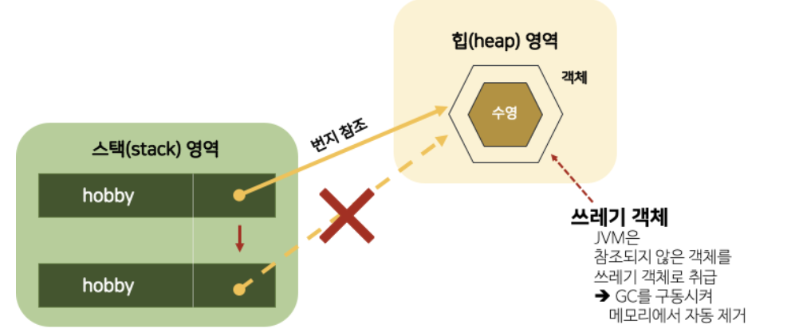

    - JVM은 참조되지 않은 객체를 쓰레기 객체로 취급하고, Garbage Collector를 구동시켜 메모리에서 자동 제거함

## 3. 리터럴

### 리터럴 (Literal)

- 소스 코드 내에서 직접 입력된 값
- 종류에 따라 정수 리터럴, 실수 리터럴, 문자 리터럴, 논리 리터럴로 구분
- 정해진 표기법대로 작성되어야 하는 특징
- 상수 (constant)와 같은 의미이지만, 프로그램에서 상수는  "값을 한 번 저장하면 변경할 수 없는 변수" 로 정의하기 때문에 이와 구분

### 정수 리터럴

- 소수점이  없는 정수 리터럴은 10진수로 간주

```java
0, 75, -100
```

- 0으로 시작되는 리터럴은 8진수로 간주

```java
02, -04
```

- 0x 또는 0X로 시작하고, 0~9 숫자나  A,B,C,D,E,F 또는  a,b,c,d,e,f로 구성된 리터럴은 16진수로 간주

```java
0x5, 0xA, 0xB3, 0xAC08
```

- 정수 리터럴을 저장할 수 있는 타입 ⇒ byte, char, short, int, long

### 실수 리터럴

- 소수점이 있는 리터럴은 10진수로 간주

```java
0.25, -3.14
```

- 대문자 E 또는 소문자 e가 있는 리터럴은 10진수 지수와 가수로 간주

```java
5E7 // 5 * 10^7
0.12E-5 // 0.12 * 10^-5
```

- 실수 리터럴을 저장할 수 있는 타입 ⇒ float, double

### 문자 리터럴

- 작은 따옴표(')로 묶은 텍스트는 하나의 문자 리터럴로 간주

```java
'A', '한', '\\t', '\\n'
```

- 역슬래쉬가 붙은 문자 리터럴 = 이스케이프 문자
- 문자 리터럴을 저장할 수 있는 타입 ⇒ char

### 문자열 리터럴

- 큰 따옴표 (") 로 묶은 텍스트
- 큰 따옴표 안에 텍스트가 없어도 문자열 리터럴로 간주
- 문자열 리터럴 내부에서도 이스케이프 문자를 사용 가능

```java
"대한민국"
"탭 만큼 이동 \\t 합니다"
"한줄 내려 쓰기 \\n 합니다"
```

- 문자열 리터럴을 저장할 수 있는 타입 ⇒ String

### 논리 리터럴

- true & false
- 논리 리터럴을 저장할 수 있는 타입 ⇒ boolean


## 4. 변수 선언 및 초기화하는 방법

### 1. 변수 (Variable)

- 값을 저장할 수 있는 메모리 공간
- 왜 변수?
  - 프로그램에 의해서 수시로 값이 변동될 수 있기 때문
- 복수 개의 값을 저장할 수 없고, 하나의 값만 저장할 수 있음

### 2. 변수의 선언

- 타입과 변수 이름을 선언

```java
int age; // int 값을 저장할 수 있는 age 변수 선언
double value;
```

### 3. 변수의 사용

- 변수에 값을 저장하고 읽는 행위

### 변수값 저장

- 대입 연산자 (=) 을 이용

- 우측의 값을 좌측 변수에 저장함

  ```java
  int score; // 변수 선언
  score = 90; // 값 저장
  ```

> **리터럴 (Literal)**
>
> - 소스 코드 내에서 직접 입력된 값
> - 값의 종류에 따라 정수 리터럴 / 실수 리터럴 / 문자 리터럴 / 논리 리터럴로 구분

### 변수값 읽기

- 변수는 초기화가 되어야 읽을 수 있고, 초기화되지 않은 변수는 읽을 수 없음

  ```java
  int value; // 변수 value 선언
  int result = value + 10; // 초기화되지 않은 변수 value 값을 읽고, 10을 더함
  ```

  - 변수 value가 선언되었지만, 초기화되지 않았기 때문에 산술 연삭식에서 사용할 수 없음
  - **컴파일 에러**

  ```java
  int value = 30;
  int result = value + 10;
  ```

  - 위와 같이 변수 초기화 필요!!

## 5. 변수의 스코프와 라이프타임

### 변수의 사용 범위 (Scope)

- 변수는 중괄호 {} 블록 내에서 선언되고 사용됨

### 로컬 변수 (local variable)

- 메소드 블록 내에서 선언된 변수
- 메소드 실행이 끝나면 메모리에서 자동으로 없어짐

- 변수는 선언된 블록 내에서만 사용이 가능


## 6. 타입 변환, 캐스팅 그리고 타입 프로모션

### 타입 변환

#### 데이터 타입을 다른 데이터 타입으로 변환하는 행위

### 1. 자동 (묵시적) 타입 변환

### 2. 강제 (명시적) 타입 변환

### 1. 자동 타입 변환 (묵시적 타입 변환) - Promotion

#### 프로그램 실행 도중에 자동적으로 타입 변환이 일어나는 것

- 작은 크기를 가지는 타입이 큰 크기를 가지는 타입에 저장될 때 발생

  

  [출처] https://kkk-kkk.tistory.com/entry/JAVA-chapter-02-%EB%B3%80%EC%88%98%EC%99%80-%ED%83%80%EC%9E%85-23-%ED%83%80%EC%9E%85-%EB%B3%80%ED%99%98

  - 큰 크기 타입과 작은 크기 타입 구분?

    ⇒ 사용하는 메모리 크기

- 자동 타입 변환이 발생되면, 변환 이전의 값과 변환 이후의 값은 동일 (손실 없이 그대로 보존)

- 자동 타입 변환의 예외

  - chart는 2 byte 의 크기를 가지지만, char 의 범위는 0 ~ 65536 이므로 음수가 저장될 수 없음

  - 따라서, byte 타입을 char 타입으로 자동 변환 불가능

    ```java
    byte byteValue = 65;
    char charValue = byteValue; // 컴파일 에러
    char charData = (char) byteDate; // 강제 타입 변환을 통해 변환 가능
    ```

### 2. 강제 타입 변환 (명시적 타입 변환) - Casting

### 강제적으로 큰 데이터 타입을 작은 데이터 타입으로 쪼개어서 저장하는 것

- 큰 크기의 타입을 작은 크기의 타입으로 쪼개어 저장하고자 할 때 사용

- 캐스팅 연산자  () 를 사용

  ```java
  int intValue = 103029770;
  byte byteValue = (byte) intValue; // 강제 타입 변환 (캐스팅)
  ```

  ### 강제 타입 변환 (캐스팅) 을 통해 메모리에서 값이 복사되는 모양

- 강제적으로 캐스팅 연산자를 사용해서 int 타입 intValue를 1byte씩 쪼개고, 끝에 있는 1 byte만 byteValue 변수에 저장

- 끝 1 byte만 byte타입 변수에 담게 되므로, 원래 int 값은 보존 X

### 강제 타입 변환 시 값 보존 되는 경우

- 만약, int 타입 변수에 10을 저장하고, byte로 강제 타입 변환을 하면, 값 손실 없이 변환 가능

- int 타입 ⇒ char 타입으로 자동 변환되지 않기 떄문에 강제 타입 변환을 사용해야 함

- int 타입에 저장된 값이 유니코드 범위 (0 ~ 65536) 라면 (char) 캐스팅 연산자를 사용해서 char 타입으로 변환할 수 있음

  ```java
  int intValue = 'A';
  char charValue = (char) intValue; // sysout으로 출력 시 유니코드에 해당하는 문자가 출력됨
  ```

- 실수 타입 (float, double) 은 정수 타입 (byte, short, int, long) 으로 자동 변환되지 않으므로, 강제 타입 변환을 사용해야 함

  - 소수점 이하 부분은 버려지고, 정수 부분만 저장됨

    ```java
    double doubleValue = 3.14;
    int intValue = (int) doubleValue; // intValue는 정수 부분인 3만 저장됨
    ```

### 주의점

- 사용자로부터 입력받은 값을 변환할 때, 값의 손실이 발생하면 안됨!
- 정수 타입을 실수 타입으로 변환할 때, 정밀도 손실을 피해야 함

[타입의 최소값 & 최대값 상수](https://www.notion.so/8e12205b0dce47cb80bb3bb120657d8e)

```java
public class FromIntToFloat {
	public static void main(String[] args) {
			int num1 = 123456780;
			int num2 = 123456780;

			float num3 = num2; // 자동 타입 변환
			num2 = (int) num3; // 강제 타입 변환

			int result = num1 - num2; // 0이라고 예상하지만, 아님ㄴ
	}
}
```

- 이유?

  - int 값을 손실 없이 float 타입으로 변환할 수 있으려면, 가수 23비트로 표현 가능한 값이어야하는데,

    123456780은 23비트로 표현할 수 없기 때문에 근사치로 변환됨

  - 정밀도 손실의 발생

  - float 값을 다시 int 타입으로 변환 시, 원래의 int 값을 얻지 못하게됨

### 모든  int 값을 실수 타입으로 안전하게 변환시키는 double 타입을 이용하여 형변환을 하자

### 3. 연산식에서의 자동 타입 변환

- 연산은 기본적으로 같은 타입의 피연산자 (operand) 간에만 수행되기 때문에 서로 다른 타입의 피연산자가 있을 경우, 두 피연산자 중 크기가 큰 타입으로 자동 변환된 후 연산을 수행함

- ex) int 타입 피연산자와 double 타입 피연산자를 덧셈 연산하면 먼저 int 타입 피연산자가 double 타입으로 자동 변환되고 연산을 수행함 ⇒ 연산의 결과는 double

- 자바는 정수 연산일 경우, int 타입을 기본으로 함

  - 피연산자를 4 byte 단위로 저장하기 때문에, 크기가 4 byte 보다 작은 타입 (byte, char, short)은 4 byte 인 int 타입으로 변환된 후 연산이 수행됨 ⇒ 연산의 결과도 int 타입이 됨

  ### 정수 연산은 int 타입을 기본으로 함

  - char 타입의 연산 결과는 int 타입으로 산출되므로 int 타입 변수에 결과를 저장해야 함
  - 연산의 결과를 다시 문자로 출력하거나 저장하기 위해서는 int 결과값을 char 타입으로 강제 변환 (casting) 해야 함

  ### 피연산자 중 하나가 long 타입이면, 다른 피연산자도 long 타입으로 자동 타입 변환되고, 연산 결과도 long 타입이 됨

### float 타입과 float 타입의 연산은 결과도 float 타입이지만, 피연산자 중에 실수 리터럴이나 double 타입이 있다면, 다른 피연산자도 double 타입으로 자동 타입 변환되어 연산되므로, 결과는 double 타입이 됨

## 7. 1차 및 2차 배열 선언하기

### 배열 타입

### 1. 배열

### 같은 타입의 데이터를 연속된 공간에 나열시키고, 각 데이터에 index를 부여해놓은 자료구조

- 같은 타입의 데이터만 저장 가능
- 선언과 동시에 저장할 수 있는 데이터 타입이 결정됨
- 다른 타입의 값을 저장하고자 하면 → **타입 불일치 (Type mismatch)** 컴파일 오류 발생
- 한 번 생성된 배열은 길이를 늘리거나 줄일 수 없음
- **참조 변수**

### 2.배열 선언

```java
타입[] 변수;
or
타입 변수[];
int[] intArray;
double[] doubleArray;
String[] strArray;

int intArray[];
double doubleArray[];
String strArray[];
```

### 3. 값 목록으로 배열 생성

- 배열 항목에 저장될 값의 목록이 있으면, 아래와 같이 배열 객체를 만들 수 있음

  ```java
  데이터타입[] 변수 = { 값0, 값1, 값2, 값3, ... };
  ```

  - 배열 객체를 힙에 생성하고, 배열 객체의 번지를 리턴
  - 값 목록으로 배열 생성 예제

- 배열 변수를 이미 선언한 후에 다른 실행문에서 중괄호를 사용한 배열 생성은 불가능

  ```java
  타입[] 변수;
  변수 = { 값0, 값1, 값2, .... }; // 컴파일 에러
  ```

- 배열 변수를 미리 선언한 후, 값 목록들이 나중에 결정되는 상황이라면

  - new 연산자를 사용해서 값 목록을 지정해주면 됨

  ```java
  변수 = new 타입[] { 값0, 값1, 값2, ... };
  ```

  ```java
  String[] names = null;
  names = new String[] { "신용권", "홍길동", "김자바" };
  ```

- 메소드 매개값이 배열일 경우

  - 값 목록으로 배열을 생성함과 동시에 add() 메소드의 매개값으로 사용하고자 할 때

  - new 연산자 사용 필수

    ```java
    int add(int[] scores) { ... }
    
    int result = add( { 95, 80, 52 } ); // 컴파일 에러
    int result = add( new int[] { 95, 85, 90 } ); 
    ```

  - 값의 리스트로 배열 생성 예제

### 4. new 연산자로 배열 생성

```java
타입[] 변수 = new 타입[배열의 길이];

타입2[] 변수2 = null;
변수2 = new 타입2[길이];
```

- 길이가 5인 int 배열 생성

  ```java
  int[] intArray = new int[5];
  ```

  - intArray[0] ~ intArray[4] 까지 값이 저장될 수 있는 공간을 확보하고, 배열의 생성 번지를 리턴
  - 리턴된 번지는 `intArray` 변수에 저장됨
  - 각 항목의 크기는 int 타입 크기인 4 byte
  - new 연산자로 배열을 처음 생성할 경우
    - 자동으로 기본값으로 초기화

[타입별 배열의 초기값](https://www.notion.so/7da45e1d27c24a8c92c7bf6b72ad2f47)

- new 연산자로 배열 생성

### 5. 배열 길이

### 배열 길이 = 배열에 저장할 수 있는 전체 항목 수

- length 필드

  ```java
  배열변수.length
  ```

```java
int[] intArray = { 10, 20, 30 };
int num = intArray.length // num은 3
```

- length는 읽기 전용 필드 → 값을 바꿀 수 없음
  - `intArray.length = 10;` ⇒ **불가능**
- 배열의 length 필드 예제

### 6. 커맨드 라인 입력

- main() 메소드의 매개값인 String[] args가 왜 필요한 것일까?

  - java 클래스로 프로그램 실행하면 JVM은 길이가 0인 String 배열을 먼저 생성하고 main() 메소드를 호출할 때 매개값으로 전달함

  - main() 메소드는 String[] args 매개 변수를 통해 커맨드 라인에서 입력된 데이터의 수 (배열의 길이) 와

    입력된 데이터 (배열의 항목 값)를 알 수 있게 됨

- main() 메소드의 매개 변수 예제

### 7.  다차원 배열

### 행과 열로 구성된 배열 → 2차원 배열 = 행렬

```java
int[][] scores = new int[2][3];
```

- 메모리에 3개의 배열 객체를 생성


- 배열 변수인 scores : 길이 2인 배열 A 를 참조
- 배열 A의 scores[0] : 길이 3인 배열 B 참조
- 배열 A의 scores[1] : 길이 3인 배열 C 참조

```java
타입[][] 변수 = { { 값1, 값2, ... }, { 값1, 값2, ... }, ...  };
```

- 배열 속의 배열 예제

### 8. 객체를 참조하는 배열

- 기본 타입 배열
  - 각 항목에 직접 값을 가짐
- 참조 타입 배열
  - 각 항목에 객체의 번지를 가짐

```java
String[] strArray = new String[3];
strArray[0] = "Java";
strArray[1] = "C++";
strArray[2] = "C#";
```


- String[] 배열 항목 간에 문자열을 비교하기 위해서는 == 연산자 대신 equals() 메소드를 사용해야 함

```java
String[] strArray = new String[3];
strArray[0] = "Java";
strArray[1] = "Java";
strArray[2] = new String("Java");
```

### 9.배열 복사

- 배열은 한 번 생성하면 크기를 변경할 수 없기에, 더 많은 저장 공간이 필요하면 보다 큰 배열을 새로 만드록 이전 배열로부터 항목 값들을 복사해야 함

- for문으로 배열 복사

  ```java
  /* for문으로 배열 복사 */
  public class ArrayCopyByForExample {
      public static void main(String[] args) {
          int[] oldIntArray = { 1, 2, 3 };
          int[] newIntArray = new int[5];
  
          for (int i=0; i<oldIntArray; i++) {
              newIntArray[i] = oldIntArray[i];
          }
  
          for (int i=0; i<newIntArray; i++) {
              System.out.print(newIntArray[i] + " ");
          }
      }
  }
  /*Result
  1 2 3 0 0
   */
  ```

- 복사되지 않은 항목은 int[] 배열의 기본 초기값 0이 그대로 유지됨

  

- System.arraycopy() 메소드를 이용한 배열 복사

  ```java
  System.arraycopy(Object src, int srcPos, Object dest, int destPos, int length);
  ```

  - src : 원본 배열
  - srcPos : 원본 배열에서 복사할 항목의 시작 인덱스
  - dest : 새 배열
  - destPos : 새 배열에서 붙여 넣을 시작 인덱스
  - length : 복사 할 개수

```java
/*System.arraycopy() 로 배열 복사 */
public class ArrayCopyExample {
    public static void main(String[] args) {
        String[] oldStrArray = { "java", "array", "copy" };
        String[] newStrArray = new String[5];

        System.arraycopy(oldStrArray, 0, newStrArray, 0, oldStrArray.length);

        for (int i=0; i<newStrArray.length; i++) {
            System.out.print(newStrArray[i] + " ");
        }
    }
}
/*Result
    java array copy null null
 */
```

- 복사되지 않은 항목은 String[] 배열의 기본 초기값 null이 그대로 유지됨

### 참조 타입 배열일 경우,

- 배열 복사 시, 복사 되는 값이 객체의 번지
- 새 배열은 이전 배열의 항목이 참조하는 객체와 동일

### shallow copy

- 복사 되는 값이 객체의 번지라서, 새 배열은 이전 배열의 항목이 참조하는 객체와 동일

### deep copy

- 참조하는 객체도 별도로 생성


## 8. 타입 추론, var

### 타입 추론 (Type Interface)

- 표현식의 타입을 컴파일러가 스스로 알아내서 사용하는 기능
- Java 10부터 var 가 추가되었음


#### 출처

- 이것이 자바다 (신용권)