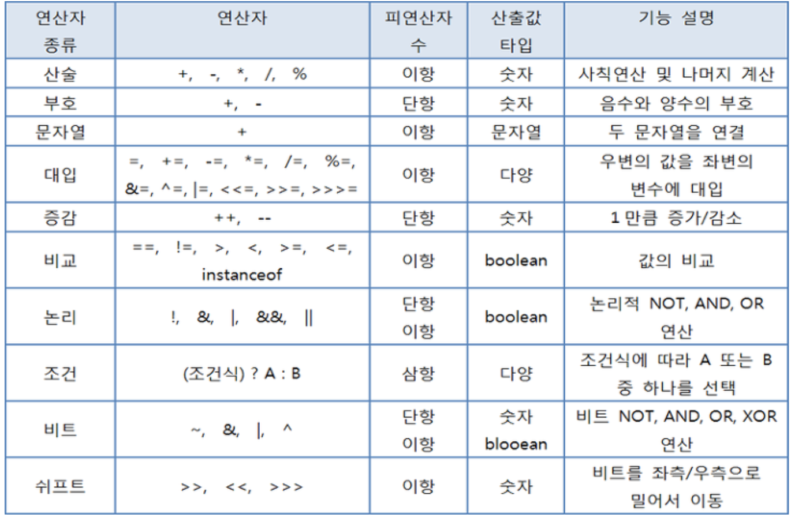
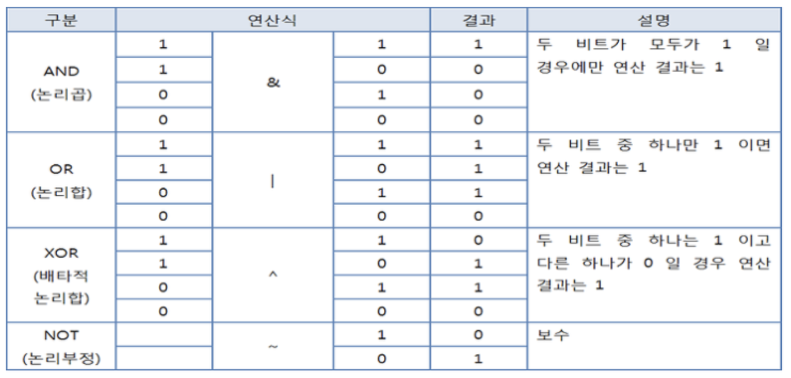
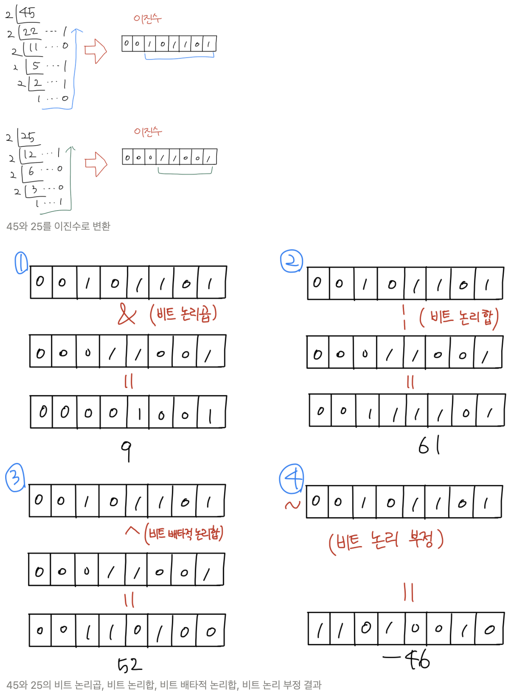
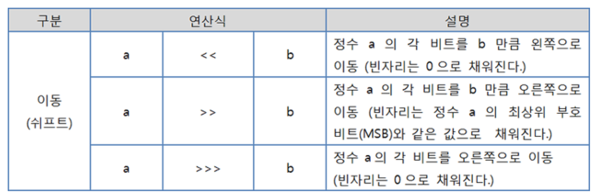
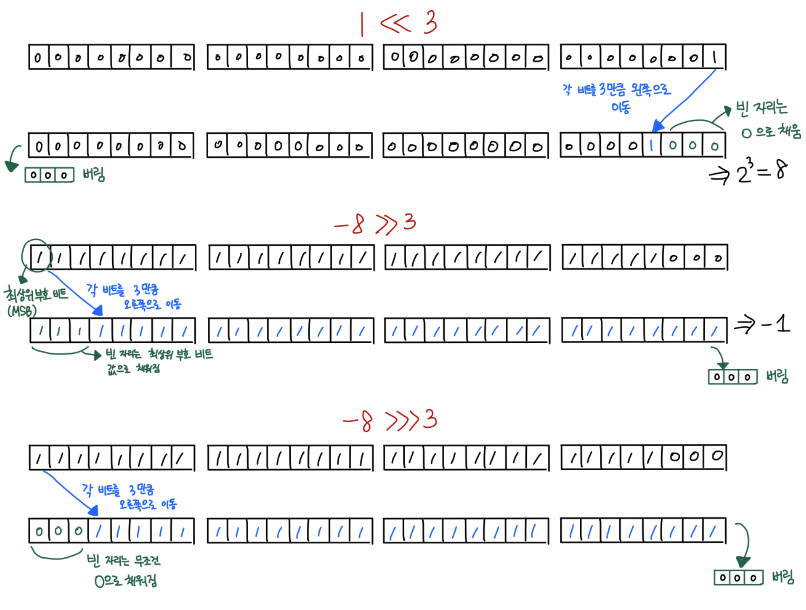
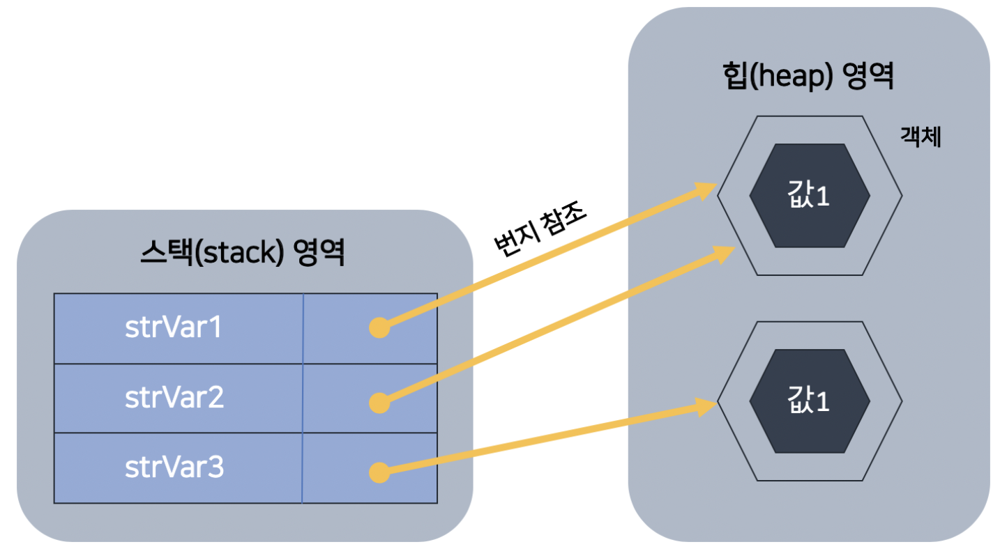
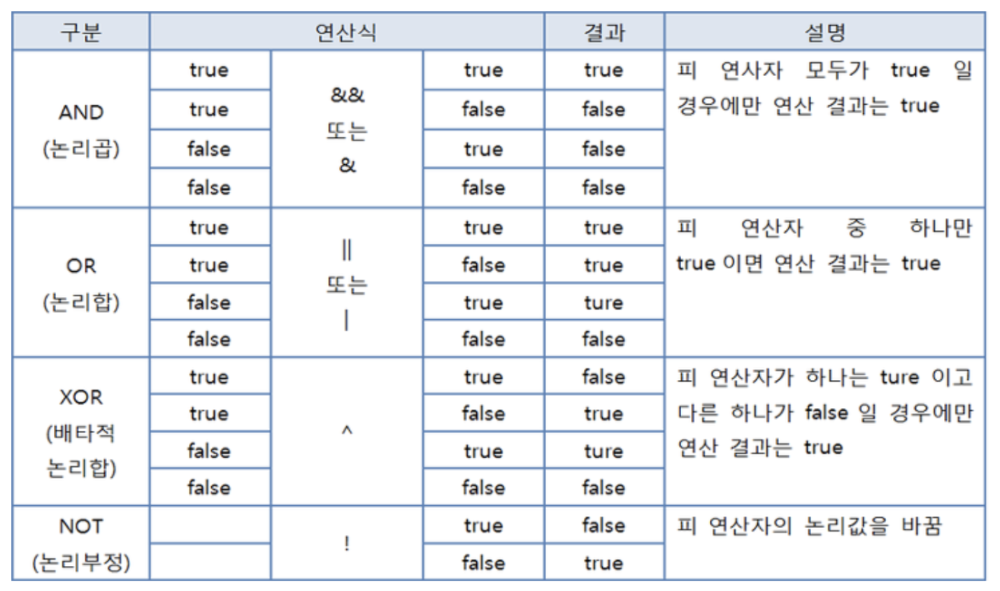
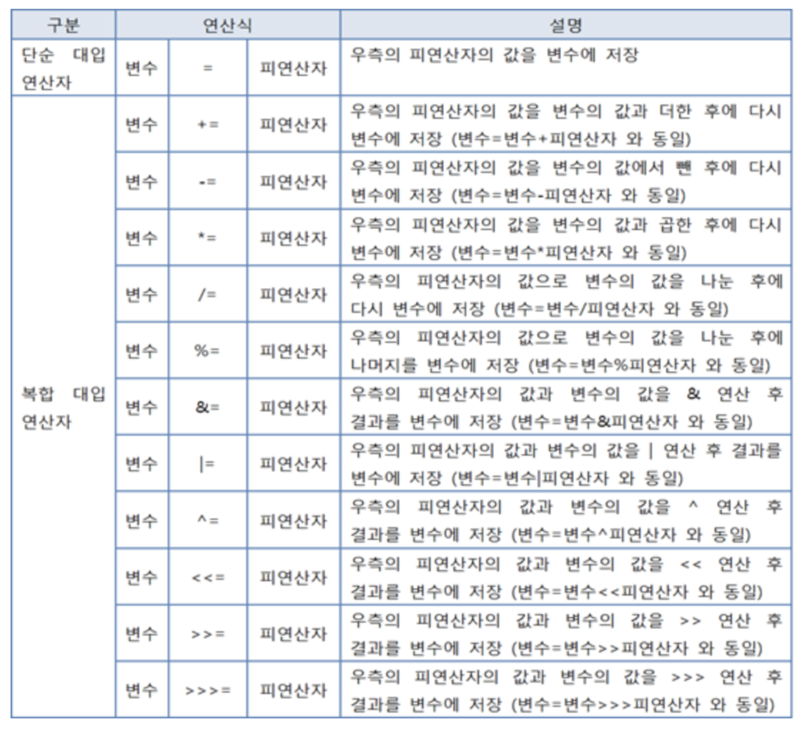
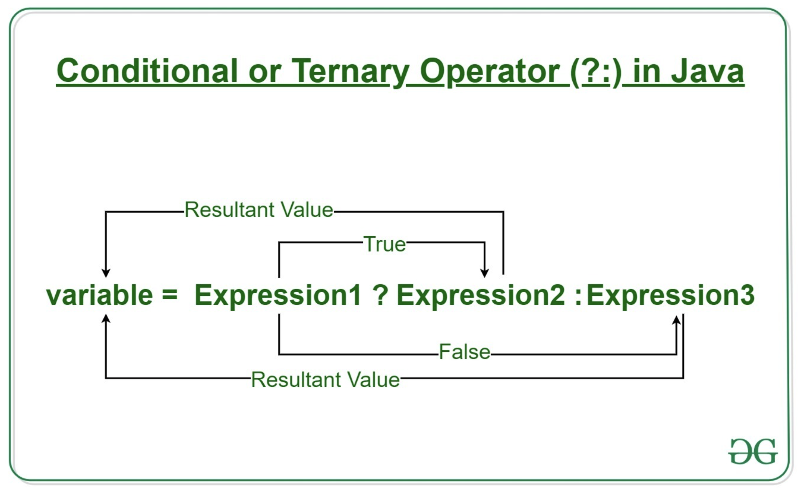
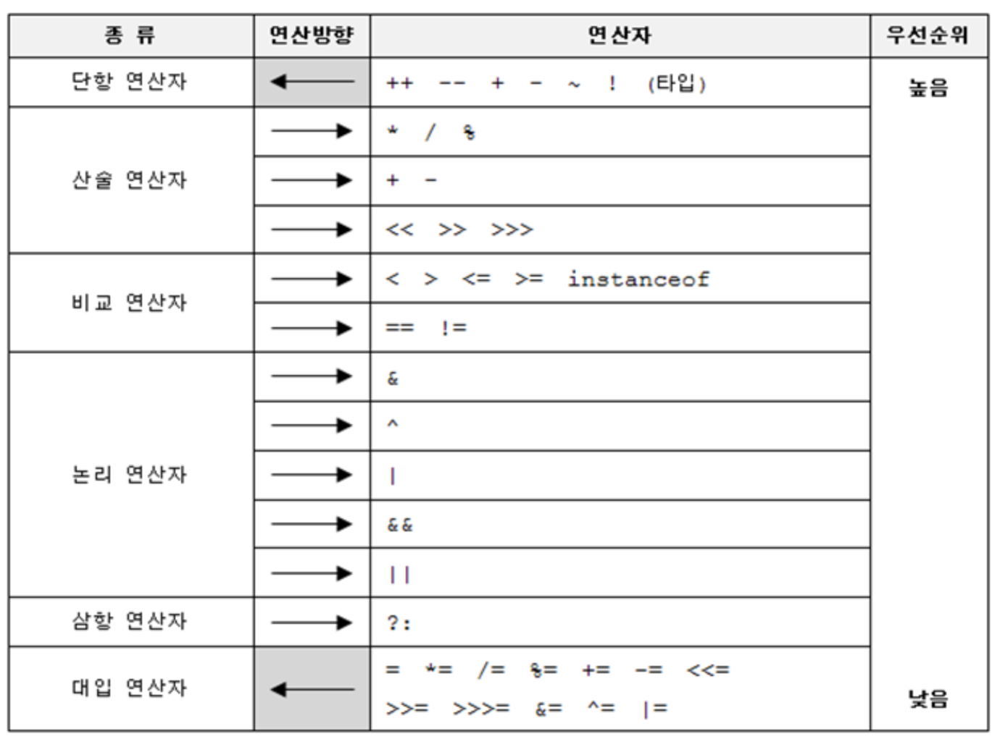

# [3주차 과제] 연산자

[TOC]

### 1. 산술 연산자

### 2. 비트 연산자

### 3. 관계 연산자

### 4. 논리 연산자

### 5. instanceof

### 6. assignment(=) operator

### 7. 화살표(->) 연산자

### 8. 3항 연산자

### 9. 연산자 우선 순위

### 10. (optional) Java 13. switch 연산자


# 0. 연산자와 연산식

### 연산 (operations)

- 프로그램에서 데이터를 처리하여 결과를 산출하는 것

### 연산자 (operator)

- 연산에 사용되는 표시나 기호

### 피연산자 (operand)

- 연산되는 데이터

### 연산식 (expressions)

- 연산자와 피연산자를 이용하여 연산의 과정을 기술한 것

```java
// +, -, *, == 은 연산자
// x, y, z는 피연산자
x + y
x - y
x * y + z
x == y
```

### 연산자의 종류

1. 산술 연산자 ⇒ 결과값이 숫자 타입 (byte, short, int, long, float, double)
2. 비교 연산자 ⇒ 결과값이 논리 타입 (boolean)
3. 논리 연산자 ⇒ 결과값이 논리 타입 (boolean)



[출처] : https://medium.com/@katekim720/%EC%97%B0%EC%82%B0%EC%9E%90%EB%B6%80%ED%84%B0-%EC%A1%B0%EA%B1%B4-%EB%B0%98%EB%B3%B5%EB%AC%B8%EA%B9%8C%EC%A7%80-3d5cec6513d4

### 필요로 하는 피연산자의 수에 따라 단항, 이항, 삼항 연산자로 구분

### 연산식은 반드시 하나의 값을 산출함

- 연산자 수가 아무리 많아도 두 개 이상의 값을 산출하는 연산식은 없음

- 하나의 값이 올 수 있는 곳이면 어디든지 값 대신에 연산식을 사용할 수 있음

  ```java
  int result = x + y;
  ```

- 연산식은 다른 연산식의 피연산자 위치에도 올 수 있음

  ```java
  boolean result = (x + y) < 5;
  ```


# 1. 산술 연산자 (+, -, *, /, %)

- 사칙연산을 하는 연산자

- boolean 타입을 제외한 모든 기본 타입에 사용할 수 있음

- 피연산자들의 타입이 동일하지 않을 경우 **피연산자들의 타입을 일치**시킨 후 연산을 수행

  1. 피연산자들이 모두 정수 타입이고, int 타입 (4 byte)보다 크기가 작은 타입일 경우

     → 모두 int 타입으로 변환 후, 연산 수행 ⇒ 결과는 int

  2. 피연산자들이 모두 정수 타입이고, long 타입이 있을 경우

     → 모두 long 타입으로 변환 후, 연산 수행 ⇒ 결과는 long

  3. 피연산자 중 실수 타입 (float, double)이 있을 경우

     → 크기가 큰 실수 타입으로 변환 후, 연산 수행 ⇒ 결과는 실수 타입

  ```java
  byte byte1 = 1;
  byte byte2 = 2;
  byte byte3 = byte1 + byte2; // 컴파일 에러 
  // long 타입을 제외한 정수의 산술 연산은 무조건 int 타입으로 변환 후 연산을 수행하고, 
  // 산출 타입도 int 이기 때문
  int result = byte1 + byte2; // 이게 맞는 코드
  ```

  - 왜 int 로 변환?
    - ⇒ 자바 가상 기계 (JVM)가 기본적으로 32비트 단위로 계산하기 때문

  ```java
  int int1 = 10;
  int int2 = 4;
  int result2 = int1 / int2; // 2
  double result3 = int1 / int2; // 2.5가 아닌 2.0
  ```

  - 2.5를 얻고 싶다면, 아래와 같이 피연산자 중 최소한 하나는 실수 타입이어야 함

    ```java
    double result3 = (int1*1.0) / int2;
    double result3 = (double) int1 / int2;
    double result3 = int1 / (double) int2;
    ```

- char 타입도 정수 타입이므로 산술 연산이 가능함 (결과는 int)

  ```java
  char c1 = 'A' + 1;
  char c2 = 'A';
  
  char c3 = c2 + 1; // 컴파일 에러
  // char를 얻고 싶으면, 강제 타입 변환 (캐스팅) 필요
  char c4 = (char) (c2 + 1);
  ```

### 산술 연산에서의 주의점

1. 오버플로우 탐지
2. 정확한 계산은 정수 사용
3. NaN 과 Infinity 연산
4. 입력값의 NaN 검사

### 1. 오버플로우 탐지

- 연산 후의 산출값이 산출 타입으로 충분히 표현 가능한지 살펴봐야 함
  - 산출 타입으로 표현할 수 없는 값이 산출되었을 경우, **오버플로우**가 발생하고 쓰레기값을 얻을 수 있기 때문
  - 예외 처리가 필요 (ArithmeticException)

### 2. 정확한 계산은 정수 사용

- 정확하계 계산해야 할 때는 부동소수점 (실수) 타입을 사용하지 말자

  ```java
  public class AccuracyExample1 {
  	public static void main(String[] args) {
  			int apple = 1;
  			double pieceUnit = 0.1;
  			int number = 7;
  
  			double result = apple - number*pieceUnit;
  			
  			System.out.println("사과 한 개에서")
  			System.out.println(number*pieceUnit+" 조각을 빼면 ");
  			System.out.println(result + "조각이 남는다."); // 결과는 0.3이 아닌 0.299999999....3
  	}
  }
  ```

  - result가 0.3이 아닌 이유?

    - 부동소수점 타입 (float, double)은 0.1을 정확히 표현할 수 없어 근사치로 처리하기 때문

    ```java
    public class AccuracyExample2 {
    	public static void main(String[] args) {
    		int apple = 1;
    
    		int totalPieces = apple * 10; // 정확한 계산을 위해서는 정수 연산을 이용해야 함
    		int number = 7;
    		int temp = totalPieces - number;
    
    		double result = temp / 10.0;
    	}
    }
    ```

### 3. NaN과 Infinity 연산

- / 나 % 연산자는 좌측 피연산자가 정수 타입인 경우에, 나누는 수인 우측 피연산자는 0을 사용할 수 없음

- 0으로 나누면, 컴파일은 되지만, 실행 시 ArithmeticException 이 발생함

  ```java
  5 / 0 // ArithmeticException 예외 발생
  5 % 0 // ArithmeticException 예외 발생
  ```

  - 자바는 프로그램 실행 도중 예외가 발생하면 실행이 즉시 멈추고 프로그램이 종료됨

  - Arithmetic Exception 이 발생했을 경우 프로그램이 종료되지 않도록 하려면 예외처리를 해야함

    ```java
    try {
    	int z = x % y;
    } catch (ArithmeticException e) {
    	System.out.println("0으로 나누면 안됨");
    }
    ```

- 실수 타입인 0.0 또는 0.0f 로 나누면 ArithmeticException 이 발생하지 않음

  - / 연산의 결과는 Infinity (무한대) 값을 가짐
  - % 연산의 결과는 NaN (Not a Number) 을 가짐

  ```java
  5 / 0.0 // Infinity
  5 % 0.0 // NaN 
  ```

  - 연산의 결과가 Infinity 또는 NaN이 나오면 다음 연산을 수행하면 안됨

    ⇒ 이 값들과 산술 연산을 하면 어떤 수와 연산하더라도 Infinity 또는 NaN이 산출되기 때문

    ```java
    Infinity + 2 // Infinity
    NaN + 2 // NaN
    ```

  - 프로그램 코드에서 결과가 Infinity 또는 NaN인지 확인하려면 아래 두 메소드 이용

    - Double.isInfinite()
    - Double.isNaN()

### 4. 입력값의 NaN 검사

- 부동소수점 (실수) 을 입력받을 때는 반드시 NaN 검사를 해야함
- NaN 검사는 == 연산자를 통해 조사하면 안되고, Double.isNaN() 메소드를 사용해야 함
  - NaN 은 != 연산자를 제외한 모든 비교 연산자를 사용할 경우 false 값을 리턴하기 때문

## 2. 비트 연산자

### 2.1. 비트 반전 연산자 (~)

- 정수 타입 (byte, short, int, long)의 피연산자에만 사용

- 피연산자를 2진수로 표현했을 때 비트값인 0 → 1, 1 → 0으로 반전

- 연산 후, 부호 비트인 최상위 비트를 포함하여 모든 비트가 반전됨

  - 부호가 반대인 새로운 값 산출됨

- 산출 타입은 **int 타입**

  - 피연산자는 연산을 수행하기 전에 int 타입으로 변환되고, 비트 반전이 일어남

    ```java
    byte v1 = 10;
    byte v2 = ~v1; // 컴파일 에러
    int v3 = ~v1; // 정상 
    ```

- 비트 반전 연산자를 이용하여 부호가 반대인 정수 구하기

  ```java
  byte b1 = 10;
  int b2 = ~b1 + 1;
  ```

- 자바에서는 Integer.toBinaryString() 메소드를 제공 : 정수값을 총 32비트의 이진 문자열로 리턴

  - Integer.toBinaryString() 메소드
    - 앞의 비트가 모두 0이면, 0은 생략되고 나머지 문자열만 리턴함

### 2.2. 비트 연산자 (&, |, ^, ~, <<, >>, >>>)

- 데이터를 비트 (bit) 단위로 연산
- 0 과 1이 피연산자가 됨
- 0과 1로 표현이 가능한 정수 타입만 비트 연산을 할 수 있음 (실수 타입인 float와 double 은 비트 연산 불가)

기능에 따라 구분

1. 비트 논리 연산자 (&, |, ^, ~) ⇒ 0과 1을 연산
2. 비트 이동 연산자 (<<, >>, >>>) ⇒ 비트를 좌측 또는 우측으로 이동하는 연산자

### 2.3. 비트 논리 연산자 (&, |, ^)

- 피연산자가 boolean 타입 ⇒ 일반 논리 연산자

- 피연산자가 정수 타입 ⇒ 비트 논리 연산자

  

  [출처] : https://medium.com/@katekim720/%EC%97%B0%EC%82%B0%EC%9E%90%EB%B6%80%ED%84%B0-%EC%A1%B0%EA%B1%B4-%EB%B0%98%EB%B3%B5%EB%AC%B8%EA%B9%8C%EC%A7%80-3d5cec6513d4

------

- 예제 : 45와 25를 비트 논리 연산

  

- 비트 연산자는 피연산자를 **int 타입(4 byte)**으로 자동 타입 변환 후 연산을 수행

  - byte, short, char 타입을 비트 논리 연산하면 그 결과는 int 타입이 됨

    ```java
    byte num1 = 45;
    byte num2 = 25;
    byte result = num1 & num2; // 컴파일 에러 
    int result2 = num1 & num2; // 정상
    ```

### 2.4. 비트 이동 연산자 (<<, >>, >>>)

- 정수 데이터의 비트를 좌측 또는 우측으로 밀어서 이동시키는 연산자

  

  [출처] : https://medium.com/@katekim720/%EC%97%B0%EC%82%B0%EC%9E%90%EB%B6%80%ED%84%B0-%EC%A1%B0%EA%B1%B4-%EB%B0%98%EB%B3%B5%EB%AC%B8%EA%B9%8C%EC%A7%80-3d5cec6513d4

- 비트 이동 연산자 예제

  

# 3. 관계 연산자

### 비교 연산자 (<, <=, >, >=, ==, !=)

- 대소 또는 동등을 비교해서 boolean 타입인 true / false를 산출

- 대소 연산자는 boolean 타입을 제외한 기본 타입에 사용 가능

- 동등 연산자는 모든 타입에 사용 가능

- 비교 연산자는 조건문, 반복문에 주로 이용되어 실행 흐름 제어

- 피연산자가 char 타입이면, 유니코드 값으로 비교 연산 수행

- 타입 변환을 통해 피연산자의 타입을 일치 시킴

  ```java
  'A' == 65 // true, 'A' 가 int 타입으로 변환되어 65가 된 다음 65 == 65로 비교
  3 == 3.0 // int 타입인 3을 double 타입으로 변환한 후 3.0 == 3.0 으로 비교
  ```

- 예외

  ```java
  0.1 == 0.1f // false
  (float) 0.1 == 0.1f
  ```

  ⇒ 이진 포맷의 가수를 사용하는 모든 부동소수점 타입은 0.1을 정확히 표현 할 수 없어

  ⇒ 0.1f는 0.1의 근사값으로 표현되어 0.1000000149011612 와 같은 값이 되기 때문에, 0.1보다 큰 값이 됨

  ⇒ 피연산자를 모두 float 타입으로 강제 타입 변환한 후에 비교 연산을 하면 됨

- String 타입의 문자열을 비교할 때는 → 대소 연산자를 사용할 수 없고, 동등 비교 연산자는 사용 가능하나 문자열이 같은지 다른지를 비교하는 용도 X

```java
String strVar1 = "값1";
String strVar2 = "값1";
String strVar3 = new String("값1");
```



[출처] : 이것이 자바다 - 신용권의 Java 프로그래밍 정복 1권 p.90 (그림은 제가 직접 그렸습니다)

String 객체의 참조

```java
strVar1 == strVar2 // true
strVar2 == strVar3 // false
```

- String 객체의 문자열만을 비교하고 싶으면, == 연산자가 아닌 equals() 메소드를 사용해야 함

# 4. 논리 연산자

### 논리 연산자 (&&, ||, &, |, ^, !)

- 논리곱, 논리합, 배타적 논리합, 논리 부정 연산을 수행
- 피연산자로 boolean 타입만 사용 가능



[출처] : https://medium.com/@katekim720/%EC%97%B0%EC%82%B0%EC%9E%90%EB%B6%80%ED%84%B0-%EC%A1%B0%EA%B1%B4-%EB%B0%98%EB%B3%B5%EB%AC%B8%EA%B9%8C%EC%A7%80-3d5cec6513d4

- &&와 & 는 산출 결과는 같지만 연산 과정이 다름

  1. && 는 앞의 피연산자가 false이면 뒤의 피연산자를 평가하지 않고 바로 false 를 결과로 냄

     ⇒ 하나라도 false이면 결과는 어차피 false이기 때문

  2. but, & 연산자는 두 개의 피연산자 모두를 평가해서 산출 결과를 냄

  - & 보다 &&가 더 효율적으로 동작
  - ||와 | 도 마찬가지로 동작

# 5. instanceof 연산자 - 비교 연산자

- 어떤 객체가 어떤 클래스의 인스턴스인지 확인하기 위한 연산자

- 좌항 : 객체

- 우항 : 타입

- 좌항의 객체가 우항의 인스턴스이면 -> true

  - 즉, 우항의 타입으로 객체가 생성되었다면 true
  - 아니면 false

- instanceof 연산자는 매개값의 타입을 조사할 때 주로 사용됨

- 메소드 내에서 강제 타입 변환이 필요할 경우 반드시 매개값이 어떤 객체인지 instanceof 연산자로 확인하고 안전하게 강제 타입 변환을 해야함

  ```java
  public void method(Parent parent) {
    	// Parent 매개변수가 참조하는 객체가 Child인지 조사
      if (parent instanceof Child) {
          Child child = (Child) parent;
      }
  }
  ```

  - instanceof 연산자로 타입을 확인하지 않고 강제 타입 변환을 시도한다면, `ClassCastException` 이 발생

# 6. assignment(=) operator

### 3.4.6 대입 연산자 (=, +=, -= ...)

- 오른쪽 피연산자의 값을 좌측 피연산자인 변수에 저장
- 연산자들 중 **가장 낮은 연산 순위** ⇒ 제일 마지막에 수행됨
- **연산 진행 방향이 오른쪽에서 왼쪽**



[출처] : https://medium.com/@katekim720/%EC%97%B0%EC%82%B0%EC%9E%90%EB%B6%80%ED%84%B0-%EC%A1%B0%EA%B1%B4-%EB%B0%98%EB%B3%B5%EB%AC%B8%EA%B9%8C%EC%A7%80-3d5cec6513d4

# 7. 화살표(->) 연산자

  Java 1.8 에 추가된 람다식에서 사용되는 연산자

> 람다식
>
> - 식별자 없이 실행 가능한 함수
> - 함수인데 함수를 따로 만들지 않고 코드한줄에 함수를 써서 그것을 호출하는 방식

### ->

- 매개변수를 이용하여 중괄호를 실행한다는 의미

### 람다식이 없을 때

```java
Runnable r = new Runnable() {
            @Override
            public void run() {
                System.out.print("Run method");
            }
        };
```

### 람다식을 이용한 표현

```java
Runnable r = ()-> System.out.print("Run method")
```

# 8. 3항 연산자

### 삼항 연산자

- 세 개의 피연산자를 필요로 하는 연산자
- 앞의 ? 조건식에 따라 콜론 (:) 앞 뒤의 피연산자가 선택됨 ⇒ **조건 연산식**



[출처] : https://www.geeksforgeeks.org/java-ternary-operator-with-examples/

```java
int score = 95;
char grade = (score > 90) ? 'A' : 'B'
```

```java
int score = 95;
char grade;

if (score > 90) {
	grade = 'A';
} else {
	grade = 'B';
}
```


# 9. 연산자 우선 순위

### 연산의 방향

- 대부분의 연산자는 왼쪽에서부터 오른쪽으로 연산을 시작

### 단항 연산자 (++,- -, ~ , !), 부호 연산자 (+,-), 대입 연산자 (=, += ...) 는 오른쪽에서 왼쪽으로 연산됨



[출처] : http://adminschool.net/doku.php?id=study:java:javachobo:ch3

# 10. Java 13 에서의 Switch Operator

### 원래 익히 알고 있던 switch문

```java
public String getGrade(int score) {
		String grade = "";
		switch (score) {
				case score >= 90:
						grade = "A";
						break;
				case score >= 80:
						grade = "B";
						break;
				case score >= 70:
						grade = "C";
						break;
				case score >= 60:
						grade = "D";
						break;
				case score >= 50:
						grade = "E";
						break;
				default:
						grade = "F";
						break;
		}

}
```


### Java 13의 switch문

1. case문 내에 여러 개의 값을 이용할 수 있음

2. 블록을 사용 가능

3. `break`로 값을 반환하던 것이 `yield` 를 이용하도록 변경

   ```java
   private static int getValueViaYield(String mode) {
           int result = switch (mode) {
               case "a", "b":
                   yield 1;
               case "c":
                   yield 2;
               case "d", "e", "f":
                   // do something here...
                   System.out.println("Supports multi line block!");
                   yield 3;
               default:
                   yield -1;
           };
           return result;
   }
   ```

   

#### 출처

1. 이것이 자바다 - 신용권의 Java 프로그래밍 정복 [한빛미디어]
2. https://mkyong.com/java/java-13-switch-expressions/
3. https://coding-factory.tistory.com/265
4. https://qastack.kr/programming/15146052/what-does-the-arrow-operator-do-in-java
5. https://www.geeksforgeeks.org/java-ternary-operator-with-examples/
6. https://medium.com/@katekim720/%EC%97%B0%EC%82%B0%EC%9E%90%EB%B6%80%ED%84%B0-%EC%A1%B0%EA%B1%B4-%EB%B0%98%EB%B3%B5%EB%AC%B8%EA%B9%8C%EC%A7%80-3d5cec6513d4


## [3주차] 라이브 강의

- 중간값 구하기

  ```java
  public static void main(String[] args) {
  		int start = 2_000_000_000;
  		int end = 2_100_000_000;
  		
  		int mid = (start + end) / 2; // 오버플로우 발생의 가능성이 있음
  		int mid = start + (end - start) / 2;
  		int mid = (start + end) >>> 1;
  }
  ```

  

