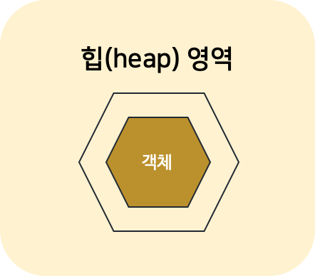
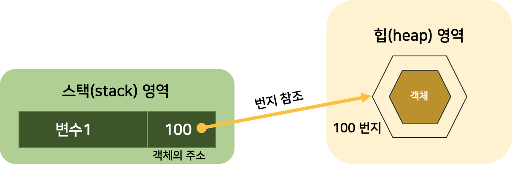
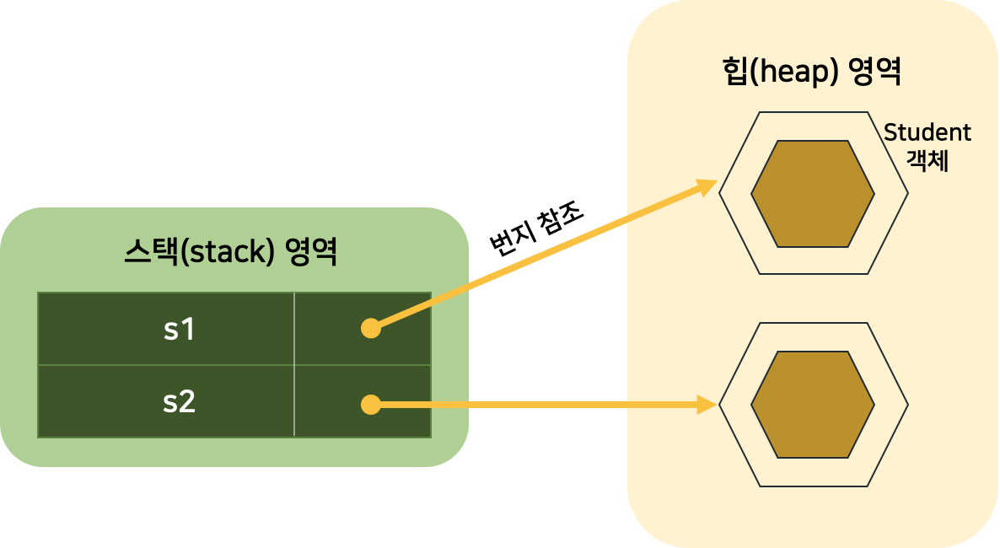
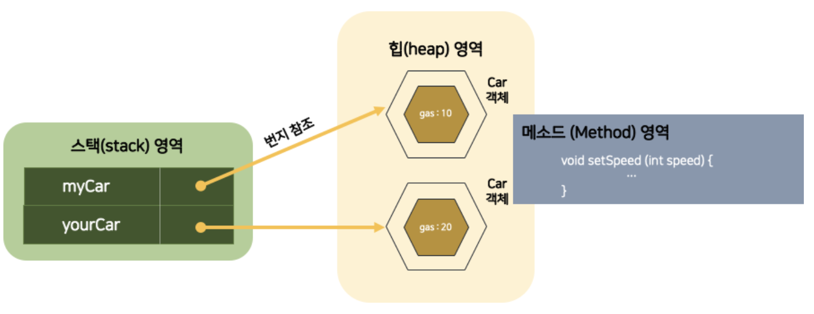

# [5주차 과제] 클래스

### 1. 클래스 정의하는 방법

### 2. 객체 만드는 방법 (new 키워드 이해하기)

### 3. 메소드 정의하는 방법

### 4. 생성자 정의하는 방법

### 5. this 키워드 이해하기

# 0. 객체

Object : 물리적으로 존재하거나 추상적으로 생각할 수 있는 것 중, 자신의 속성을 가지고 있고 다른 것과 구별되는 것

- 객체는 속성과 동작으로 구성
  - 속성 = 필드 (field)
  - 동작 = 메소드 (Method)

## 1. 객체의 상호작용

- 객체들은 각각 독립적으로 존재하고, 다른 객체와 서로 상호작용 하면서 동작
- 객체들 간 상호작용 수단 → **메소드**
- 객체가 다른 객체의 기능을 이용하는 것 → **메소드 호출**

## 2. 객체 간의 관계

- 객체는 개별적으로 사용될 수 있지만, 대부분 다른 객체와 관계를 맺고 있음
  - 집합 관계 : 객체 중 하나는 부품, 하나는 완성품
  - 사용 관계 : 객체 간의 상호작용 - 객체는 다른 객체의 메소드를 호출하여 원하는 결과를 얻어냄
  - 상속 관계 : 상위 객체(종류) 를 기반으로 하위 객체(구체적인 사물) 를 생성하는 관계

## 3. 객체 지향 프로그래밍

- 현실 세계에서 어떤 제품을 만들 때, 부품을 먼저 개발하고 이 부품들을 하나씩 조립해서 완성된 제품을 만들 듯,

  소프트웨어 개발 시에도 부품에 해당하는 객체들을 먼저 만들고, 이것들을 하나씩 조립해서 완성된 프로그램을 만드는 기법 ⇒ **객체 지향 프로그래밍 (OOP : Object Oriented Programming)**

### 객체 지향 프로그래밍의 특징

### 캡슐화, 상속, 다형성

### 캡슐화 (Encapsulation)

- 객체의 필드, 메소드를 하나로 묶고, 실제 구현 내용을 감추는 것
- 외부 객체는 객체 내부 구조를 알지 못하며, 객체가 노출해서 제공하는 **필드**와 **메소드**만 이용할 수 있음
- 왜 캡슐화 ?
  - 외부의 잘못된 사용으로 인해 객체가 손상되는 것을 방지
- 접근 제한자 (Access Modifier)를 통해 캡슐화

### 상속 (Inheritance)

- 상위 객체가 가지고 있는 필드와 메소드를 하위 객체에게 물려주어 하위 객체가 사용할 수 있도록 하는 것
- 상위 객체를 재사용해서 하위 객체를 쉽고 빨리 설계할 수 있도록 도와주고, 이미 잘 개발된 객체를 재사용해서 새로운 객체를 만들기 때문에 → 반복된 코드의 중복을 줄여줌
- 상위 객체의 수정으로 모든 하위 객체들의 수정 효과를 가져오므로 → 유지 보수 시간 최소화

### 다형성 (Polymorphism)

- 같은 타입이지만 실행 결과가 다양한 객체를 이용할 수 있는 성질
- 하나의 타입에 여러 객체를 대입함으로써 다양한 기능을 이용할 수 있도록 해줌
- **부모 클래스 또는 인터페이스의 타입 변환**을 허용하여 다형성
- 부모 타입에는 모든 자식 객체가 대입될 수 있고 인터페이스 타입에는 모든 구현 객체가 대입 될 수 있음
- 다형성의 효과 → **객체의 부품화**
- ex) 자동차를 설계할 때 타이어 인터페이스 타입을 적용했다면, 이 인터페이스를 구현한 실제 타이어들은 어떤 것이든 **상관없이 장착 (대입)이 가능**


# 1. 클래스 정의하는 방법

## 1. 클래스란

- 설계도 : 클래스 (class)
- 클래스로부터 만들어진 객체 : 인스턴스 (instance)
- 클래스로부터 객체를 만드는 과정 : **인스턴스화**

## 2. 클래스 정의하는 방법

### 클래스 이름의 작성 규칙

| 번호 | 작성 규칙                                   | 예시                         |
| ---- | ------------------------------------------- | ---------------------------- |
| 1    | 하나 이상의 문자로 이루어져야 한다.         | Car, SportsCar               |
| 2    | 첫 번째 글자는 숫자가 올 수 없다.           | Car, 3Car(x)                 |
| 3    | '$', '_' 이외의 특수 문자는 사용할 수 없다. | $Car, _Car, @Car(x), #Car(x) |
| 4    | 자바 키워드는 사용할 수 없다.               | int(x), float(x)             |

- 클래스 이름이 단일 단어 → 첫 자를 대문자로, 나머지는 소문자

- 클래스 이름에 서로 다른 단어가 혼합된 경우 → 각 단어의 첫 머리 글자는 대문자로 작성

  ```java
  Calculator, Car, Member, ChatClient, ChatServer, Web_Browser
  ```

#### 클래스 이름을 정했다면, `클래스이름.java` 로 소스파일을 생성해야 함

- 소스 파일 역시 대소문자를 구분하므로 클래스 이름과 대소문자가 같도록 해야함

  ```java
  public class 클래스이름 {
  
  }
  ```

- public class 키워드는 클래스를 선언할 때 사용하며, 반드시 소문자로 작성해야 함
- 클래스 이름 뒤에는 중괄호 `{}`를 붙여주는데, `{ ` 은 클래스 선언의 시작을 알려주고`}`은 클래스 선언의 끝을 알려줌

#### Car 클래스 선언하기

```java
public class Car {

}
```

- 일반적으로 소스 파일당 하나의 클래스를 선언함

# 3. 클래스의 구성 멤버

### 클래스에는 객체가 가져야 할 구성 멤버

1. 필드 (Field)

2. 생성자 (Constructor)

3. 메소드 (Method)

   ```java
   public class ClassName {
   
   			int fieldName; // 필드
   			
   			ClassName() { ... } // 생성자
   			
   			void methodName() { ... } // 메소드
   }
   ```

   

## 1. 필드

- 객체의 고유 데이터, 부품 객체, 상태 정보를 저장하는 곳
- 선언 형태는 변수와 비슷함

### 변수

- 생성자와 메소드 내에서만 사용되고 생성자와 메소드가 실행 종료되면 자동 소멸

### 필드

- 생성자와 메소드 전체에서 사용되며 객체가 소멸되지 않는 한 객체와 함께 존재

### 필드 선언

- 클래스 중괄호 블록 어디서든 존재 가능

  ```java
  타입 필드 [= 초기값];
  ```

  - Car 클래스 내의 필드

  ```java
  /* Car 클래스 필드 선언 */
  public class Car {
      String company = "현대자동차";
      String model = "그랜저";
      String color = "검정";
      int maxSpeed = 350;
      int speed;
  }
  ```

### 필드 사용

- 필드 값을 읽고, 변경하는 작업

- 클래스 내부에서 사용 -> 단순히 필드 이름으로 읽고 변경하면 됨

- 클래스 외부에서 사용할 경우, 우선적으로 클래스로부터 객체를 생성한 뒤 필드를 사용해야 함

  ```java
  Car myCar = new Car();
  ```

  - myCar 변수가 Car 객체를 참조하게 되면, `. 연산자` 를 사용해서 speed 필드에 접근할 수 있음

    > **. 연산자**
    >
    > 객체 접근 연산자
    >
    > - 객체가 가지고 있는 필드나, 메소드를 사용하고자 할 때 사용됨

    ```java
    myCar.speed = 60; // Car 객체의 speed값을 60으로 변경
    ```

```java
/* 외부 클래스에서 Car 필드값 읽기와 변경 */
public class CarExample {
    public static void main(String[] args) {
        // 객체 생성
        Car myCar = new Car();

        // 필드값 읽기
        System.out.println("제작 회사 : " + myCar.company);
        System.out.println("모델명 : " + myCar.model);
        System.out.println("색깔 : " + myCar.color);
        System.out.println("최고 속도 : " + myCar.maxSpeed);
        System.out.println("현재 속도 : " + myCar.speed);

        // 필드값 변경
        myCar.speed = 60;
        System.out.println("수정된 속도 : " + myCar.speed);
    }
}
/* Result
    제작 회사 : 현대자동차
    모델명 : 그랜저
    색깔 : 검정
    최고 속도 : 350
    현재 속도 : 0
    수정된 속도 : 60
*/
```

## 2. 생성자

- **new 연산자로 호출되는 특별한 중괄호 {} 블록**
- 객체 생성 시 초기화를 담당
- 필드를 초기화하거나 메소드를 호출해서 객체를 사용할 준비를 함
- 메소드와 비슷하게 생겼지만, 클래스 이름으로 되어있고 리턴 타입이 없음

## 3. 메소드

- **객체의 동작에 해당하는 중괄호 {} 블록**
- 메소드를 호출하게 되면 중괄호 블록에 있는 모든 코드들이 일괄적으로 실행됨
- 객체 간의 데이터 전달의 수단으로 사용됨


# 2. 객체 만드는 방법

### 클래스로부터 객체를 생성하는 방법

- new 연산자 사용

  ```java
  new 클래스();
  ```

  



[출처] : 이것이 자바다 - 신용권의 Java 프로그래밍 정복 1권 p.194

### new

- 클래스로부터 객체를 생성시키는 연산자
- new 연산자 뒤에는 생성자가 옴
- 생성자는 `클래스()` 형태를 가지고 있음
- new 연산자로 생성된 객체는 메모리 힙(heap) 영역에 생성됨
- 객체 지향에서는 메모리 내에서 생성된 객체의 위치를 모르면 객체를 사용할 수 없음
  - **new 연산자**는 힙 영역에 객체를 생성시킨 후, **객체의 주소를 리턴**하도록 되어있음
  - 리턴한 주소를 **참조 타입인 클래스 변수에 저장해두면, 변수를 통해 객체를 사용할 수 있음**

#### 클래스 타입으로 선언된 변수에 new 연산자가 리턴한 객체의 주소를 저장

```java
클래스 변수;
변수 = new 클래스();
```

##### 클래스 변수 선언과 객체 생성을 한 개의 실행문으로 작성

```java
클래스 변수 = new 클래스();
```

#### new 연산자로 객체를 생성하고 리턴된 객체의 주소를 변수에 저장하여 변수가 객체를 참조



[출처] : 이것이 자바다 - 신용권의 Java 프로그래밍 정복 1권 p.194

### 클래스 선언부터 생성까지의 예제

```java
/* 클래스 선언 */
public class Student {
}
```

```java
/* 클래스로부터 객체 생성 */
public class StudentExample {
    public static void main(String[] args) {
        Student s1 = new Student();
        System.out.println("s1 변수가 Student 객체를 참조합니다.");

        Student s2 = new Student();
        System.out.println("s2 변수가 또 다른 Student 객체를 참조합니다.")
    }
}
```

- 예제가 실행되면 아래와 같이 메모리에 클래스 변수와 객체가 생성됨
- Student 클래스는 하나지만 new 연산자를 사용한 만큼 객체가 메모리에 생성됨
  - 객체들 : Student 클래스의 인스턴스들
    - 같은 클래스에서 생성되었지만 Student 객체는 자신만의 고유 데이터를 가지면서 메모리에서 활동
    - s1과 s2가 참조하는 Student 객체는 완전히 독립된 서로 다른 객체



[출처] : 이것이 자바다 - 신용권의 Java 프로그래밍 정복 1권 p.196

# 3. 메소드 정의하는 방법

## 1. 메소드

- 객체의 동작에 해당하는 중괄호 {} 블록
- 중괄호 블록의 이름 = 메소드 이름

### 메소드 선언

- 선언부 (리턴타입, 메소드이름, 매개변수선언)와 실행 블록으로 구성됨
  - 선언부 = 메소드 시그니처

```java
리턴타입 메소드이름 ([매개변수선언, ... ]) {
		
		실행할 코드를 작성하는 곳
		
}
```

### 리턴 타입

- 메소드가 실행 후 리턴하는 값의 타입
- 메소드는 리턴값이 있을 수도 있고 없을 수도 있음
- 메소드가 실행 후 결과를 호출한 곳에 넘겨줄 경우에는 리턴값이 있어야 함

### 메소드 이름

- 자바 식별자 규칙에 맞게 작성하면 됨

1. 숫자로 시작하면 안되고, $와 _를 제외한 특수문자를 사용하지 말아야 한다
2. 관례적으로 메소드명은 소문자로 작성한다
3. 서로 다른 단어가 혼합된 이름이라면 뒤이어 오는 단어의 첫머리 글자는 대문자로 작성한다(CamelCase)

### 매개 변수 선언

- 매개변수 = 메소드가 실행할 때 필요한 데이터를 외부로부터 받기 위해 사용

### 메소드 선언 및 호출 예제

```java
/* 메소드 선언 */
public class Calculator {
    // 메소드
    void powerOn() {
        System.out.println("전원을 켭니다");
    }

    int plus(int x, int y) {
        int result = x + y;
        return result;
    }

    double divide(int x, int y) {
        double result = (double) x / (double) y;
        return result;
    }

    void powerOff() {
        System.out.println("전원을 끕니다");
    }
}
```

```java
/* 메소드 호출 */
public class CalculatorExample {
    public static void main(String[] args) {
        Calculator myCalc = new Calculator();
        myCalc.powerOn();

        int result1 = myCalc.plus(5,6);
        System.out.println("result1 : " + result1);

        byte x = 10;
        byte y = 4;
        double result = myCalc.divide(x,y);
        System.out.println("result2 : " + result2);

        myCalc.powerOff();
    }
}
/*Result
    전원을 켭니다
    result1 : 11
    result2 : 2.5
    전원을 끕니다
 */
```

### 매개 변수의 수를 모를 경우 예제

- 매개 변수의 개수가 정해져있는 것이 일반적이지만, 경우에 따라 메소드 선언 시 매개 변수의 개수를 알 수 없는 경우가 있다. 
- 매개 변수를 배열 타입으로 선언하여 해결한다
  - 메소드 호출 시 배열을 넘겨줌으로써 배열의 항목 값들을 모두 전달할 수 있다
- 매개 변수를 `...` 을 사용해서 선언하여 해결한다
  - 메소드 호출 시 넘겨준 값의 수에 따라 자동으로 배열이 생성되고 매개값으로 사용된다.

```java
/* 매개 변수의 수를 모를 경우 */
public class Computer {
    int sum1(int[] values) {
        int sum = 0;
        for (int i=0;i<values.length;i++) {
            sum += values[i];
        }

        return sum;
    }

    int sum2(int ... values) {
        int sum = 0;
        for (int i=0;i<values.length; i++) {
            sum += values[i];
        }
        return sum;
    }
}
```


## 2. Return 문

### 1. 리턴값이 있는 메소드

- 반드시 return 문을 사용해서 리턴값을 지정해야 함
  - return문 없으면 → 컴파일 오류
  - return문 실행되면 → 메소드 즉시 종료
- Return문의 return 값은 리턴 타입이거나, 리턴 타입으로 변환될 수 있어야 함

```java
int plus(int x, int y) {
		int result = x + y;
		return result;
}
```

------

```java
int plus(int x, int y) {
		byte result = (byte) (x + y);
		return result; }
```

- return 값이 int 이지만, 메소드 내에서 byte, short, int 타입의 값이 리턴되도 상관 없음 (자동 형변환 되므로)

- return문 이후에 실행문이 오는 경우 → **Unreachable code (컴파일 오류)**

  ```java
  int plus (int x, int y) {
  		int result = x + y;
  		return result;
  		System.out.println(result); // Unreachable code
  }
  ```

### 2. 리턴값이 없는 메소드 (void)

- void로 선언된  리턴값이 없는 메소드도 return 문을 사용 가능 → **return 문 만나면 메소드 실행 강제 종료**

- Return문 예제

  ```java
  /* return 문 */
  public class Car {
      // 필드 
      int gas;
  
      // 생성자
  
      // 메소드
      void setGas(int gas) {
          this.gas = gas;
      }
  
      boolean isLeftGas() {
          if (gas == 0) {
              System.out.println("gas가 없습니다");
              return false;
          } else {
              System.out.println("gas가 있습니다");
              return true;
          }
      }
      void run() {
          while (true) {
              if (gas > 0) {
                  System.out.println("달립니다. (gas 잔량 : " + gas + ")");
                  gas -= 1;
              } else {
                  System.out.println("멈춥니다. (gas 잔량 : " + gas + ")");
                  return; // run() 메소드 실행 강제 종료, 메소드 실행 종료 말고, while문만 나가려면 -> break문 이용하자
              }
          }
      }
  }
  ```

  ```java
  /**return 문 - 사용 */
  public class CarExample {
      public static void main(Stirng[] args) {
          Car myCar = new Car();
  
          myCar.setGas(5); // Car 클래스의 setGas 메소드 호출
  
          boolean gasState = myCar.isLeftGas(); // Car 클래스의 isLeftGas 메소드 호출
          if (gasState) {
              System.out.println("출발합니다.");
              myCar.run();
          }
  
          if (myCar.isLeftGas()) { // 조건식으로 메소드 호출 (isLeftGas() 메소드가 boolean을 리턴하기 때문에 가능)
              System.out.println("gas를 주입할 필요가 없습니다.");
          } else {
              System.out.println("gas를 주입하세요.");
          }
      }
  }
  /*Result
  gas가 있습니다.
  출발합니다.
  달립니다. (gas잔량 : 5)
  달립니다. (gas잔량 : 4)
  달립니다. (gas잔량 : 3)
  달립니다. (gas잔량 : 2)
  달립니다. (gas잔량 : 1)
  멈춥니다. (gas잔량 : 0)
  gas가 없습니다.
  gas를 주입하세요.
  */
  ```

## 3. 메소드 호출

- 메소드는 클래스 내/외부의 호출에 의해 실행됨
- 클래스 내부의 다른 메소드에서 호출할 때 → 메소드 이름으로 호출
- 클래스 외부에서 호출할 때 → 클래스로부터 객체 생성 → 참조 변수를 이용해서 메소드 호출
  - 객체가 존재해야 메소드도 존재하기 때문

### 객체 내부에서 호출 (클래스 내부에서 다른 메소드 호출)

```java
메소드(매개값, ...); // return 값 안 받고 싶을 때의 메소드 호출
타입 변수 = 메소드(매개값, ...); // return값 받고 싶을 때의 메소드 호출
public class ClassName {
		void method1(String p1, int p2) {
				....
		}

		void method2() {
				method1("홍길동", 100);
		}
}
```

- return 값 받는 변수는 **메소드 리턴 타입과 동일하거나, 자동 타입 변환이 될 수 있어야 함**

- 클래스 내부에서 메소드 호출

  ```java
  /* 클래스 내부에서 메소드 호출 */
  public class Calculator {
      int plus(int x, int y) {
          int result = x + y;
          return result;
      }
  
      double avg(int x, int y) {
          double sum = plus(x, y);
          double result = sum / 2;
          return result;
      }
  
      void execute() {
          double result = avg(7,10);
          println("실행 결과 : " + result);
      }
  
      void println(String message) {
          System.out.println(message);
      }
  }
  ```

  ```java
  public class CalculatorExample {
      public static void main(String[] args) {
          Calculator myCalc = new Calculator();
          myCalc.execute(); // Calculator 클래스의 execute() 메소드 실행
      }
  }
  /*Result
      실행 결과 : 8.5
   */
  ```

  

### 객체 외부에서 호출

- 클래스로부터 객체를 생성 → 메소드 호출

  - 메소드는 객체에 소속된 멤버이므로 객체가 존재하지 않으면 메소드도 존재하지 않기 때문

  ```java
  클래스 참조변수 = new 클래스(매개값, ...);
  ```

  - 객체 생성 후, . 연산자로 메소드 호출 (. 연산자 : 객체 접근 연산자 → 객체가 가지고 있는 필드나 메소드에 접근할 때 사용됨)

    ```java
    참조변수.메소드(매개값,...); // 리턴값이 없거나, 있어도 리턴값을 받지 않을 경우
    타입 변수 = 참조변수.메소드(매개값,...); // 리턴값이 있고, 리턴값을 받고 싶은 경우
    ```

- 클래스 외부에서 메소드 호출

  ```java
  /* 클래스 외부에서 메소드 호출 */
  public class Car {
      // 필드
      int speed;
  
      // 생성자
      
      // 메소드
      int getSpeed() {
          return speed;
      }
  
      void KeyTurnOn() {
          System.out.println("키를 돌립니다.");
      }
  
      void run() {
          for (int i=0; i<=50; i+=10) {
              speed += i;
              System.out.println("달립니다. (시속 : " + speed + "km/h)");
          }
      }
  }
  ```

  ```java
  /*클래스 외부에서 메소드 호출 */
  public class CarExample {
      public static void main(String[] args) {
          Car myCar = new Car();
          myCar.KeyTurnOn();
          myCar.run();
          int speed = myCar.getSpeed();
          System.out.println("현재 속도 : " + speed + "km/h");
      }
  }
  /* Result
      키를 돌립니다.
      달립니다. (시속 : 10km/h)
      달립니다. (시속 : 20km/h)
      달립니다. (시속 : 30km/h)
      달립니다. (시속 : 40km/h)
      달립니다. (시속 : 50km/h)
   */
  ```

  

## 4. 메소드 오버로딩

Method Overloading : 클래스 내 같은 이름의 메소드를 여러 개 선언하는 것

### 메소드 오버로딩의 조건

1. 매개 변수의 타입
2. 개수
3. 순서

위 3개 중 하나가 달라야 함

- 오버로딩된 메소드를 호출할 경우, JVM은 **매개 변수의 타입**을 보고 메소드를 선택

```java
int plus(int x, int y) {
		int result = x + y;
		return result;
}

double plus(double x, double y) {
		double result = x + y;
		return result;
}

int x = 10;
double y = 20.3;
plus(x, y); // 어떤 메소드가 실행될까?
```

- 컴파일 오류가 날 것 같지만, 

  plus(double x, double y)

   메소드가 실행됨

  - 왜?
    - JVM은 일차적으로 매개변수 타입을 보고 메소드를 선택
    - 매개 변수의 타입이 일치하지 않을 경우, **자동 타입 변환이 가능한지**를 보고 메소드 선택

### **메소드 오버로딩이 아닌 경우**

- 매개 변수의 타입과 개수와 순서가 똑같을 경우, **매개변수 이름만 바꾸는 것**

- 매개 변수의 타입과 개수와 순서가 똑같을 경우, 

  리턴 타입만 다르게 바꾸는 것

  - **리턴 타입**은 **자바 가상 기계가 메소드를 선택**할 때, 아무런 도움을 줄 수 없기 때문 → 컴파일 오류

    ```java
    int divide(int x, int y) {}
    double divide(int boonja, int boonmo) {} // 컴파일 오류
    ```

### 메소드 오버로딩의 가장 대표적인 예시 : System.out.println()

- 메소드 오버로딩 예제

  ```java
  /* 메소드 오버로딩 */
  public class Calculator {
  		// 정사각형의 넓이
      double areaRectangle(double width) {
          return width * width;
      }
  
  		// 직사각형의 넓이
      double areaRectangle(double width, double height) {
          return width * height;
      }
  }
  ```


# 4. 생성자 정의하는 방법

### 생성자

- 객체를 생성할 때 호출되어 객체의 초기화를 담당
- 객체 초기화
  - 필드를 초기화하거나, 메소드를 호출해서 객체를 사용할 준비를 함
- 생성자를 실행시키지 않고는 클래스로부터 객체를 만들 수 없음
- new 연산자에 의해 생성자가 성공적으로 실행되면 heap 영역에 객체가 생성되고 객체의 주소가 리턴됨
- 리턴된 객체의 주소는 클래스 타입 변수에 저장되어 객체에 접근할 때 이용됨
- 만약 생성자가 성공적으로 실행되지 않고 예외가 발생했다면 객체는 생성되지 않음

- **new 연산자로 호출되는 특별한 중괄호 {} 블록**

## 1. 기본 생성자

- 모든 클래스는 생성자가 반드시 존재하며, 하나 이상을 가질 수 있음

- 클래스 내부에 생성자 선언을 생략했다면, 컴파일러는 자동으로 중괄호 {} 블록 내용이 비어있는 기본 생성자를 바이트 코드에 자동 추가시킴

  ```java
  [public] 클래스() {}
  ```

  - 클래스가 public class로 선언되면 기본 생성자에서도 public이 붙지만, 클래스가 public 없이 class로만 선언되면 기본 생성자에도 public이 붙지 않음

## 2. 생성자 선언

```java
클래스 (매개변수선언, ... ) {
		// 객체의 초기화 코드
}
```

- 메소드와 비슷한 모양을 가지고 있으나, 리턴 타입이 없고 클래스 이름과 동일함
- 생성자 블록 내부에서는 객체 초기화 코드가 작성되는데, 일반적으로 필드에 초기값을 저장하거나 메소드를 호출하여 객체 사용 전에 필요한 준비를 함

### 생성자 선언 및 생성자 호출하여 객체 생성 예제

```java
/* 생성자 선언 */
public class Car {
    Car (String color, int cc) {
    }
}
```

```java
public class CarExample {
    public static void main(String[] args) {
        Car myCar = new Car("검정", 3000);
        //  Car myCar = new Car(); // 클래스에 생성자가 명시적으로 선언되어 있으므로, 기본 생성자를 호출하여 객체를 생성할 수 없음
    }
}
```

#### 클래스에 생성자가 명시적으로 선언되어 있을 경우에는 반드시 선언된 생성자를 호출해서 객체를 생성해야 함

## 3. 생성자에서 필드 초기화

- 클래스로부터 객체가 생성될 때 필드는 기본 초기값으로 자동 설정됨
- 다른 값으로 초기화를 하고 싶다면 두 가지 방법이 있음
  1. 필드를 선언할 때 초기값을 준다
     - 동일한 클래스로부터 생성되는 객체들은 모두 같은 데이터를 갖게 된다
     - 객체 생성 시점에는 필드의 값이 모두 같다
  2. 생성자에서 초기값을 준다
     - 객체 생성 시점에 외부에서 제공되는 다양한 값들로 초기화되어야 하는 경우 유용하다

### 생성자에서 필드 초기화 예제

```java
/* 생성자에서 필드 초기화 */
public class Korean {
    // 필드
    String nation = "대한민국";
    String name;
    String ssn;

    // 생성자
    public Korean(String name, String ssn) {
        // name = n;
        // ssn = s;
        // 가독성을 위해 초기화시킬 필드 이름과 매개변수명을 동일하게 사용
        this.name = name;
        this.ssn = ssn;
    }
    
}
```

```java

/* 객체 생성 후 필드 값 출력 */
public class KoreanExample {
    public static void main(String[] args) {
        Korean k1 = new Korean("박자바", "011225-1234567");
        System.out.println("k1.name : " + k1.name);
        System.out.println("k1.ssn : " + k1.ssn);
    }
}
```


#5. this 키워드 이해하기

## 1. 인스턴스 멤버와 this

### 인스턴스 (instance) 멤버

- 객체(인스턴스)를 생성한 후 사용할 수 있는 필드와 메소드
  - 인스턴스 필드
  - 인스턴스 메소드

→ 객체를 생성하지 않고서는 사용 불가능

```java
public class Car {
		// 필드
		int gas;

		// 메소드
		void setSpeed(int speed) { ... }
}
Car myCar = new Car();
myCar.gas = 10;
myCar.setSpeed(60);

Car yourCar = new Car();
yourCar.gas = 20;
yourCar.setSpeed(80);
```



[출처] : 이것이 자바다 - 신용권의 Java 프로그래밍 정복 1권 p.234

- 인스턴스 필드 : 객체마다 따로 존재

- 인스턴스 메소드 : 메소드 영역에 저장되고 공유 (객체마다 존재 X)

- 객체 외부에서 인스턴스 멤버에 접근하기 위해 참조 변수를 이용하는 것 처럼 객체 내부에서도 인스턴스 멤버에 접근 가능

  - 생성자와 메소드의 매개 변수 이름이 필드와 동일한 경우,

    - this를 이용하여

      - 인스턴스 멤버인 필드임을 명시

      ```java
      Car(String model) {
      		this.model = model; // this로 인스턴스 멤버인 필드임을 명시
      }
      
      void setModel(String model) {
      		this.model = model; // this로 인스턴스 멤버인 필드임을 명시
      }
      ```

- 인스턴스 멤버와 this 예제

  ```java
  /* 인스턴스 멤버와 this */
  public class Car {
      // 필드
      String model;
      int speed;
  
      // 생성자
      Car(String model) {
          this.model;
      }
  
      // 메소드
      void setSpeed(int speed) {
          this.speed = speed;
      }
  
      void run() {
          for (int i=10;i<=50; i+=10) {
              this.setSpeed(i);
              System,out.println(this.model + "가 달립니다. (시속 : " + this.speed + "km/h)");
          }
      }
  }
  
  public class CarExample {
      public static void main(String[] args) {
          Car myCar = new Car("포르쉐");
          Car yourCar = new Car("벤츠");
  
          myCar.run();
          yourCar.run();
      }
  }
  ```

  

## 2. 다른 생성자 호출

### 생성자에서 다른 생성자를 호출할 때 this() 키워드를 이용

```java
클래스 ([매개변수선언, ... ]) {
			this(매개변수, ..., 값, ...); // 클래스의 다른 생성자 호출
			실행문
}
```

### this() 

- 자신의 다른 생성자를 호출하는 코드
- 반드시 생성자의 첫줄에서만 허용됨
- this()의 매객밧은 호출되는 생성자의 매개 변수 타입에 맞게 제공해야 함

### 생성자 오버로딩에서 생기는 중복 코드 제거하는 예제

#### 원래 생성자의 오버로딩 예제

```java

/* 생성자의 오버로딩 */
public class Car {
    // 필드 
    String company = "현대자동차";
    String model;
    String color;
    int maxSpeed;

    // Constructor
    Car() {
    }

    Car(String model) {
        this.model = model;
    }

    Car(String model, String color) {
        this.model = model;
        this.color = color;
    }

    Car(String model, String color, int maxSpeed) {
        this.model = model;
        this.color = color;
        this.maxSpeed = maxSpeed;
    }
}
```

#### 중복 코드를 줄인 예시

```java
/* 다른 생성자를 호출해서 중복 코드 줄이기 */
public class Car {
    // 필드 
    String company = "현대자동차";
    String model;
    String color;
    int maxSpeed;

    Car() {}

    Car(String model) {
        this(model, "은색", 250);
    }

    Car(String model, String color) {
        this(model, color, 250);
    }

    Car(String model, String color, int maxSpeed) {
        this.model = model;
        this.color = color;
        this.maxSpeed = maxSpeed;
    }
}
```

```java
/* 객체 생성 시 생성자 선택 */
public class CarExample {
    public static void main(String[] args) {
        Car car1 = new Car();
        System.out.println("car1.company : " + car1.company);
        
        Car car2 = new Car("자가용");
        System.out.println("car2.company : " + car2;company);
        System.out.println("car2.model : " + car2.model);

        Car car3 = new Car("자가용", "빨강");
        System.out.println("car3.company : " + car3.company);
        System.out.println("car3.model : " + car3.model);
        System.out.println("car3.color : " + car3.color);

        Car car4 = new Car("택시", "검정", 200);
        System.out.println("car4.company : " + car4.company);
        System.out.println("car4.model : " + car4.model);
        System.out.println("car4.color : " + car4.color);
        System.out.println("car4.maxSpeed : " + car4.maxSpeed);
    }
}

/*Result
    car1.company : 현대자동차
    car2.company : 현대자동차
    car2.model : 자가용
    car3.company : 현대자동차
    car3.model : 자가용
    car3.color : 빨강
    car4.company : 현대자동차
    car4.model : 택시
    car4.color : 검정
    car4.maxSpeed : 200
 */
```


## Reference

- 신용권, 『이것이 자바다』, 한빛미디어(2015), p.186 ~ p.235