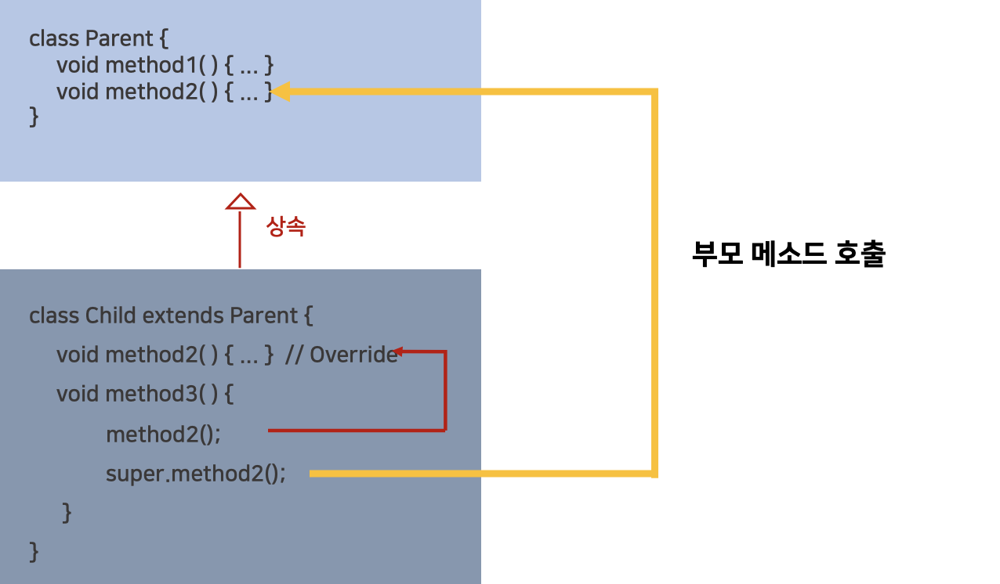
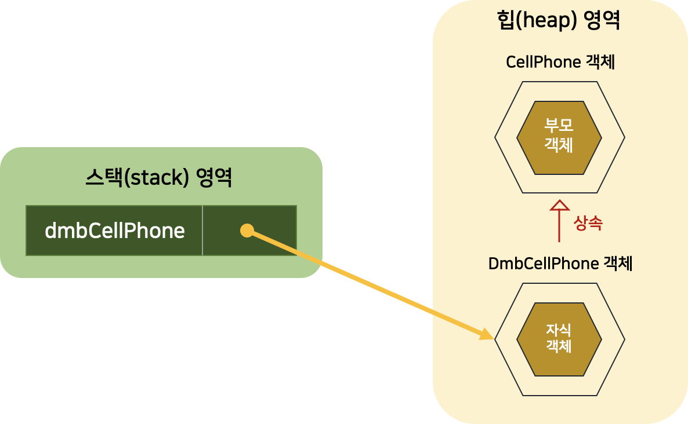
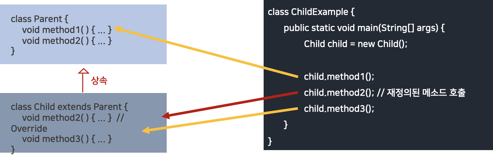

# [6주차 과제] 상속

### 1. 자바 상속의 특징

### 2. super 키워드

### 3. 메소드 오버라이딩

### 4. 다이나믹 메소드 디스패치 (Dynamic Method Dispatch)

### 5. 추상 클래스

### 6. final 키워드

### 7. Object 클래스


# 1. 자바 상속의 특징

## 1. 상속

### 부모 클래스(상위 클래스)의 멤버를 자식 클래스(하위 클래스)에게 물려주는 것

```java
class 자식클래스 extends 부모클래스 { ... }
```

### 상속의 장점

1. 코드의 중복을 줄여줌
2. 개발 시간 줄여줌
3. 수정을 최소화 → 유지 보수 시간 최소화
   - 부모 클래스의 수정으로 모든 자식 클래스들의 수정 효과를 가져오기 때문

## 2. 상속의 특징

### 1.상속을 한다고, 모든 필드와 메소드를 물려 받는 것은 아니다

### 2. 부모 클래스에서 private 접근 제한을 갖는 필드와 메소드는 상속 대상에서 제외된다

### 3. 부모 클래스와 자식 클래스가 다른 패키지에 존재 시 default 접근 제한을 갖는 필드와 메소드는 상속 대상에서 제외된다

### 4. 다중 상속은 불가능하다

- 여러 개의 부모 클래스를 상속할 수 없다
- extends 키워드 뒤에는 단 하나의 부모 클래스만 올 수 있다.

### 상속 예제

```java
// 부모 클래스
public class CellPhone {
    String model;
    String color;

    void powerOn() { System.out.println("전원을 켭니다."); }
    void powerOff() { System.out.println("전원을 끕니다."); }
    void bell() { System.out.println("벨이 울립니다."); }
    void sendVoice(String message) { System.out.println("자기: " + message); }
    void receiveVoice(String message) { System.out.println("상대방 : " + message); }
    void hangUp() { System.out.println("전화를 끊습니다."); }
}
```

```java
// 자식 클래스
public class DmbCellPhone extends CellPhone {
    int channel;

    DmbCellPhone(String model, String color, int channel) {
        this.model = model;
        this.color = color;
        this.channel = channel;
    }

    void turnOnDmb() {
        System.out.println("채널 " + channel + "번 DMB 방송 수신을 시작합니다.");
    }

    void changeChannelDmb(int channel) {
        this.channel = channel;
        System.out.println("채널 " + channel + "번으로 바꿉니다.");
    }

    void turnOffDmb() {
        System.out.println("채널 " + channel + "번 DMB 방송 수신을 멈춥니다.");
    }
}
```

```java
// 상속 실행 예제
public class DmbCellPhoneExample {
    public static void main(String[] args) {
        //  DmbCellPhone 객체 생성
        DmbCellPhone dmbCellPhone = new DmbCellPhone("자바폰", "검정", 10);

        // CellPhone 으로 부터 상속 받은 필드
        System.out.println("모델 : " + dmbCellPhone.model);
        System.out.println("색상 : " + dmbCellPhone.color);

        // DmbCellPhone의 필드
        System.out.println("채널 : " + dmbCellPhone.channel);

        // CellPhone으로부터 상속받은 메소드 호출
        dmbCellPhone.powerOn();
        dmbCellPhone.bell();
        dmbCellPhone.sendVoice("여보세요");
        dmbCellPhone.receiveVoice("자바");
        dmbCellPhone.sendVoice("하이!");
        dmbCellPhone.hangUp();

        // DmbCellPhone의 메소드 호출
        dmbCellPhone.turnOnDmb();
        dmbCellPhone.changeChannelDmb(12);
        dmbCellPhone.turnOffDmb();
        dmbCellPhone.powerOff();
    }
}

/*Result
    모델 : 자바폰
    색상 : 검정
    채널 : 10
    전원을 켭니다.
    벨이 울립니다.
    자기 : 여보세요
    상대방 : 자바
    자기 : 하이!
    전화를 끊습니다.
    채널 10번으로 DMB 방송 수신을 시작합니다.
    채널 12번으로 바꿉니다.
    채널 12번 DMB 방송 수신을 멈춥니다.
    전원을 끕니다.
 */
```

# 2. super 키워드

## 1. super 키워드

### 부모 메소드를 호출 하는 역할

- 자식 클래스에서 부모 클래스의 메소드를 오버라이딩하면, 부모 클래스의 메소드는 숨겨지고 오버라이딩 된 **자식 메소드만 사용하게 된다**

- 그런데, 오버라이딩 된 부모 클래스의 메소드를 호출해야 하는 상황이 필요한 경우가 있다.
- **super 키워드**를 붙여 부모 메소드 호출 가능

#### **super** 는 부모 객체를 참조하고 있다

```java
super.부모메소드();
```



## 2. super()

### 부모의 생성자를 호출하는 역할

- **반드시 자식 생성자의 첫 줄에 위치해야 함**

### 자바에서 자식 객체의 생성 구조

- 자바에서 자식 객체 생성 시, **부모 객체가 먼저 생성되고 자식 객체가 그 다음에 생성됨**

```java
DmbCellPhone dmbCellPhone = new DmbCellPhone();
```



- 부모인 CellPhone 객체가 먼저 생성되고, DmbCellPhone 객체가 생성됨

#### 모든 객체는 클래스의 생성자를 호출해야 생성됨

### 부모 객체를 생성하기 위한 부모 생성자는 어디서 호출하는가?

- **자식 생성자의 맨 첫 줄에서 호출된다**
- 자식 생성자가 명시적으로 선언되지 않았다면, 기본 생성자에서 부모 기본 생성자 호출한다

```java
public DmbCellPhone() {
		super(); // CellPhone(부모) 의 기본 생성자 호출 -> CellPhone 코드에서도 CellPhone의 생성자가 선언되지 않았지만,컴파일러에 의해 기본 생성자가 만들어지므로, 문제없이 실행됨
}
```

### super()의 이용 예시

**직접 자식 생성자를 선언하고 명시적으로 부모 생성자를 호출하고 싶다**

- 매개값의 타입과 일치하는 부모 생성자를 호출 → 해당하는 부모 생성자가 없으면 **컴파일 에러**

```java
자식클래스(매개변수선언, ...) {
		super(매개값, ...); // 명시적으로 부모 생성자 호출
}
```

- **super(매개값, ...) 이 생략되면, 컴파일러에 의해 super() 가 자동으로 추가됨**

  - 그래서, 부모의 **기본 생성자가 존재해야 함**
  - 부모 클래스에 기본 생성자가 없고, 매개 변수가 있는 생성자만 있으면 → 자식 생성자에서 반드시 부모 생성자 호출을 위해 super(매개값, ...) 를 명시적으로 호출해야 함
  - super(매개값, ...) 은 반드시 자식 생성자 첫 줄에 위치해야 함

  → 안그러면 **컴파일 에러**

### super의 예제

```java
// 부모 클래스
public class Airplane {
    public void land() {
        System.out.println("착륙합니다.");
    }

    public void fly() {
        System.out.println("일반비행합니다.");
    }
    
    public void takeOff() {
        System.out.println("이륙합니다.");
    }
}
```

```java
// 자식 클래스
// 오버라이딩 된 부모 클래스의 메소드를 호출해야 하는 상황 -> 명시적으로 super 키워드를 붙여서 호출
public class SuperSonicAirplane extends Airplane {
    public static final int NORMAL = 1;
    public static final int SUPERSONIC = 2;

    public int flyMode = NORMAL;

    @Override
    public void fly() {
        if (flyMode == SUPERSONIC) {
            System.out.println("초음속비행합니다.");
        } else {
            // Airplane 객체의 fly() 메소드 호출 (부모 메소드 호출)
            super.fly();
        }
    }
}
```

```java
// 예시
public class SuperSonicAirplaneExample {
    public static void main(String[] args) {
        SuperSonicAirplane sa = new SuperSonicAirplane();
        sa.takeOff();
        sa.fly();
        sa.flyMode = SuperSonicAirplane.SUPERSONIC;
        sa.fly();
        sa.flyMode = SuperSonicAirplane.NORMAL;
        sa.fly();
        sa.land();
    }
}
/*Result
    이륙합니다.
    일반비행합니다.
    초음속비행합니다.
    일반비행합니다.
    착륙합니다.
 */
```

# 3. 메소드 오버라이딩 (Overriding)

### **상속된 메소드를 자식 클래스에서 다시 수정해서 사용하는 것 **

-  왜 오버라이딩을 이용?  
  - 부모의 메소드가 자식 클래스가 사용하기에 적합하지 않을 수도 있기 때문

### 메소드 재정의 (@Override)

- 상속된 메소드를 자식 클래스에서 **재정의** 하는 것

1. 메소드 오버라이딩 시, 부모 객체의 메소드는 숨겨짐

2. 자식 객체에서 오버라이딩 된 메소드 호출하면 오버라이딩된 자식 메소드가 호출됨



### 메소드 오버라이딩 규칙

1. 부모의 메소드와 동일한 시그너처 (리턴 타입, 메소드 이름, 매개 변수 리스트)를 가져야 함
2. 접근 제한을 더 강하게 오버라이딩 할 수 없음
   - 부모가 public 메소드면 → 자식도 public (default나 private으로 변경할 수 없음)
   - 부모가 default 메소드 → 자식은 defulat or public으로 가능
3. 새로운 예외(Exception)를 throws 할 수 없음

### 오버라이딩 예제

```java
// 부모 클래스
public class Calcuator {
    double areaCircle(double r) {
        System.out.println("Calculator 객체의 areaCircle() 실행");
        return 3.14159 * r * r;
    }
}
```

```java
// 자식 클래스
public class Computer extends Calculator {
    @Override
    double areaCircle(double r) {
        System.out.println("Computer 객체의 areaCircle() 실행");
        return Math.PI * r * r;
    }
}
```

```java
// 예제
public class ComputerExample {
    public static void main(String[] args) {
        int r = 10;

        Calcuator calculator = new Calcuator();
        System.out.println("원면적 : " + calculator.areaCircle(r));
        System.out.println();

        Computer computer = new Computer();
        System.out.println("원면적 : " + computer.areaCircle(r)); // 오버라이딩 된 메소드 호출
    }
}
/* Result
	Calculator 객체의 areaCircle() 실행
	원면적 : 314.159
	Computer 객체의 areaCircle() 실행
	원면적 : 314.1592653589793
*/
```


# 4. 다이나믹 메소드 디스패치 (Dynamic Method Dispatch)

### 다이내믹 메소드 디스패치

- 런타임 때 오버라이딩된 메서드에 대한 호출을 해결하여 런타임 때 다향성을 구현하도록 하는 메커니즘
- 인터페이스나 추상 클래스에 정의된 추상 메소드를 호출하는 경우로, 호출되는 메소드가 런타임 시 동적으로 결정되는 것
- 오버라이딩된 메서드가 참조에 의해 호출되면, 자바는 참조하는 객체의 타입에 따라 실행할 해당 메서드의 버전을 결정한다

# 5. 추상 클래스

## 1. 추상 클래스의 개념

### 클래스들의 공통적인 특성을 추출해서 선언한 클래스

- 그에비해, 객체를 직접 생성할 수 있는 클래스 : 실체 클래스
- 추상 클래스와 실체 클래스는 상속의 관계를 가짐
  - 추상 클래스 : 부모
  - 실체 클래스 : 자식
    - 추상 클래스의 모든 특성을 물려받고, 추가적인 특성을 가질 수 있음
      - 특성
        - 필드, 메소드

## 2. 추상 클래스의 용도

#### 실체 클래스들의 공통적인 특성 (필드, 메소드)을 뽑아내어 추상 클래스로 만드는 이유가 무엇인가?

1. 실체 클래스들의 공통된 필드와 메소드의 이름을 통일할 목적
2. 실체 클래스를 작성할 때 시간을 절약 목적

## 3. 추상 클래스 선언

#### 클래스 선언에 abstract 키워드를 붙여서 선언

```java
public abstract class 클래스 {
		// 필드
		// 생성자
		// 메소드
}
```

- abstract 키워드
  - new 연산자를 이용해서 객체를 만들지 못하고, 상속을 통해 자식 클래스만 만들 수 있음

- 추상 클래스도 일반 클래스와 마찬가지로 필드, 생성자, 메소드 선언을 할 수 있음
- new 연산자로 직접 생성자를 호출할 수는 없지만, 자식 객체가 생성될 때 super(...) 를 호출해서 추상 클래스 객체를 생성하므로 추상 클래스도 생성자가 반드시 있어야 함

### 추상 클래스 예제

```java
//추상 클래스 선언
public abstract class Phone {
    // 필드
    public String owner;

    // 생성자 (추상 클래스도 생성자가 있어야 함 - new 연산자로 직접 생성자를 호출할 수는 없지만, 자식 객체가 생성될 때 super(...)를 호출해서 추상 클래스 객체를 생성하므로 반드시 생성자 필요)
    public Phone(String owner) {
        this.owner = owner;
    }

    // 메소드
    public void turnOn() {
        System.out.println("폰 전원을 켭니다.");
    }

    public void turnOff() {
        System.out.println("폰 전원을 끕니다.");
    }
}
```

```java

// 실체 클래스
public class SmartPhone extends Phone {
    // 생성자
    public SmartPhone(String owner) {
        super(owner);
    }

    // 메소드
    public void internetSearch() {
        System.out.println("인터넷 검색을 합니다.");
    }
}
```

```java
// 예시
public class PhoneExample {
    public static void main(String[] args) {
        // Phone phone = new Phone(); // Phone 클래스는 추상클래스이므로, new 연산자를 통해 직접 생성자를 호출할 수는 없음
        SmartPhone smartPhone = new SmartPhone("홍길동");

        smartPhone.turnOn();
        smartPhone.internetSearch();
        smartPhone.turnOff();
    }
}
/*Result
    폰 전원을 켭니다.
    인터넷 검색을 합니다.
    폰 전원을 끕니다.
*/
```

## 4. 추상 메소드와 오버라이딩

## 1.추상 메소드

- 추상 클래스에서 메소드의 선언부만 있고, 메소드 실행 내용인 중괄호 {} 가 없는 메소드
- 주로, 추상 클래스 설계 시, 하위 클래스가 반드시 실행 내용을 채우도록 강요하고 싶은 메소드가 있는 경우 이용

### 왜 이용?

- 추상 클래스는 실체 클래스가 공통적으로 가져야 할 필드와 메소드들을 정의해 놓은 추상적인 클래스이므로, 실체 클래스의 멤버 (필드, 메소드)를 통일화하는 데 목적이 있다.
- 모든 실체들이 가지고 있는 메소드의 실행 내용이 동일하다면 추상 클래스에 메소드를 작성하는 것이 좋다.
  - 그러나, 메소드의 선언만 통일화하고, 실행 내용은 실체 클래스마다 달라야 하는 경우가 있음
  - 이 경우, 추상 클래스에서 통일적으로 작성할 수 없기 때문에 추상 메소드를 선언할 수 있다

### 특징

- 자식 클래스에서 추상 메소드를 반드시 오버라이딩해서 실행 내용을 작성해야 한다. 그렇지 않으면 컴파일 에러가 발생한다.

##2 .선언 방법

```java
[public | protected] abstract 리턴타입 메소드명(매개변수, ...);
```

#### 일반 메소드 선언과의 차이점

-  abstact 키워드가 붙어있고 메소드 중괄호가 없다

### 추상 메소드 예제

```java
// 추상 메소드 선언
public abstract class Animal {
    public String kind;

    public void breathe() {
        System.out.println("숨을 쉽니다.");
    }

    public abstract void sound(); // 추상 메소드
}
```

 ```java
// 실행 클래스 (Dog)
public class Dog extends Animal {
    public Dog() {
        this.kind = "포유류";
    }

    // 추상 메소드 재정의
    @Override
    public void sound() {
        System.out.println("멍멍");
    }
}
 ```

```java
// 실행 클래스 (Cat)
public class Cat extends Animal {
    public Cat() {
        this.kind = "포유류";
    }

    // 추상 메소드 재정의
    @Override
    public void sound() {
        System.out.println("야옹");
    }
}
```

```java
// 예제
public class AnimalExample {
    public static void main(String[] args) {
        Dog dog = new Dog();
        Cat cat = new Cat();
        dog.sound();
        cat.sound();
        System.out.println("-----");

        // 변수의 자동 타입 변환
        Animal animal = null;
        animal = new Dog(); // 자동 타입 변환
        animal.sound(); // 재정의된 메소드 호출
        animal = new Cat();
        animal.sound();
        System.out.println("-----");

        animalSound(new Dog()); // 자동 타입 변환 --> 자식 클래스에서 오버라이딩 된 경우, 재정의된 메소드 호출
        animalSound(new Cat()); // 자동 타입 변환 --> 자식 클래스에서 오버라이딩 된 경우, 재정의된 메소드 호출
    }

    public static void animalSound(Animal animal) {
        animal.sound();
    }
}

/*Result
    멍멍
    야옹
    -----
    멍멍
    야옹
    -----
    멍멍
    야옹
 */
```

# 6. final 키워드

### final 필드

- 초기값이 저장되면 이것이 최종적인 값이 되어서 프로그램 실행 도중에 수정이 불가능한 필드

```java
final 타입 필드 [=초기값];
```


# 7. Object 클래스

### 자바의 최상위 부모 클래스

- 클래스 선언할 때 `extends` 키워드로 다른 클래스를 상속하지 않으면, 암시적으로 java.lang.Object 클래스를 상속하게 됨
- 자바의 모든 클래스는 Object 클래스의 자식이거나 자손 클래스
- Object 클래스는 필드가 없고, 메소드들로 구성되어 있음
- Object클래스의 메소드들은 모든 클래스가 Object를 상속하기 때문에 모든 클래스에서 사용이 가능