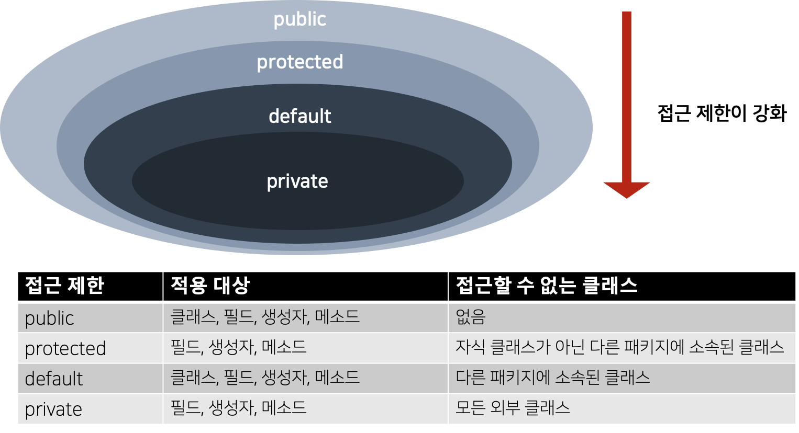
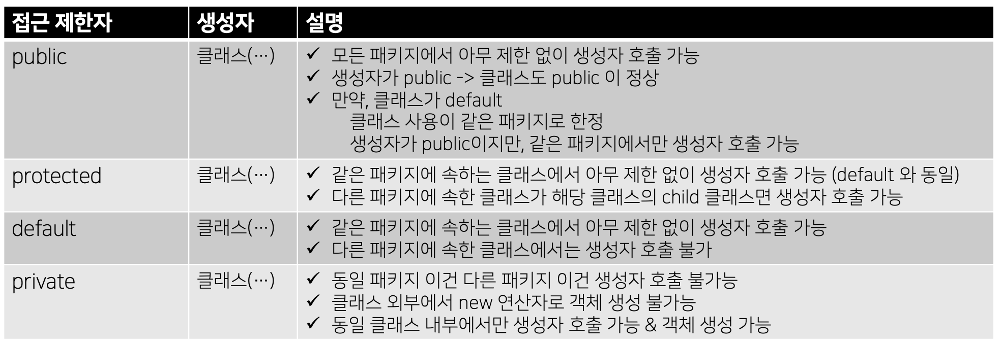
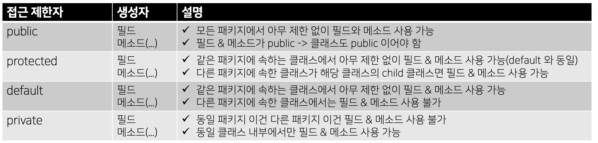

# [7주차 과제] 패키지

### package 키워드

### import 키워드

### 클래스패스

### CLASSPATH 환경변수

### -classpath 옵션

### 접근지시자

# 1. package 키워드

## 1. package

### 클래스를 유일하게 만들어주는 식별자

- 클래스를 체계적으로 관리하기 위해 패키지 (package)를 사용한다.
- 패키지의 물리적인 형태는 파일 시스템의 폴더(디렉토리)이다.

## 2. 패키지 선언

### 패키지 선언의 규칙

```java
package 상위패키지.하위패키지;

public class ClassName { ... }
```

- 숫자로 시작하면 안됨
- _, $ 를 제외한 특수 문자를 사용해서는 안됨
- java로 시작하는 패키지는 자바 표준 API 에서만 사용하므로 사용해서는 안됨
- 모두 소문자로 작성하는 것이 관례

## 3. 패키지 선언이 포함된 클래스 컴파일 방법

- javac 명령어 다음에 -d 옵션을 추가

  ```bash
  javac -d   .            ClassName.java -> 현재 폴더 내에 생성
  javac -d   ..\\bin       ClassName.java -> 현재 폴더와 같은 위치의 bin 폴더에 생성
  javac -d   C:\\Temp\\bin  ClassName.java -> C:\\Temp\\bin 폴더에 생성
  ```

- 실행 시, C:\Temp 폴더로 이동하여 java 명령어 실행해야 함

  ```bash
  C:\\Temp> java sec12.exam01_package_compile.Application
  ```

# 2. import 키워드

## 1. import 키워드

### 다른 패키지에 속하는 클래스를 사용하기 위한 방법

1. 패키지와 클래스를 모두 기술

   ```java
   com.algorithm.HashExample he = new com.algorith.HashExample();
   ```

2. import문으로 선언 & 클래스 사용 시, 패키지를 생략

   ```java
   import com.algorithm.HashExample;
   [ 또는 import com.algorithm.*; ]
   
   HashExample he = new HashExample();
   ```

   - 패키지에 포함된 다수의 클래스를 사용해야 한다면, 클래스별로 import문을 작성할 필요 없이, 클래스 이름을 생략하고 * 를 사용 ( * : 패키지에 속하는 모든 클래스들)

   - **import 문으로 지정된 패키지의 하위 패키지는 import 대상이 아님**

     ```java
     // com.mycompany 패키지에 있는 클래스도 사용해야 하고,
     // com.mycompany.project 패키지에 있는 클래스도 사용해야 할 때
     import com.mycompany.*;
     import com.mycompany.project.*;
     ```

- 패키지 이름 전체를 꼭 기술해야 하는 경우

  - 서로 다른 패키지에 동일한 클래스 이름이 존재하고, 두 패키지가 모두 import 되어 있을 경우

    → 자바 컴파일러는 어떤 패키지에서 클래스를 로딩할지 결정 할 수 없음

    **→ 컴파일 에러 → 패키지 이름 전체 기술 필요**

# 3. 클래스패스

#### 클래스를 찾기 위한 경로

- JVM이 프로그램을 실행하기 위한 클래스파일을 찾는 기준이 되는 경로


#### 클래스패스를 지정할 수 있는 두 가지 방법

1. CLASSPATH 환경변수를 이용
2. java 컴파일 또는 실행 시 -classpath 옵션을 이용


# 4. CLASSPATH 환경변수

### 일일이 여러 개의 클래스 패스를 지정하는 것 외에 환경변수에 클래스패스를 지정하는 방법이 있다

- 일반적으로, 클래스 패스의 환경 변수 이름은 `CLASSPATH` 라고 지정한다.

#### 1. Windows 에서의 CLASSPATH 환경변수 지정 방법

- set 이라는 명령어를 실행

  ```bash
  $ set CLASSPATH=C:\yegenieee\lib\*;c:\yegenieee;
  ```

#### 2. 유닉스 계열에서의 CLASSPATH 환경변수 지정 방법

- export 명령어를 실행

  ```bash
  $ set CLASSPATH=/yegenieee/lib/*:/yegenieee
  ```

#### 유의할 점

- 환경 변수를 실행지정하는 것은 해당 콘솔에서만 사용할 수 있음
  - 즉, cmd 창이나 terminal을 닫으면, 그 설정이 없어진다.
  - 이 단점을 해결하기 위해서는 Windows 계열에서는 OS의 환경 설정값에 지정하면 되고, 유닉스 계열에서는 프로파일(profile) 파일에 설정해주면 된다

# 5. -classpath 옵션

### 자바 파일을 컴파일할 때나 실행할 때 `-classpath` 를  추가한다

- 클래스패스에 디렉터리만 지정해주면, 해당 디렉터리가 프로그램을 실행하는 기본위치가 된다

#### `-classpath` 옵션은 줄여서 `-cp` 로 쓸 수 있음

- `-classpath` 단어와 경로 사이에는 반드시 하나의 공백이 있어야만 함


#### 1. Windows 에서의 --classpath 옵션 사용 방법

```bash
$ java -classpath C:\yegenieee Calculator
$ java -cp C:\yegenieee Calculator
```

- 이렇게 클래스패스에 디렉터리만 지정해주면, 해당 디렉터리가 프로그램을 실행하는 기본위치가 됨
- 패키지가 지정되지 않은 `Calculator` 라는 클래스가 `C:\yegenieee` 라는 디렉토리에 있으면, 어느 경로에서 이 명령을 실행하더라도 전혀 문제가 없다.

#### 2. Unix 계열에서의 --classpath 옵션 사용 방법

```bash
$ java -classpath /yegenieee Calculator
$ java -cp /yegenieee Calculator
```

### 지정된 환경변수(CLASSPATH) 사용 방법

#### 1. Windows

```bash
$ java -cp %CLASSPATH% Calculator
```

#### 2. Unix 계열

```bash
$ java -cp $CLASSPATH Calculator
```


# 6. 접근 지시자 (Access Modifier)

- 라이브러리 클래스 (main() 메소드를 가지지 않는 클래스)는 외부 클래스에서 접근할 수 있는 멤버와 접근 할 수 없는 멤버로 구분해서 필드, 생성자, 메소드를 설계하는 것이 바람직함
- 객체 생성을 막기 위해 생성자를 호출하지 못하게 하거나, 객체의 특정 데이터를 보호하기 위해 해당 필드에 접근하지 못하도록 막아야 함
- 특정 메소드를 호출할 수 없도록 제한해야 함

### → 접근 지시자 를 통해 구현 가능하다

## 1. 접근 지시자



[출처] : 이것이 자바다 - 신용권의 Java 프로그래밍 정복 1권 p.257

- public
  - 외부 클래스가 자유롭게 사용할 수 있는 공개 멤버
- protected
  - 같은 패키지 또는 자식 클래스에서만 사용할 수 있는 멤버
- private
  - 외부에 노출되지 않는 멤버
- default
  - 위 세 가지 접근 제한자가 적용되지 않은 멤버
  - 같은 패키지에 소속된 클래스에서만 사용할 수 있는 멤버

## 2. 클래스의 접근 제한 (public / default)

#### 클래스에 이용하는 접근 지시자의 쟁점

- 같은 패키지 내에서만 사용할 것인지 vs 다른 패키지에서도 사용할 수 있도록 할 것 인지에 대한 지시

### 1. default 접근 제한

→ 같은 패키지에서는 제한 없이 사용 가능, 다른 패키지에서는 사용 불가

```java
class 클래스 { ... }
```

### 2. public 접근 제한

→ 같은 패키지뿐만 아니라 다른 패키지에서도 제한 없이 사용 가능 (필드로 선언 가능)

```java
public class 클래스 { ... }
```

#### 클래스의 접근 제한 예제

- default 접근 제한을 가지는 클래스 A

```java
package ch6.class_example.package1;

class A {} // default 접근 제한
```

- public 접근 제한을 가지는 클래스 B

```java
package ch6.class_example.package1;

public class B {
		A a; // 같은 패키지이므로 B에서 A 사용 가능, 접근 가능 (필드로 선언 가능)
}
```

- B 클래스는  A 클래스와 같은 패키지 내에 있으므로 A 클래스에 접근이 가능하다
  - B 클래스에서 A 클래스를 이용하여 필드 선언 , 생성자 / 메소드 내부에서 변수 선언 가능하다


- 클래스 A와 클래스 B와는 다른 패키지에 있는 클래스 C

```java
package ch6.class_example.package2;

import ch6.class_example.package1.*;

public class C {
	A a; // 불가능
	B b;
}
```

##### 컴파일 에러가 발생

- C 클래스는 A 클래스와 다른 패키지이므로, default 접근 제한에 해당하는 A 클래스에는 접근이 되지 않는다
- B 클래스는 public 으로 공개되어있으므로 접근 가능하다
  - 그래서, C 클래스에서 B 클래스를 이용하여 필드 선언 및 생성자 / 메소드 내부에서 변수 선언이 가능하다

## 3. 생성자의 접근 제한 (public / protected / default / private)

#### 생성자에 이용하는 접근 지시자의 쟁점

- 생성자가 어떤 제한 접근자를 가지냐에따라 생성자 호출 가능 여부를 결정한다 (new  연산자로 생성자 호출 가능 여부 결정)

```java
public class ClassName {
		// public 접근 제한
		public ClassName( ... ) { ... }

		// protected 접근 제한
		protected ClassName( ... ) { ... }

		// default 접근 제한
		default ClassName( ... ) { ... }

		// private 접근 제한
		private ClassName( ... ) { ... }
}
```

- 클래스에 생성자 선언을 하지 않으면, 컴파일러에 의해 자동적으로 기본 생성자를 추가한다.
- 그러면, 자동으로 생성되는 기본 생성자의 접근 제한은 무엇인가?
  - **클래스의 접근 제한과 동일하다**
    - default  클래스 → default 기본 생성자
    - public 클래스 → public 기본 생성자



[출처] : 이것이 자바다 - 신용권의 Java 프로그래밍 정복 1권 p.260

#### 생성자의 접근 제한 예제

- 클래스 A의 public, default, private 생성자

```java
package ch6.example.package3;

public class A {
		// 생성자
		public A (boolean b) {} // public 
		A (int b) {}            // default
		private A (String s) {} // private

		// 필드
		A a1 = new A(true);
		A a2 = new A(3);
		A a3 = new A("문자열");
}
```

##### 같은 클래스 내 모두 호출 가능

------

- 클래스 B에서 클래스 A의 생성자에 접근하고자 함

```java
package ch6.example.package3;

public class B {
		// 필드
		A a1 = new A(true);
		A a2 = new A(3);
		A a3 = new A("문자열"); // **생성자 호출 불가능**
}
```

##### 같은 패키지 내 다른 클래스이므로, **private 생성자 호출 불가능 (컴파일 에러)**

------

- 클래스 C에서 클래스 A의 생성자에 접근하고자 함

```java
package ch6.example.package4;

import ch6.example.package3.*;

public class C {
		// 필드
		A a1 = new A(true);
		A a2 = new A(3); **// 생성자 호출 불가능**
		A a3 = new A("문자열"); **// 생성자 호출 불가능**
}
```

##### 다른 패키지 → **default 생성자 & private 생성자 접근 불가 (컴파일 에러)**

## 4. 필드와 메소드의 접근 제한 (public / protected / default / private)

#### 필드와 메소드에 사용하는 접근 지시자의 쟁점

- 클래스 내부에서만 사용할 것인지 vs 패키지 내부에서만 사용할 것인지 vs 다른 패키지에서도 사용 가능할 것인지를 결정

```java
// 필드 선언
[ public | protected | private ] [static] 타입 필드;

// 메소드 선언
[ public | protected | private ] [static] 리턴타입 메소드( ... ) { ... } 
```



[출처] : 이것이 자바다 - 신용권의 Java 프로그래밍 정복 1권 p.263

#### 필드 & 메소드의 접근 제한 예제

- 클래스 A의 public, default, private 필드와 메소드

```java
package ch6.example.package5;

public class A {
		// 필드
		public int field;
		int field2;
		private int field3;

		// 메소드
		public void method1() {}
		void method2() {}
		private void method3() {}

		// 생성자
		public A() {
				field1 = 1;
				field2 = 1;
				field3 = 1;

		}
}
```

##### 클래스 내부이므로,  모든 필드와 메소드 사용 가능

------

- 클래스 A와 같은 패키지 내에 있는 클래스 B에서의 필드 및 메소드 접근

```java
package ch6.example.package5;

public class B {
		public B() {
				A a = new A();
				a.field1 = 1;
				a.field2 = 1;
				a.field3 = 1;  **// 접근 불가**

				a.method1();
				a.method2();
				a.method3();  **// 접근 불가**
		}
}
```

##### 같은 패키지 내 다른 클래스이므로,  **private 접근 불가 (컴파일 에러)**

------

- 클래스 A와 다른 패키지 내에 있는 클래스 C에서의 필드 및 메소드 접근

```java
package ch6.example.package6;

import ch6.example.package5.*;

public class C {
		public C() {
				A a = new A();
				a.field1 = 1;
				a.field2 = 1;  **// 접근 불가**
				a.field3 = 1;  **// 접근 불가**

				a.method1();
				a.method2();  **// 접근 불가**
				a.method3();  **// 접근 불가**
		}
}
```

##### 다른 패키지 내 클래스이므로, **private & default 접근 불가 (컴파일 에러)**


## Reference

- 신용권, 『이것이 자바다』, 한빛미디어(2015), p.248 ~ p.265
- 이상민, 『자바의 신』, 로드북(2018), p.419 ~ p.421