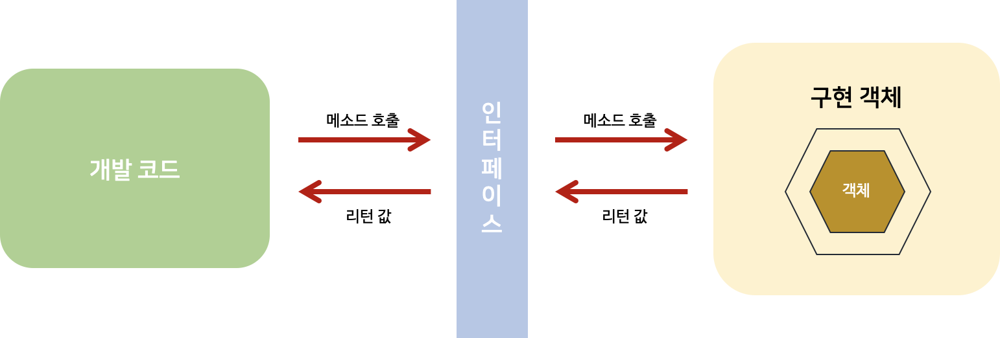
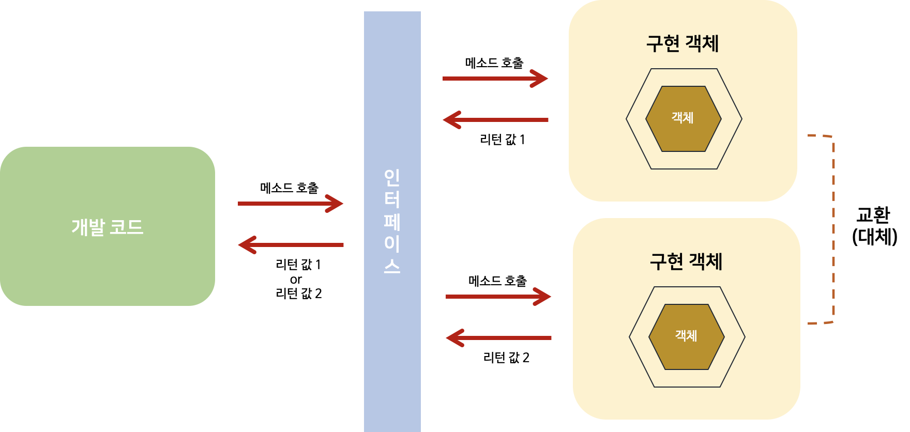
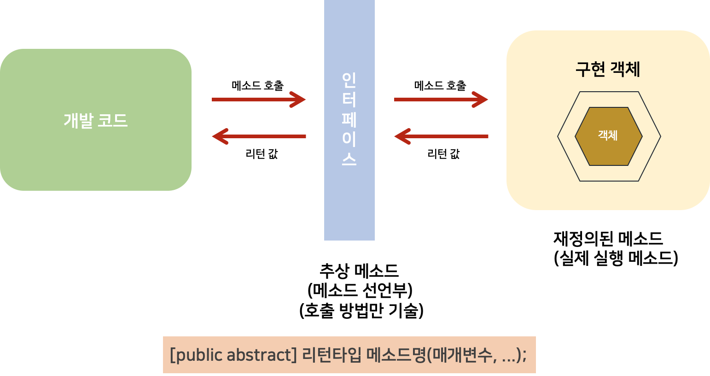
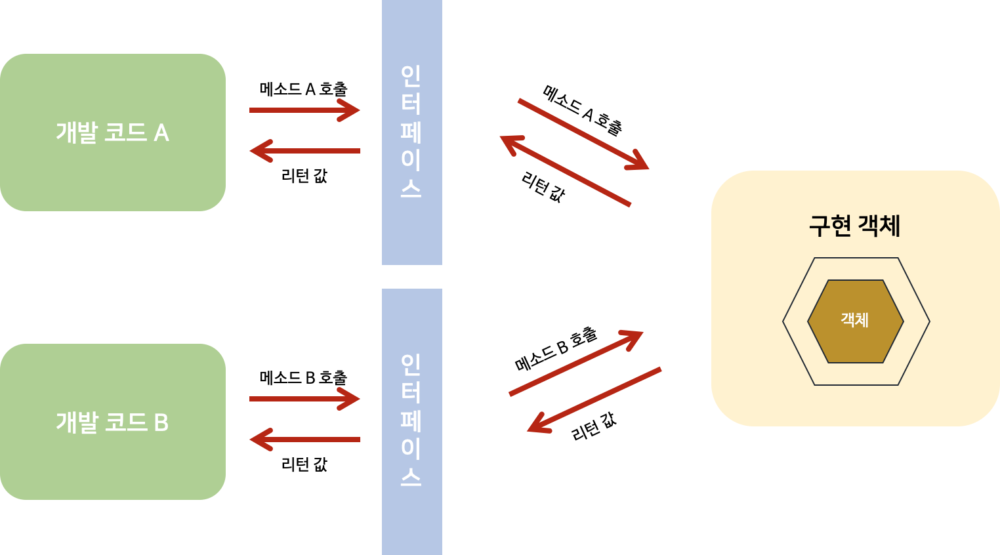
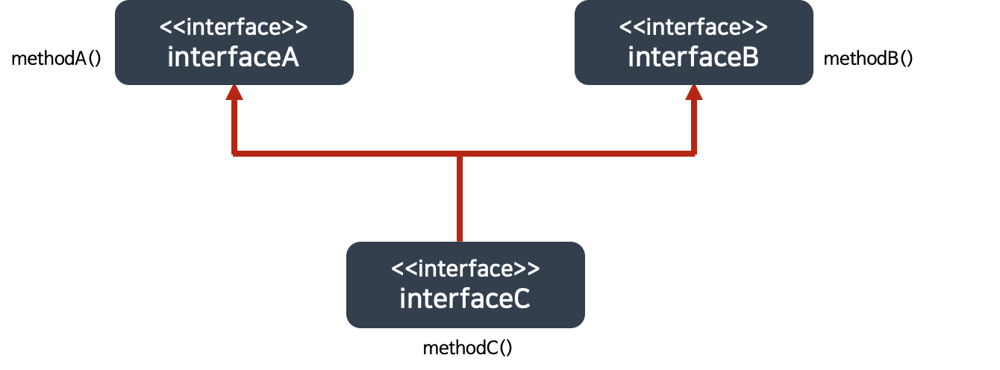
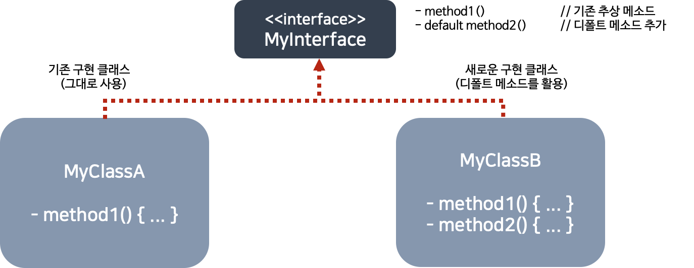

# [8주차 과제] 인터페이스

### 인터페이스 정의하는 방법

### 인터페이스 구현하는 방법

### 인터페이스 레퍼런스를 통해 구현체를 사용하는 방법

### 인터페이스 상속

### 인터페이스의 기본 메소드 (Default Method)

### 인터페이스의 static 메소드

### 인터페이스의 private 메소드

# 0. 인터페이스란

### Interface

- **객체의 사용 방법**을 정의한 타입
- 객체의 교환성을 높여주어 다형성을 구현하는 매우 중요한 역할을 한다


### 인터페이스의 역할 : 개발 코드와 객체가 서로 통신하는 접점



*[출처] : 이것이 자바다 - 신용권의 Java 프로그래밍 정복 1권 p.344*

- 위 그림처럼, 개발 코드가 인터페이스의 메소드를 호출하면 → 인터페이스는 객체의 메소드를 호출한다
  - 이렇게 되면, **개발 코드**는 **객체의 내부 구조를 알 필요가 없고, 인터페이스의 메소드만 알면 된다**는 장점을 가진다

------

#### 그럼 개발 코드가 직접 객체 메소드 호출하면 되는거 아닌가? 굳이 왜 인터페이스를 두는걸까?

- **개발 코드를 수정하지 않고, 사용하는 객체를 변경할 수 있도록 하기 위해서** 인터페이스를 쓴다
- 인터페이스는 하나의 객체가 아니라, 여러 객체들과 사용이 가능하다
  - 그래서, 어떤 객체를 사용하느냐에 따라서 실행 내용과 리턴값이 다를 수 있다
    - 개발 코드 측면에서는 코드 변경 없이 실행 내용과 리턴값을 다양화 할 수 있다는 장점을 가진다



*[출처] : 이것이 자바다 - 신용권의 Java 프로그래밍 정복 1권 p.344*

------

# 1. 인터페이스 정의하는 방법

  인터페이스는 `~.java` 형태의 소스 파일로 작성되고, 컴파일러 (`javac.exe`)를 통해 `~.class` 형태로 컴파일 되므로

물리적 형태는 클래스와 동일하다. 다만, 소스 작성 시, **선언 방식이 다르다**

## 1.인터페이스 선언 (`interface` 키워드)

- `interface` 키워드를 사용하여 선언한다

  ```java
  [public] interface 인터페이스명 { ... }
  ```

- 인터페이스 이름은 클래스 이름 작성 방법과 동일하다

  > 영어 대소문자를 구분하며, 첫 문자를 대문자로작성하는 것이 관례

### 인터페이스 특징

- 인터페이스는 **상수와 메소드**만을 구성 멤버로 가진다

  > 클래스는 필드, 생성자, 메소드를 구성 멤버로 가진다 

- 인터페이스는 **객체로 생성할 수 없기** 때문에 생성자를 가질 수 없다
- 자바 7이전까지는 인터페이스의 메소드는 실행 블록이 없는 추상 메소드로만 선언이 가능했지만,
- 자바 8부터는 디폴트 메소드와 정적 메소드도 선언이 가능하다

```java
interface 인터페이스명 {
		// 상수
		타입 상수명 = 값;

		// 추상 메소드
		타입 메소드명(매개변수, ...);

		// 디폴트 메소드
		default 타입 메소드명(매개변수, ...) {...}
	
		// 정적 메소드
		static 타입 메소드명(매개변수) {...}
}
```

#### 1. 상수 필드 (Constant Field)

- 인터페이스는 **객체 사용 설명서** 이므로 런타임 시 데이터를 저장할 수 있는 필드를 선언할 수 없다
- 그러나, 상수 필드는 선언이 가능하다
  - 상수는 인터페이스에 고정된 값으로, 런타임 시에 데이터를 바꿀 수 없기 때문이다
  - 상수 선언하려면, 반드시 선언 할 때 초기값을 대입해야 함

#### 2. 추상 메소드 (Abstract Method)

- 객체가 가지고 있는 메소드를 설명한 것으로,
- 호출 시, 어떤 매개값이 필요하고, 리턴 타입이 무엇인지만 알려준다
- 실제 실행부는 객체 (구현 객체)가 가지고 있다

#### 3. 디폴트 메소드 (Default Method)

- 자바 8부터 작성 가능
- 인터페이스에 선언되지만 사실은 구현 객체가 가지고 있는 인스턴스 메소드

#### 4. 정적 메소드 (Static Method)

- 자바 8부터 작성 가능
- 디폴트 메소드와는 달리 객체가 없더오 인터페이스만으로 호출이 가능

#### 5. Private Method

- 자바 9부터 작성 가능

#### 6. Private Static Method

- 자바 9부터 작성 가능

## 2. 인터페이스 구성 멤버 선언

- 먼저 자바 7 기준으로 설명하고, 이후의 목차에서 자바 8 & 자바 9에서 도입된 인터페이스의 구성 멤버에 대해 알아보자

### 1. 상수 필드 (Constant Field) 선언

- 인터페이스는 **데이터를 저장할 수 없기 때문**에 데이터를 저장할 **인스턴스** 또는 **정적 필드**를 **선언할 수 없음**

- 대신 **상수 필드**만 선언 가능하다

  ```java
  [ public  static final ] 타입 상수명 = 값;
  ```

  > public, static, final을 생략해도 컴파일 과정에서 자동으로 붙는다

- 인터페이스 상수는 **static {} 블록으로 초기화 할 수 없기 때문에, 반드시 선언과 동시에 초기값을 지정해 주어야 함**

```java
/* 상수 필드 선언 */
public interface RemoteControl {
		public int MAX_VOLUME = 10;
		public int MIN_VOLUME = 0;
}
```

### 2. 추상 메소드 선언

- 인터페이스를 통해 호출된 메소드는 최종적으로 객체에서 실행된다

  - 따라서, 인터페이스의 메소드는 → 어차피 객체에서 실행되니까 실행 블록이 필요없는 **추상 메소드**로 선언한다

    > 추상 메소드 (Abstract Method)
    >
    > - 리턴 타입, 메소드명, 매개변수 만 기술되고, 중괄호 {} 를 붙이지 않는 메소드

  - 인터페이스에 선언된 추상 메소드는 모두 `public abstract`의 특성을 가짐

    - `public abstract` 를 생략하더라도 자동으로 컴파일 과정에서 붙음



*[출처] : 이것이 자바다 - 신용권의 Java 프로그래밍 정복 1권 p.347*

```java
/* 추상 메소드 선언 */
/* RemoteControl 인터페이스에서 turnOn(), turnOff(), setVolume() 추상 메소드를 선언*/
public interface RemoteControl {
    // 상수 
    public int MAX_VOLUME = 10;
    public int MIN_VOLUME = 0;

    // 추상 메소드 -> 메소드 선언부만 작성함
    public void turnOn();
    public void turnOff();
    public void setVolume(int volume);
}
```

------

# 2. 인터페이스 구현(`implement`) 하는 방법

- 개발 코드가 인터페이스 메소드를 호출하면 인터페이스는 **객체의 메소드를 호출** 한다

- 객체는 인터페이스에서 정의된 추상 메소드와 동일한 메소드 이름, 매개 타입, 리턴 타입을 가진 실체 메소드를 가지고 있어야 함
  - 이런 객체를 인터페이스의 구현(**implement**) 객체라고하고, 구현 객체를 생성하는 클래스를 구현 클래스라고 한다


*[출처] : 이것이 자바다 - 신용권의 Java 프로그래밍 정복 1권 p.344*

- 실체 메소드를 가진 객체
  - 인터페이스의 구현 (implement) 객체
- 구현 객체를 생성하는 클래스
  - 구현 클래스


## 1. 구현 클래스

- 보통의 클래스와 동일하지만, 인터페이스 타입으로 사용할 수 있음을 알려주기 위해

  → 클래스 선언부에 **implements  키워드 추가 & 인터페이스명을 명시**

  ```java
  public class 구현클래스명 implements 인터페이스명 {
  		// 인터페이스에 선언된 추상 메소드의 실체 메소드 선언
  }
  ```

#### 1. 이전에 선언했던 `RemoteControl` 인터페이스를 구현하는 `Television` 클래스 예제

- 아래 클래스는 `RemoteControl` 인터페이스에 선언한 추상 메소드들에 대한 실체 메소드를 가져야 함

```java
/* 구현 클래스 */
// 구현 클래스 - Television
public class Television implements RemoteControl {
    // 필드 
    private int volume;

    // turnOn() 추상 메소드의 실체 메소드
    public void turnOn() {
        System.out.println("TV를 켭니다.");
    }

    // turnOff() 추상 메소드의 실체 메소드
    public void turnOff() {
        System.ouut.println("TV를 끕니다.");
    }

		// setVolume() 추상 메소드의 실체 메소드
    public void setVolume(int volume) {
        if (volume > RemoteControl.MAX_VOLUME) { // 인터페이스 상수를 이용해서, volume 필드의 값을 제한
            this.volume = RemoteControl.MAX_VOLUME;
        } else if (volume < RemoteControl.MIN_VOLUME) {
            this.volume = RemoteControl.MIN_VOLUME;
        } else {
            this.volume = volume;
        }

        System.out.println("현재 TV 볼륨 : " + volume);
    }
}
```

####2. 이전에 선언했던 `RemoteControl` 인터페이스를 구현하는 `Television` 클래스 예제 

- 아래 클래스는 `RemoteControl` 인터페이스에 선언한 추상 메소드들에 대한 실체 메소드를 가져야 함

```java
// 구현 클래스 - Audio
public class Audio implements RemoteControl {
    // 필드
    private int volume;

    // turnOn() 추상 메소드의 실체 메소드
    public void turnOn() {
        System.out.println("Audio를 켭니다.");
    }

		// turnOff() 추상 메소드의 실체 메소드
    public void turnOff() {
        System.out.println("Audio를 끕니다.");
    }

    // setVolume() 추상 메소드의 실체 메소드
    public void setVolume(int volume) {
        if (volume > RemoteControl.MAX_VOLUME) {
            this.volume = RemoteControl.MAX_VOLUME;
        } else if (volume < RemoteControl.MIN_VOLUME) {
            this.volume = RemoteControl.MIN_VOLUME;
        } else {
            this.volume = volume;
        }

        System.out.println("현재 Audio 볼륨 : " + volume);
    }
}
```

------

### 구현 클래스에서 인터페이스 추상 메소드들에 대한 실체 메소드 작성 시 주의할 점

- 인터페이스의 모든 메소드는 기본적으로 `public` 접근 제한을 가짐

  - 따라서, 구현 클래스의 실체 메소드들은 `public` 보다 **낮은 접근 제한자를 가질 수 없음**
    - `public` 생략 시
      - *`Cannot reduce the visibility of the inherited method`* : **컴파일 에러** 발생

- 만약, 인터페이스에 선언된 추상 메소드에 대응하는 **실체 메소드를 구현 클래스가 작성하지 않으면**

  - 구현 클래스는 자동적으로 추상 클래스가 됨

- `abstract` 키워드 필수

  ```java
  //  setVolume() 실체 메소드가 없음 (일부만 구현됨) -> Television 클래스는 자동으로 추상 클래스가 됨
  public abstract class Television implements RemoteControl {
  		public void turnOn() { ... }
  		public void turnOff() { ... }
  }
  ```

------

### 인터페이스의 구현 후 사용

- 구현 클래스가 작성되면 **`new` 연산자**로 객체를 생성할 수 있음

- 그러나, 아래와 같이 `Television` 객체를 생성하고,  `Television` 변수에 대입한다고 인터페이스를 사용하는 것이 아님

  ```java
  Television tv = new Television(); // 인터페이스의 사용 X
  ```

- 인터페이스로 구현 객체를 사용하려면 인터페이스 변수를 선언하고 구현 객체를 대입해야한다. 인터페이스 레퍼런스를 통해 구현체를 사용하는 방법은 이후 목차에서 알아보자


## 2. 익명 구현 객체

  방금 알아봤던 구현 클래스를 만들어 사용하는 것이 일반적이고, 클래스를 재사용 할 수 있기 때문에 편리하지만,

일회성의 구현 객체를 만들기 위해 소스 파일을 만들고 클래스를 선언하는 것은 비효율적이다.

- 그래서, 자바에서는 소스 파일을 만들지 않고도 구현 객체를 만들 수 있는 방법 제공한다

  → **익명 구현 객체**

ex) UI 프로그래밍에서 이벤트 처리를 위해, 임시 작업 스레드를 만들기 위해 , 익명 구현 객체를 활용

ex2) 자바 8의 람다식 → 인터페이스의 익명 구현 객체를 만든다


#### 익명 구현 객체를 생성하여 인터페이스 변수에 대입하는 코드

- 하나의 실행문이므로 끝에는 세미콜론을 반드시 붙여야 함

```java
인터페이스 변수 = new 인터페이스() {
		// 인터페이스에 선언된 추상 메소드의 실체 메소드 선언 -> 작성 안하면 컴파일 에러
		// 필드와 메소드를 선언할 수 있지만, 익명 객체 안에서만 사용 가능, 인터페이스 변수로 접근 불가
};
```

- `new` 연산자 뒤에는 클래스이름이 와야 하는데, 이름이 없는 것이 특징이다
- 중괄호 `{}` 에는 인터페이스에 선언된 모든 추상 메소드들의 실체 메소드를 작성해야 한다. 그렇지 않으면 컴파일 에러가 발생한다
- 또한, 필드와 메소드를 선언할 수 있지만, 익명 객체 안에서만 사용할 수 있고 인터페이스 변수로 접근할 수 없다는 특징을 갖는다

```java
/* 익명 구현 객체 */
// 익명 구현 클래스
public class RetmoteControllerExample {
    public static void main(String[] args) {
        RemoteControl rc = new RemoteControl() {
            public void turnOn() {
                /* 실행문 */
            }
            public void turnOff() {
                /* 실행문 */
            }
            public void setVolume(int volume) {
                /* 실행문 */
            }
        };
    }
}
```

>  모든 객체는 클래스로부터 생성되는데, 익명 구현 객체도 예외는 아님
>
> RemoteContorollerExample.java를 컴파일하면 자바 컴파일러에 의해 자동으로 다음과 같은 클래스 파일이 만들어짐
>
> ```java
> RemoteControllerExample$1.class
> ```
>
> - 두번째 익명 구현 객체를 만들었다면 → 클래스 파일명은 *RemoteControllerExample$2.class*


## 3. 다중 인터페이스 구현 클래스

- 객체는 아래 그림 처럼**다수의 인터페이스 타입**으로 사용할 수 있다 

- **다중 인터페이스 구현 시, 구현 클래스는 모든 인터페이스의 추상 메소드에 대해 실체 메소드를 작성해야 함 **
- **(하나라도 없으면 추상 클래스로 선언해야 함)**



*[출처] : 이것이 자바다 - 신용권의 Java 프로그래밍 정복 1권 p.356*

- 인터페이스 A와 인터페이스 B가 객체의 메소드를 호출할 수 있으려면
  - **객체는 이 두 인터페이스를 모두 구현해야 함**

#### 다중 인터페이스 구현 클래스 코드

```java
public class 구현클래스명 implements 인터페이스A, 인터페이스B {
		// 인터페이스 A에 선언된 추상 메소드의 실체 메소드 선언
		// 인터페이스 B에 선언된 추상 메소드의 실체 메소드 선언
}
```

#### 다중 인터페이스 예제

- `Searchable` 인터페이스

```java
// 인터페이스
public interface Searchable {
    void search(String url); // 추상 메소드
}
```

- `RemoteControl` , `Searchable` 인터페이스를 구현한 `SmartTelevision` 클래스

```java
// 다중 인터페이스 구현 클래스
public class SmartTelevision implements RemoteControl, Searchable {
    private int volume;

		// RemoteControl의 추상 메소드에 대한 실체 메소드
    public void turnOn() {
        System.out.println("SmartTV를 켭니다.");
    }
    public void turnOff() {
        System.out.println("SmartTV를 끕니다.");
    }
    public void setVolume(int volume) {
        if (volume > RemoteControl.MAX_VOLUME) {
            this.volume = RemoteControl.MAX_VOLUME;
        } else if (volume < RemoteControl.MIN_VOLUME) {
            this.volume = RemoteControl.MIN_VOLUME;
        } else {
            this.volume = volume;
        }

        System.out.println("현재 SmartTV 볼륨 : " + volume);
    }

		// Searchable 의 추상 메소드에 대한 실체 메소드
    public void search(String url) {
        System.out.println(url + "을 검색합니다.");
    }
}
```

------

# 3. 인터페이스 레퍼런스를 통해 구현체를 사용하는 방법

### 인터페이스로 구현 객체 사용 : 인터페이스 변수를 선언하고 구현 객체를 대입

```java
인터페이스 변수;
변수 = 구현 객체;
```

```java
인터페이스 변수 = 구현 객체;
```

- 인터페이스로 구현 객체를 사용하려면 → **인터페이스 변수를 선언**하고 **구현 객체를 대입**해야 한다

- 인터페이스 변수는 참조타입이므로, 구현 객체가 대입될 경우, 구현 객체의 번지를 저장

```java
RemoteControl rc;
rc = new Television();
rc = new Audio();
```

- `RemoteControl` 인터페이스로 구현 객체인 `Television `과 `Audio`를 사용하려면,  `RemoteControl` 타입 변수 `rc`를 선언하고 **구현 객체를 대입**해야 한다

## 1. 추상 메소드 사용

- 구현 객체가 인터페이스 타입에 **대입**되면 → 인터페이스에 선언된 **추상 메소드**를 개발 코드에서 호출할 수 있다
- 코드에서 `RemoteControl` 의 변수 `rc` 로 `turnOn()` 을 호출하면 구현 객체의 `turnOn()` 이 실행된다

```java
RemoteControl rc = new Television();
rc.turnOn(); // Television의 turnOn() 실행
rc.turnOff(); // Television의 turnOff() 실행
```

- 추상 메소드 사용 예제

  ```java
  /* 인터페이스 사용 */
  public class RemoteControlExample {
      public static void main(String[] args) {
          RemoteControl rc = null; // 인터페이스 변수 선언
  
          rc = new Television(); // Television 객체를 인터페이스 타입에 대입
          rc.turnOn(); // 인터페이스에 선언된 추상 메소드를 개발코드에서 turnOn(), turnOff() 호출
          rc.turnOff(); // 결국 구현 객체의 메소드가 자동 실행됨
  
          rc = new Audio(); // Audio 객체를 인터페이스 타입에 대입
          rc.turnOn(); // 인터페이스에 선언된 추상 메소드를 개발 코드에서 turnOn(), turnOff() 호출
          rc.turnOff();
      }
  }
  /*Result
      TV를 켭니다.
      TV를 끕니다.
      Audio를 켭니다.
      Audio를 끕니다.
   */
  ```

- 디폴트 메소드와 정적 메소드 사용은 이후 목차에서 살펴보자

------


# 4. 인터페이스 상속

### 인터페이스도 다른 인터페이스 상속할 수 있음

### 다중 상속 허용

>  클래스는 다중 상속 불가능

- `extends` 키워드를 이용하여 상속할 인터페이스를 나열한다

```java
public interface 하위인터페이스 extends 상위인터페이스1, 상위인터페이스2 { ... }
```

### 인터페이스 상속 시 주의해야 할 점

- 하위 인터페이스를 구현하는 클래스는 하위 인터페이스의 메소드 뿐만 아니라
  - 상위 인터페이스의 모든 추상 메소드에 대한 실체 메소드까지 가지고 있어야 한다
  - 이렇게 모든 실체 메소드를 가지고 있어야, 구현 클래스로부터 객체를 생성하고 나서, **하위 및 상위 인터페이스 타입으로 변환 가능** 하다

  ```java
  하위인터페이스  변수 = new 구현클래스(...);
  상위인터페이스1 변수 = new 구현클래스(...);
  상위인터페이스2 변수 = new 구현클래스(...);
  ```

  - 하위 인터페이스로 타입 변환이 되면
    - 상, 하위 인터페이스에 선언된 모든 메소드를 사용할 수 있다
  - 상위 인터페이스로 타입 변환되면
    - 상위 인터페이스에 선언된 메소드만 사용 가능하다
    - 하위 인터페이스에 선언된 메소드는 사용 불가하다

  

  *[출처] : 이것이 자바다 - 신용권의 Java 프로그래밍 정복 1권 p.377*

- `InterfaceC` 인터페이스 변수는 `methodA()`,  `methodB()`, `methodC()` 를 모두 호출할 수 있다
- `InterfaceA` 와 `InterfaceB` 변수는 각각 `methodA()` 와 `methodB()` 만을 호출할 수 있다

#### 인터페이스 상속 예제

- `InterfaceA` 인터페이스 (부모 인터페이스)

```java
// 부모 인터페이스
public interface InterfaceA {
    public void methodA();
}
```

- `InterfaceB` 인터페이스 (부모 인터페이스)

```java
// 부모 인터페이스
public interface InterfaceB {
    puublic void methodB();
}
```

- `InterfaceC` 인터페이스 (하위 인터페이스)

```java
// 하위 인터페이스
public interface InterfaceC extends interfaceA, interfaceB {
    public void methodC();
}
```

- 하위 인터페이스 구현 클래스 `ImplementationC`

```java
// 하위 인터페이스 구현
public class ImplementationC implements interfaceC {
    public void methodA() {
        System.out.println("ImplementationC-methodA() 실행");
    }

    public void methodB() {
        System.out.println("ImplementationC-methodB() 실행");
    }

    public void methodC() {
        System.out.println("ImplementationC-methodC() 실행");
    }
}
```

- 호출 가능 메소드

```java
// 호출 가능 메소드
public class Example {
    public static void main(String[] args) {
        ImplementationC impl = new ImplementationC();

        InterfaceA ia = impl;
        ia.methodA();
        System.out.println(); // interfaceA 변수는 methodA()만 호출 가능

        InterfaceB ib = impl;
        ib.methodB();
        System.out.println();

        // interfaceC 변수는 methodA(), methodB(), methodC() 모두 호출 가능
        InterfaceC ic = impl;
        ic.methodA();
        ic.methodB();
        ic.methodC();
    }
}
```

------

# 5. 인터페이스의 기본 메소드 (default method)

## 1.디폴트 메소드 (default method) - Java 8에서 추가된 인터페이스의 새로운 멤버

- 형태는 클래스의 인스턴스 메소드와 동일
- 인터페이스에 선언되지만 사실은 객체 (구현 객체)가 가지고 있는 인스턴스 메소드
- 자바 8에서 디폴트 메소드를 허용한 이유는 **기존 인터페이스를 확장해서 새로운 기능을 추가하기 위함**

## 2. default method 선언 방식

- 클래스의 인스턴스 메소드와 형태는 동일, default 키워드가 리턴 타입 앞에 붙음

- `public`의 특성을 가짐 (`public` 키워드 생략해도 컴파일 과정에서 자동으로 붙음)

  ```java
  [public] default 리턴타입 메소드명(매개변수, ...) { ... }
  ```

### default method 선언 예제

```java
/* 디폴트 메소드 선언 */
/* RemoteControl 인터페이스에서 무음 처리 기능을 제공하는 setMute() 디폴트 메소드를 선언 */
public interface RemoteControl {
    ...

    // 디폴트 메소드
    // 무음 처리 기능을 제공하는 setMute() 메소드 (실행 내용까지 작성)
    default void setMute(boolean mute) {
        if (mute) {
            System.out.println("무음 처리합니다.");
        } else {
            System.out.println("무음 해제합니다.");
        }
    } 
}
```

## 3. default method 사용

- 디폴트 메소드는 인터페이스에 선언되지만, **인터페이스에서 바로 사용할 수 없음**

- 디폴트 메소드는 추상 메소드가 아닌 **인스턴스 메소드** 이다
- 따라서, **구현 객체가 있어야 사용 가능**하다

### default method 예제

- `RemoteControl` 인터페이스는 `setMute()` 라는 디폴트 메소드를 가지고 있지만, 
- 아직 `RemoteControl`의 구현객체가 없어서 호출할 수 없음

```java
RemoteControl.setMute(true); // 호출 불가 
```

- 호출 가능하게 하려면, `RemoteControl`의 **구현 객체가 필요**하다

```java
RemoteControl rc = new Television(); // Television 객체를 인터페이스 변수에 대입하고 나서, setMute()를 호출할 수 있음
rc.setMute(true);
```

- 비록, `setMute()`가 `Television` 클래스에 선언되지는 않았지만 ,
  - `Television` 객체가 없으면 `setMute()` 도 호출할 수 없다

- 어떤 구현 객체는 디폴트 메소드의 내용이 맞지 않아, 수정이 필요할 수도 있다

- 구현 클래스를 작성할 때 디폴트 메소드를 재정의(오버라이딩)해서 자신에게 맞게 수정하면 
  - 디폴트 메소드가 호출될 때 자신을 **재정의한 메소드가 호출**된다

#### default method 오버라이딩 부터 사용 예제

- `Audio` 클래스에서 default Method `setMute()` 오버라이딩

```java
/* 디폴트 메소드를 사용한 구현 클래스 */
public class Audio implements RemoteControl {
    // 필드
    private int volume;
    private boolean mute;

 		...

    // 디폴트 메소드 재정의
    @Override
    public void setMute(boolean mute) {
        this.mute = mute;

        if (mute) {
            System.out.println("Audio 무음 처리합니다");
        } else {
            System.out.println("Audio 무음 해제합니다");
        }
    }
}
```

- default method 사용 예시 - `RemoteConrolExample` 클래스

```java
/* 디폴트 메소드 사용 예제 */
public class RemoteControlExample {
    public static void main(String[] args) {
        RemoteControl rc = null;

        rc = new Television();
        rc.turnOn();
        rc.setMute(true);

        rc = new Audio();
        rc.turnOn();
        rc.setMute(true);
    }
}
/* Result 
TV를 켭니다.
무음 처리합니다.
Audio를 켭니다.
Audio 무음 처리합니다.
*/
```

## 4. default method의 필요성

- default method는 인터페이스에 선언된 인스턴스 메소드이기 때문에 **구현 객체가 있어야 사용할 수 있다**. 선언은 인터페이스에서 하고, 사용은 구현 객체를 통해 한다는 것이 낯설 수 있다
- default method는 모든 구현 객체에서 공유하는 기본 메소드처럼 보이지만, 인터페이스에서 default method가 필요한 이유가 있다

#### 기존 인터페이스를 확장해서 새로운 기능을 추가하기 위해서 필요

- 기존 인터페이스의 이름과 추상 메소드의 **변경 없이 디폴트 메소드만 추가할 수 있기 때문**에 
  - 이전에 개발한 구현 클래스를 **그대로 사용**할 수 있으면서 **새롭게 개발하는 클래스는 디폴트 메소드를 활용 가능**

#### 예시



*[출처] : 이것이 자바다 - 신용권의 Java 프로그래밍 정복 1권 p.380*

1. 기존에 `MyInterface` 인터페이스

2. 이를 구현한 `MyClassA` 클래스

가 있다


#### 만약, `MyInterface`에 새로운 기능을 추가해야 한다. `MyInterface` 에 어떻게 새로운 기능을 추가할 수 있을까?

1. **`MyInterface`**에 추상 메소드를 추가했다

   - 그런데,

   - **`MyClassA`** 에는 **`MyInterface`** 에 추가된 추상 메소드에 대한 **실체 메소드가 없어서** 문제 발생!!!!
   - 결국 `MyInterface` 에 **추상 메소드를 추가할 수 없게 됨**

2. **`MyInterface`에 디폴트 메소드 선언**  (`MyClassA` 를 고치기 어려워서 고안)

   - default method는 **추상 메소드가 아니므로, 구현 클래스에서 실체 메소드를 작성할 필요가 없음!**
   - `MyClassA` 는 별 문제 없이 계속 사용 가능

####반면, 수정된 `MyInterface` 를 구현한 새로운 클래스인 `MyClassB` 는 `method1()` 을 반드시 구현 필요

- `MyClassB` 는 `method1()` 의 **내용은 반드시 채워야 하지만**, `method2()` 는 **다르다.**

- default method 인 `method2()` 는 인터페이스에 정의된 것을 사용해도 되고, 필요에 따라 재정의하여 사용할 수도 있음

### default method 필요성 예제

```java
// 기존 인터페이스
public interface MyInterface {
    public void method1();
}
```

```java
// 기존 구현 클래스
public class MyClassA implements MyInterface {
    @Override
    public void method1() {
        System.out.println("MyClassA-method1() 실행");
    }
}
```

- `MyInterface`에 디폴트 메소드 `method2()` 를 추가

```java
// 수정 인터페이스
public interface MyInterface {
    public void method1();
    public default void method2() {
        System.out.println("MyInterface-method2 실행");
    }
}
```

- **인터페이스를 수정**하더라도 `MyClassA` 는 컴파일 에러가 발생하지 않음


- 수정된 인터페이스를 구현한 새로운 구현 클래스 `MyClassB`

```java
// 수정된 인터페이스를 구현한 인터페이스
public class MyClassB implements MyInterface {
    @Override
    public void method1() {
        System.out.println("MyClassB-method1() 실행");
    }

		// 디폴트 메소드 재정의
    @Override
    public void method2() {
        System.out.println("MyClassB-method2() 실행");
    }
}
```

- Default Method 사용 예제

  ```java
  // 디폴트 메소드 사용
  public class DefaultMethodExample {
      public static void main(String[] args) {
          MyInterface mi1 = new MyClassA();
          mi1.method1();
          mi1.method2();
  
          MyInterface mi2 = new MyClassB();
          mi2.method1();
          mi2.method2();
      }
  }
  /*Result
   * MyClassA-method1() 실행
   * MyInterface-method2() 실행
   * MyClassB-method1() 실행
   * MyClassB-method2() 실행
   */
  ```

  

## 5. default method가 있는 interface 상속

- **부모 인터페이스**에 default method가 정의되어 있는 경우, **자식 인터페이스에서 디폴트 메소드를 활용하는 방법**은 아래와 같다

1. **디폴트 메소드를 단순히 상속만 받음**
2. **디폴트 매소드를 재정의(Override)해서 실행 내용을 변경**
3. **디폴트 메소드를 추상 메소드로 재선언**

#### default method가 있는 interface 상속 예제

- 추상 메소드와 디폴트 메소드가 선언된 `ParentInterface`

```java
public interface ParentInterface {
		public void method1();
		public default void method2() { // 실행문 }
}
```

- `ChildInterface1` 은 `ParentInterface` 를 상속하고, 자신의 추상 메소드인 `method3()` 을 선언

  ```java
  public interface ChildInterface1 extends ParentInterface {
  		public void method3();
  }
  ```

- `ChildInterface1` 을 구현하는 클래스는 `method1()` 과 `method3()`의 실체 메소드를 가지고 있어야 함

- `ParentInterface`의 `method2()` 는 그냥 호출 가능

  ```java
  ChildInterface1 ci1 = new ChildInterface() {
  		@Override
  		public void method1() { ... }
  		@Override
  		public void method3() { ... } 
  };
  
  ci1.method1();
  ci1.method2(); // ParentInterface 의 method2() 호출
  ci1.method3();
  ```

- `ChildInterface2` 는 `ParentInterface` 를 상속하고, `method2()` 를 재정의 & 자신의 추상 메소드인 `method3()` 을 선언

  ```java
  public interface ChildInterface2 extends ParentInterface {
  		@Override
  		public default void method2() { ... } // 재정의
  
  		public void method3();
  }
  ```

- `ChildInterface2` 를 구현하는 클래스는 `method1()` 과 `method3()` 의 실체 메소드를 가지고 있어햐 함

- `ChildInterface2`에서 재정의한 `method2()` 를 호출 가능

  ```java
  ChildInterface2 ci2 = new ChildInterface2() {
  		@Override
  		public void method1() { ... }
  		@Override
  		public void method3() { ... }
  };
  
  ci2.method1();
  ci2.method2(); // ChildInterface2의 method2() 호출
  ci2.method3();
  ```

- `ChildInterface3` 는 `ParentInterface`를 상속하고 `ParentInterface`의 디폴트 메소드인  `method2()` 를 추상 메소드로 재선언 & 자신의 추상 메소드인 `method3()` 을 선언

  ```java
  public interface ChildInterface3 extends ParentInterface {
  		@Override
  		public void method2(); // 추상 메소드로 재선언
  		public void method3();
  }
  ```

- `ChildInterface3` 를 구현하는 클래스는 `method1()` 과 `method2()`, `method3()` 의 실체 메소드를 모두 가져야 함

  ```java
  ChildInterface3 ci3 = new ChildInterface3() {
  		@Override
  		public void method1() { ... }
  		@Override
  		public void method2() { ... }
  		@Override
  		public void method3() { ... }
  };
  
  ci3.method1();
  ci3.method2(); // ChildInterface3의 method2() 호출
  ci3.method3();
  ```

------

# 6. 인터페이스의 static 메소드

##1. 정적 메소드 (static method) - Java 8에서 허용된 부분

- 자바 8에서 추가된 **인터페이스의 새로운 멤버**
- default method와는 달리 **객체가 없어도 인터페이스만으로 호출 할 수 있다**

##2. static method 선언 방식

- 형태는 **클래스의 정적 메소드**와 동일하다

- 정적 메소드는 `public` 특성을 가짐 (`public` 키워드 생략해도 컴파일 과정에서 자동으로 붙는다)

  ```java
  [public] static 리턴타입 메소드명(매개변수, ...) { ... }
  ```

  

#### static method 예제

- `RemoteControl` 인터페이스에 `changeBattery() ` static method 선언

```java
/* RemoteControl 인터페이스에서, 배터리 교환하는 기능을 가진 changeBattery() 정적 메소드를 선언 */
public interface RemoteControl {
		...

    // 정적 메소드
    // 배터리를 교환하는 기능을 가진 changeBattery() 정적 메소드
    static void changeBattery() {
        System.out.println("건전지를 교환합니다.");
    }
  
  	...
}
```

## 3. static method의 사용

### 인터페이스의 정적 메소드는 인터페이스로 바로 호출 가능하다

#### `RemoteControl`의 `changeBattery()` 정적 메소드를 호출하는 예제

```java
public class RemoteControlExample {
		public static void main(String[] args) {
				RemoteControl.changeBattery();
		}
}
```

------


# 7. 인터페이스의 private 메소드

## 1. private method - Java 9 에서 허용된 부분

- 자바 9에서 추가된 **인터페이스의 새로운 멤버**
- `private` method와 `private static` method 를 인터페이스에 추가 할 수 있음
- 중복된 코드를 작성할 필요가 없어서, **코드 재사용성이 증가**한다
- private method를 이용하면 해당 메소드를 인터페이스를 구현하는 클래스에 **노출하지 않아도 된다** => **캡슐화**

## 2. private [static] method 선언 방식

- `private` 접근 지시자를 **반드시 사용**해야 함

- `private` 과 `abstract` 키워드를 **동시에 사용할 수 없다**

  - 동시에 사용 시 컴파일 에러

    > - private methods
    >   - private method는 해당 클래스에서만 사용 가능하다, 결국 하위 클래스가 상속할 수 없고, 이 메소드를 재정의(오버라이딩) 할 수 없다는 의미이기 때문에 추상 메소드가 될 수없다
    >   - 즉, **구현이 되어 있어야만 한다**
    > - abstract methods
    >   - 추상 메소드는 **구현부가 없는 메소드**라는 의미다
    >   - 즉, 하위 클래스가 상속해서 이 추상 메소드를 구현해야한다 

```java
private [static] 리턴타입 메소드명(매개변수, ...) { ... }
```

- private method는 interface 내에서만 사용할 수 있다
- private static method는 static & non-static 인터페이스 메소드 안에서 사용할 수 있다
- private non-static method는 private static method 내에서 사용할 수 없다

### private method 예제

- private method를 가지는 `CustomInterface` 예제

```java
public interface CustomInterface {
		
		public abstract void method1();
		
		public default void method2() {
				method4(); // default method 내 private method 호출
				method5(); // non-static method 내 private static method 호출
				System.out.println("default method");
		}
		
		public static void method3() {
				method5(); // static method 내 private static method 호출
				System.out.println("static method");
		}
		
		private void method4() {
				System.out.println("private method");
		}
		
		private static void method5() {
				System.out.println("private static method");
		}
}
```

- `CustomInterface` 를 구현한 `CustomClass`

```java
public class CustomClass implements CustomInterface {
		@Override
		public void method1() {
				System.out.println("abstract method");
		}
		
		public static void main(String[] args) {
				CustomInterface instance = new CustomClass();
				instance.method1();
				instance.method2();
				CustomInterface.method3();
		}
}

// Output
/*
 * abstract method
 * private method
 * private static method
 * default method
 * private static method
 * static method
 */
```

### private method 실제 예시

- 두 가지 기능이 있는 계산기 클래스 예제

  	1. 입력 받은 숫자들 중 짝수의 합을 구하는 기능 (메소드)
   	2. 입력 받은 숫자들 중 홀수의 합을 구하는 기능 (메소드)

- `CustomCalculator` 인터페이스

  ```java
  import java.util.function.IntPredicate;
  import java.util.stream.IntStream;
  
  public interface CustomCalculator {
  		default int addEvenNumbers(int... nums) {
  				return add(n -> n % 2 == 0, nums);
  		}
  		
  		default int addOddNumbers(int... nums) {
  				return add(n -> n % 2 != 0, nums);
  		}
  		
  		private int add(IntPredicate predicate, int... nums) {
  				return IntStream.of(nums)
  												.filters(predicate)
  												.sum();
  		}
  }
  ```

- `CustomCalculator` 를 구현한 `Main` 클래스

  ```java
  public class Main implements CustomCalculator {
  		public static void main(String[] args) {
  				CustomCalculator demo = new Main();
  				
  				int sumOfEvens = demo.addEvenNumbers(1,2,3,4,5,6,7,8,9);
  				System.out.println(sumOfEvens);
  				
  				int sumOfOdds = demo.addOddNumbers(1,2,3,4,5,6,7,8,9);
  				System.out.println(sumOfOdds);
  		}
  }
  
  // Output
  /*
   * 20
   * 25
   */
  ```

   

## Reference

- 신용권, 『이것이 자바다』, 한빛미디어(2015), p.344 ~ p.385
- 이상민, 『자바의 신』, 로드북(2018), p.310 ~ p.317
- https://howtodoinjava.com/java9/java9-private-interface-methods#java9
- https://www.journaldev.com/12850/java-9-private-methods-interfaces#java-9-interface-changes

