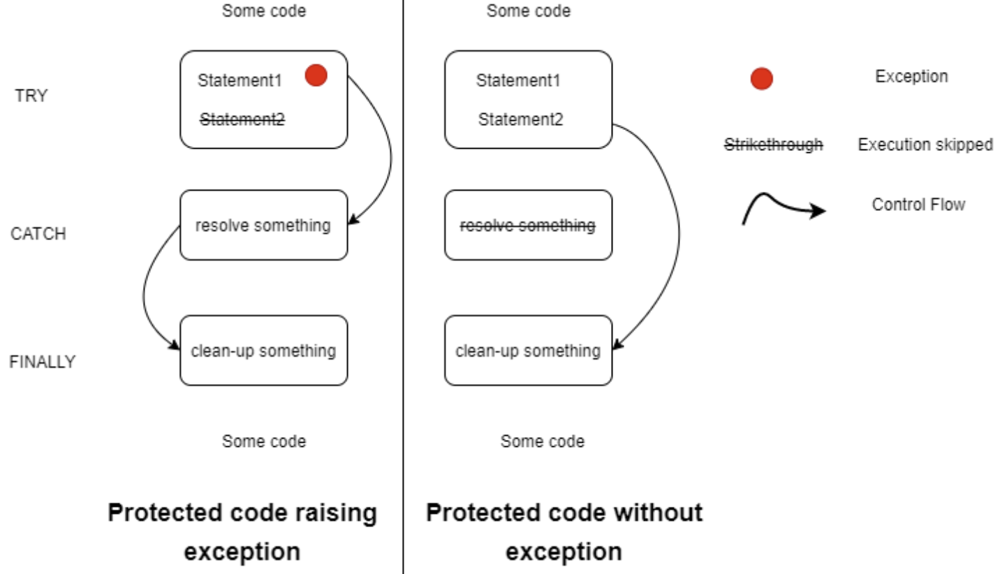
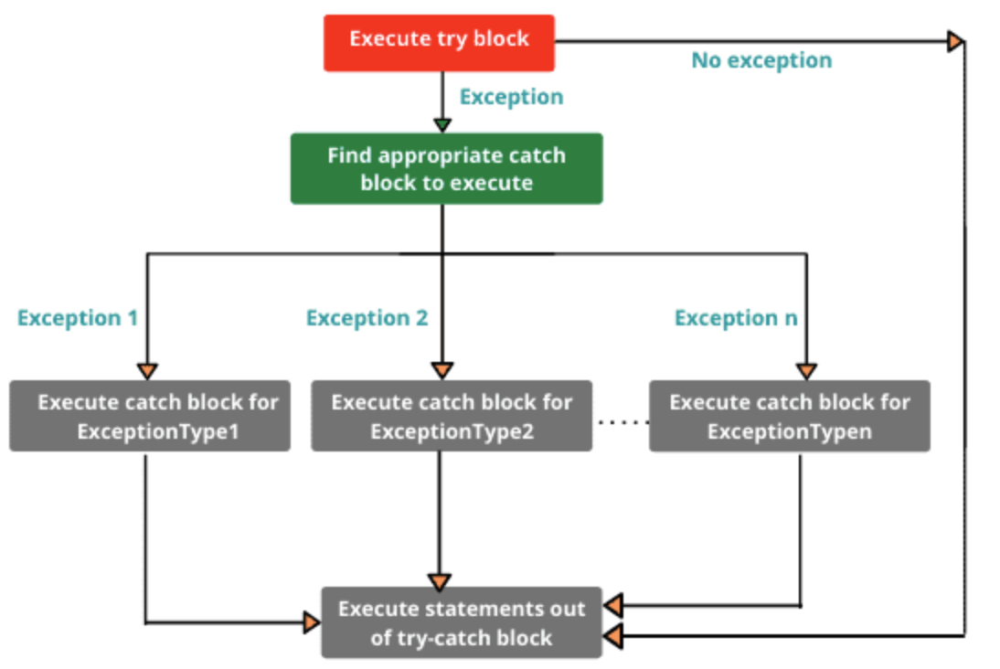
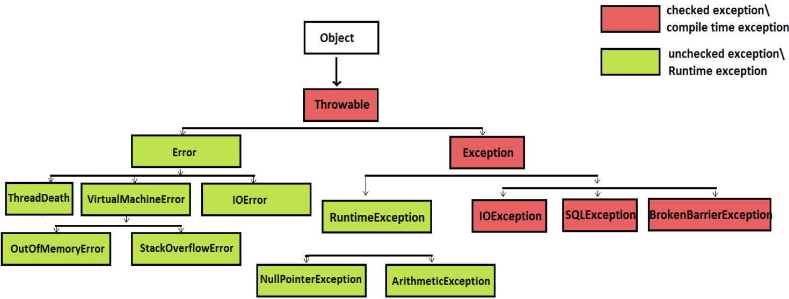

# [9주차 과제] 예외처리

### 자바에서 예외 처리 방법 (try, catch, throw, throws, finally)

### 자바가 제공하는 예외 계층 구조

### Exception과 Error의 차이

### RuntimeException과 RuntimeException이 아닌 것의 차이

### 커스텀한 예외 만드는 방법

# 0. 예외


### 예외 (Exception)

- 사용자의 잘못된 조작 또는 개발자의 잘못된 코딩으로 인해 발생하는 프로그램 오류
- 예외가 발생되면 프로그램은 곧바로 종료된다는 점에서 에러와 동일하다
- 예외 처리 (Exception Handling)를 통해 프로그램을 종료하지 않고 정상 실행 상태가 유지되도록 할 수 있다

### 예외의 종류

- 예외는 두 가지 종류가 있다. 뒷 부분에서 더 살펴보자.

1. 일반 예외 (Exception) - checked Exception, Compile Time Exception
2. 실행 예외 (Runtime Exception) - unchecked Exception, Runtime Exception


# 1. 자바에서 예외 처리 방법

  자바 컴파일러는 소스 파일을 컴파일할 때 일반 예외가 발생할 가능성이 있는 코드를 발견하면 컴파일 오류를 발생시켜서 개발자가 강제적으로 예외 처리 코드를 작성하도록 한다. 그러나 실행 예외는 컴파일러가 체크해주지 않는다. 따라서, 예외 처리 코드가 필요하다. 예외 처리 코드는 `try-catch-finally` 블록을 이용한다.

### 예외 처리 코드

#### 프로그램에서 예외가 발생했을 때, 프로그램의 갑작스러운 종료를 막고, 정상 실행을 유지할 수 있도록 처리하는 코드

- `try-catch-finally` 블록은 생성자 내부와 메소드 내부에 작성되어 일반 예외와 실행 예외가 발생할 경우 예외 처리를 할 수 있도록 한다

## 1. try-catch-finally 작성 방법



[출처]: https://www.codespeedy.com/flow-control-in-try-catch-finally-in-java/

### 1. try

- 예외 발생 가능 코드가 위치한다
- `try-catch` 는 짝이다

### 2. catch

- `try` 블록의 코드가 예외 발생 없이 정상 실행되면, 
  - `catch` 는 실행되지 않고, `finally` 블록의 코드만 실행한다
- `try` 에서 예외 발생 시
  - 즉시 실행을 멈추고, `catch` 블록으로 이동하여 **예외 처리 코드 실행**하고, `finally` 코드를 실행한다

### 3. finally

- **옵션으로, 생략 가능하다**
- 예외 발생 여부와 상관없이 항상 실행할 내용이 있을 경우에만 `finally` 블록에 작성해 주면 된다
- try와 catch 블록 내 `return` 문을 사용하더라도, **`finally` 블록은 항상 실행됨**

#### 일반 예외 처리 예제

```java
/* 일반 예외 처리 예제 */
public class TryCatchFinallyExample {
    public static void main(String[] args) {
        try {
            Class clazz = Class.forName("java.lang.String2"); // 예외 발생
        } catch (ClassNotFoundException e) { // 예외 처리
            System.out.println("클래스가 존재하지 않습니다.");
        }
    }
}
```

> `Class.forName()`
>
> - 매개값으로 주어진 클래스가 존재하면 Class 객체를 리턴하지만,
> - 존재하지 않으면 `ClassNotFoundException` 예외를 발생시킨다
> - ClassNotFoundException 은 `일반 예외`

- `java.lang.String2` 라는 클래스가 존재하지 않기 때문에 4라인에서 **예외 발생**

#### 실행 예외 처리 예제 - ArrayIndexOutOfBoundsException

```java
/* 실행 예외 처리 예제 */
public class TryCatchFinallyRuntimeExceptionExample {
    public static void main(String[] args) {
        String data1 = null;
        String data2 = null;

        try {
            data1 = args[0]; // 실행 매개값 주지 않아 exception 발생
            data2 = args[1];
        } catch (ArrayIndexOutOfBoundsException e) {
            System.out.println("실행 매개값의 수가 부족합니다.");
            System.out.println("[실행 방법]");
            System.out.println("java TryCatchFinallyRuntimeExceptionExample num1 num2");
            return;
        }

        try {
            int value1 = Integer.parseInt(data1); // 실행 매개값을 줬는데, 그 값이 숫자가 아니라 문자이면 -> 예외 발생
            int value2 = Integer.parseInt(data2);
            int result = value1 + value2;
            System.out.println(data1 + " + " + data2 + " = " + result);
        } catch (NumberFormatException e) {
            System.out.println("숫자로 변환할 수 없습니다.");
        } finally {
            System.out.println("다시 실행하세요");
        }
    }
}
```

## 2. 다중 catch

- `try`  블록 내부는 다양한 종류의 예외가 발생할 수 있다. 이 경우, 발생되는 예외별로 예외 처리 코드를 다르게 하려면 어떻게 해야할까?
  - 다중  `catch` 블록을 작성하면 된다

#### 발생되는 예외 별로 예외 처리 코드를 다르게 하려면 → 다중 catch 블록 이용하면 된다

- `catch` 블록의 예외 클래스 타입은 `try` 블록에서 발생된 예외의 종류를 말한다
  - 즉, `try` 블록에서 해당 타입의 예외가 발생하면 `catch` 블록을 실행하도록 되어있음
- **만약, `catch` 블록이 여러 개라 할지라도 단 하나의 `catch` 블록만 실행됨**
  - 왜냐하면, `try` 블록에서 동시 다발적으로 예외가 발생하지 않고, **하나의 예외가 발생하면 즉시 실행을 멈추고 해당 `catch` 블록으로 이동하기 때문**이다

### 다중 catch 예제

```java
/* 다중 catch 예제 */
public class CatchByExceptionKindExample {
    public static void main(String[] args) {
        try {
            String data1 = args[0]; // Point 1
            String data2 = args[1]; // Point 2
            int value1 = Integer.parseInt(data1); // Point 3
            int value2 = Integer.parseInt(data2); // Point 4
            int result = value1 + value2;
            System.out.println(data1 + " + " + data2 + " = " + result);
        } catch (ArrayIndexOutOfBoundsException e) {
            System.out.println("실행 매개값의 수가 부족합니다.");
            System.out.println("[실행 방법]");
            System.out.println("java CatchByExceptionKindExample num1 num2");
        } catch (NumberFormatException e) {
            System.out.println("숫자로 변환할 수 없습니다.");
        } finally {
            System.out.println("다시 실행하세요");
        }
    }
}
```

- Point 1 ~ 2 에서 예외 발생
  - `ArrayIndexOutOfBoundsException`이 발생한 것이므로 → 해당 `catch` 블록 실행한다 *(실행 매개값의 수가 부족합니다)*
- Point 3 ~ 4 에서 예외 발생
  - `NumberFormatException` 이 발생한 것이므로 → 해당 `catch` 블록 실행한다 *(숫자로 변환할 수 없습니다)*
- `finally` 블록은 예외 발생 여부와 상관없이 항상 실행된다

## 3. catch 순서

- 다중 `catch` 블록을 작성할 때는
  - → **상위 예외 클래스가 하위 예외 클래스보다 아래에 위치해야 한다**
  - `try` 블록에서 예외 발생했을 때, 예외 처리해 줄 `catch` 블록은 위에서부터 차례대로 검색되기 때문이다
  - **만약, 상위 예외 클래스의 `catch` 블록이 위에 있다면, 하위 예외 클래스의 `catch` 블록은 실행되지 않음**
    - 하위 예외는 상위 예외를 상속했기 때문에 상위 예외 타입도 되는 것이기 때문이다



[출처] : https://www.scientecheasy.com/2020/09/multiple-catch-block-in-java.html/

#### 잘못된 예외 처리 예제

```java
try {
		// ArrayIndexOutOfBoundsException 발생

	 // NumberFormatException 발생
} catch (Exception e) {
	예외 처리 1
} catch (ArrayIndexOutOfBoundsException e) {
	예외 처리 2
}
```

- `ArrayIndexOutOfBoundsException` 은 `Exception` 을 상속 받기 때문에 **첫번째 `catch` 블록만 선택되어 실행** 된다

- **두 번째 `catch` 블록은 어떤 경우에라도 실행되지 않는다**

#### 수정된 예외 처리 예제

```java
try {
	// ArrayIndexOutOfBoundsException 발생
	
  // NumberFormatException 발생
} catch (ArrayIndexOutOfBoundsException e) {
		예외 처리 1
} catch (Exception e) {
		예외 처리 2
}
```

- try 블록에서 `ArrayIndexOutOfBoundsException` 이 발생하면
  - 첫번째 `catch` 블록을 실행하고
  - 그 밖의 다른 예외가 발생하면 → 두 번째 `catch` 블록을 실행하게 된다

## 4. 멀티 catch

- 자바 7부터 하나의 `catch` 블록에서 **여러 개의 예외를 처리할 수 있도록 멀티 (multi) catch 기능을 추가** 했다

- **동일하게 처리 하고 싶은 예외**를 `|` 로 연결하여` catch` 괄호 안에 작성하면 된다

  ```java
  try {
  	// ArrayIndexOutOfBoundsException 또는 NumberFormatException 발생
  
  	// 다른 Exception 발생
  } catch (ArrayIndexOutOfBoundsException | NumberFormatException e) {
  	예외 처리 1
  } catch (Exception e) {
  	예외 처리 2
  }
  ```

### MultiCatch 예제

```java
public class MultiCatchExample {
    public static void main(String[] args) {
        try {
            String data1 = args[0];
            String data2 = args[1];

            int value1 = Integer.parseInt(data1);
            int value2 = Integer.parseInt(data2);
            int result = value1 + value2;
            System.out.println(data1 + "+" + data2 + "=" + result);
        } catch (ArrayIndexOufOfBoundsException | NumberFormatException e) {
            System.out.println("실행 매개값의 수가 부족하거나 숫자로 변환할 수 없습니다..");
        } catch (Exception e) {
            System.out.println("알 수 없는 예외 발생");
        } finally {
            System.out.println("다시 실행하세요");
        }
    }
}
```

## 5. 예외 떠넘기기 (throws)

- 메소드 내부에서 예외가 발생할 수 있는 코드를 작성할 때 `try-catch` 블록으로 예외를 처리하는 것이 기본이지만, 경우에 따라서는 메소드를 호출한 곳으로 예외를 떠넘길 수도 있다
- `throws` 키워드 이용하면 된다

### throws 키워드

- 메소드 선언부 끝에 작성되어 메소드에서 처리하지 않은 예외를 호출한 곳으로 떠넘기는 역할
- throws 키워드 뒤에는 떠넘길 예외 클래스를 쉼표로 구분해서 나열해주면 된다

```java
리턴타입 메소드명(매개변수, ...) throws 예외클래스 1, 예외 클래스2 , ... {
}
```

- 발생할 수 있는 예외의 종류별로 `throws` 뒤에 나열하는 것이 일반적이지만, `throws Exception` 만으로 모든 예외를 간단히 떠넘길 수도 있다

```java
리턴타입 메소드명(매개변수, ...) throws Exception {}
```

#### 특징

- `throws` 키워드가 붙어있는 메소드는 반드시 `try` 블록 내에서 호출 되어야 한다
- `catch` 블록에서 떠넘겨 받은 예외를 처리해야 한다


####throws 키워드가 있는 method2() 를 method1() 에서 호출하는 방법을 보여주는 코드

```java
public void method1() {
	try {
		method2();
	} catch (ClassNotFoundException e) { // 호출한 곳에서 예외 처리
		// 예외 처리 코드
		System.out.println("클래스가 존재하지 않습니다.");
	}
}

public void method2() throws ClassNotFoundException {
	Class clazz = Class.forName("java.lang.String2");
}
```

- `method1()` 에서도 `try-catch` 블록으로 예외를 처리하지 않고 `throws` 키워드로 다시 예외를 떠넘길 수 있다
  - 그러면, `method1()` 을 호출하는 곳에서 `try-catch` 블록을 사용해서 예외를 처리해야 한다

```java
public void method1 throws ClassNotFoundException {
	method2();
}
```

#### throws 키워드가 붙어있는 클래스 생성자 or 메소드

- 반드시 `try-catch` 블록으로 예외처리를 해야한다
- `throws`를 다시 사용하여 예외를 호출한 곳으로 예외를 떠넘겨야 한다
  - 그렇지 않으면, 컴파일 오류 발생한다

#### throws 키워드가 붙어있는 자바 API의 예외 처리 떠넘기기

```java
/* 예외 처리 떠넘기기 */
public class ThrowsExample {
    public static void main(String[] args) {
        try {
            findClass();
        } catch (ClassNotFoundException e) {
            System.out.println("클래스가 존재하지 않습니다.");
        }
    }

    public static void findClass() throws ClassNotFoundException {
        Class clazz = Class.forName("java.lang.String2");
    }
}
```

- `forName()` 메소드 선언부는 `throws ClassNotFoundException` 이 붙어있어서
  - `forName()` 메소드를 호출할 때 `try-catch` 블록으로 예외를 처리하거나, `throws` 로 예외를 떠넘겨야 한다
  - 위의 예제에서는 `Class.forName()` 메소드를 사용하는 `findClass()` 메소드는 예외를 떠넘겼고,
  - `findClass()` 를 호출하는 `main()` 메소드에서 `try-catch` 블록을 사용해서 예외 처리를 했다


#### `main()` 메소드에서도 예외 떠넘기기

- `main()` 메소드에서도 throws 키워드를 사용해서 예외를 떠넘길 수 있는데, 결국 최종적으로는 JVM 이 예외 처리를 하게 된다

- JVM은 예외의 내용을 콘솔에 출력하는 것으로 예외 처리를 한다

```java
public static void main(String[] args) throws ClassNotFoundException {
	findClass();
}
```

- 그러나, `main()` 메소드에서 `throws Exception` 을 붙이는 것은 좋은 예외 처리 방법이 아니다
- 프로그램 사용자는 프로그램이 알 수 없는 예외 내용을 출력하고 종료되는 것을 좋아하지 않기 때문이다
- 따라서, `try-catch` 블록으로 예외를 최종 처리하는것이 좋다


# 2. 자바가 제공하는 예외 계층 구조

- 자바가 제공하는 예외의 계층 구조는 아래와 같다



[출처] : https://www.javamadesoeasy.com/2015/05/exception-handling-exception-hierarchy.html

- 최상위 클래스는 Object 클래스이고, Exception 과 Error의 공통 부모 클래스인 `Throwable` 클래스가 있다. 

- 다시말해서, Exception과 Error 클래스는 Throwable 클ㄹ래스를 상속받아 처리하도록 되어있다
  - 그래서, Exception 이나 Error를 처리할 때 Throwable로 처리해도 무관하다
- 상속 관계가 이렇게 되어 있는 이유는 Exception 이나 Error의 성격은 다르지만, 모두 동일한 이름의 메소드를 사용하여 처리할 수 있도록 하기 위함이다

### Throwable 클래스

- Throwable 클래스에는 아래와 같은 세 개의 생성자가 선언되어 있다

#### 1. Throwable()

#### 2. Throwable(String message)

#### 3. Throwable(String message, Throwable cause)

#### 4. Throwable(Throwable cause)

- 아무런 매개 변수가 없는 생성자를 기본으로 제공한다
- 그리고, 예외 메시지를 String으로 넘겨줄 수도 있고, 별도로 예외의 원인을 Throwable 객체로 넘겨줄 수도 있다


#### Throwable 클래스에 선언되어 있고, Exception 클래스에서 오버라이딩한 메소드 중 가장 많이 사용되는 메소드

1. getMessage()
2. toString()
3. printStackTrace()

#### 1. getMessage()

- 예외 메시지를 String 형태로 제공받는다
- 예외가 출력되었을 때 어떤 예외가 발생되었는지를 확인할 때 매우 유용한 메소드

#### 2. toString()

- 예외 메시지를 String 형태로 제공받는다
- getMessage() 메소드보다는 더 자세하고, 예외 클래스 이름도 같이 제공하는 메소드

#### 3. printStackTrace()

- 가장 첫 줄에는 예외 메시지를 출력하고, 두 번째 줄부터는 예외가 발생하게 된 메소드들의 호출 관계 (스택 트레이스) 를 출력해주는 메소드


# 3. Exception과 Error의 차이

#### 프로그램 안에서 오류 / 예외가 발생했는지, 밖에서 발생했는지에 따름

#### 프로그램이 바로 멈추어 버리느냐, 계속 실행할 수 있느냐의 차이

- **Error는 Process에 영향을 준다**
- **Exception은 Thread에 영향을 준다**


## 1. Exception

- 프로그램 내에서 발생하는 예외를 의미한다
- Exception은 쓰레드에만 영향을 준다

## 2.  Error

- 자바 프로그램 밖에서 발생한 예외를 의미한다
- ex) 서버의 디스크가 고장, 메인보드가 맛이 가서 자바 프로그램이 제대로 동작하지 않는 현상 ...

# 4. Runtime Exception과 Runtime Exception이 아닌 것의 차이

- Exception 에는 두 가지 종류가 있다. 하나는 일반 예외이고, 다른 하나는 실행 예외이다. 

- 둘의 차이는 `java.lang.RuntimeException` 을 상속하는 예외인지 아닌지에 따라 Runtime Exception과 일반 예외가 나뉜다


### 일반 예외와 실행 예외 클래스를 구별하는 방법

- **일반 예외는 Exception을 상속 받지만, Runtime Exception 클래스는 상속 받지 않는 클래스들이다**
- 실행 예외는 Runtime Exception을 상속받은 클래스
  - Runtime Exception 역시 Exception을 상속받지만,
  - JVM은 RuntimeException을 상속했는지 여부를 보고 실행 예외를 판단한다


### 1. 일반 예외 (Exception) - checked Exception, Compile Time Exception

- = 컴파일러 체크 예외
- 자바 소스를 컴파일 하는 과정에서 예외 처리 코드가 필요한지 검사하기 때문이다
- 예외 처리 코드가 없으면 → 컴파일 오류 발생

### 2. 실행 예외 (Runtime Exception) - unchecked Exception, Runtime Exception

- 컴파일하는 과정에서 예외 처리 코드를 검사하지 않는 예외
- 컴파일 시 예외 처리를 확인하는 차이일 뿐, 일반 예외와 실행 예외는 모두 예외 처리 필요하다
- 자바에서는 예외를 클래스로 관리한다
- JVM 은 프로그램을 실행하는 도중 예외가 발생하면 → 해당 예외 클래스로 객체를 생성한다
- 이후, 예외 처리 코드에서 예외 객체를 이용할 수 있도록 해준다
- 모든 예외 클래스들은 `java.lang.Exception` 클래스를 상속받는다


## 2. Runtime Exception

- 자바 컴파일러가 체크하지 않음
- 개발자의 경험에 의해 예외 처리 코드를 삽입해야 함


### 대표적인 Runtime Exception 예시

### 1. NullPointerException

- java.lang.NullPointerException

- 객체 참조가 없는 상태

- 즉, null 값을 갖는 참조 변수로 객체 접근 연산자인 도트(.)를 사용했을 때 발생함

- 객체가 없는 상태에서 객체를 사용하려해서 예외 발생

  - NullPointerException이 발생하는 경우

  ```java
  /* NullPointerException이 발생하는 경우 */
  public class NullPointerExceptionExample {
      public static void main(String[] args) {
          String data = null;
          System.out.println(data.toString()); // NullPointerException 발생
      }
  }
  ```

  - data 변수는 null 값을 가지고 있기 때문에 String 객체를 참조하고 있지 않음
  - But, String 객체의 toString() 메소드를 호출
  - 4라인에서 `NullPointerException` 발생

### 2. ArrayIndexOutOfBoundsException

- 배열에서 인덱스 범위를 초과하여 사용할 경우 발생

- `int [] arr = new int[3];`

  - `arr[3]` 에 접근하고자 하면 인덱스 범위를 초과했기 때문에 `ArrayIndexOutOfBoundsException` 발생

- ArrayIndexOutOfBoundsException 이 발생하는 경우

  ```java
  /* ArrayIndexOutOfBoundsException이 발생하는 경우 */
  public class ArrayIndexOutOfBoundsExceptionExample {
      public static void main(String[] args) {
          String data1 = args[0];
          String data2 = args[1];
  
          System.out.println("args[0] : " + data1);
          System.out.println("args[1] : " + data2);
      }
  }
  ```

  - 3라인에서 

    ```
    ArrayIndexOutOfBoundsException
    ```

     발생

    - 두 개의 실행 매개값을 주지 않았기 때문에 → `args[0]`, `args[1]` 사용 불가

- 배열의 값을 읽기 전에 배열의 길이를 먼저 조사하여 `ArrayIndexOutOfBoundsException` 이 발생하지 않는 프로그램으로 변경

  ```java
  /* ArrayIndexOutOfBoundsException이 발생하지 않도록 수정 */
  public class ArrayIndexOutOfBoundsExceptionExample {
      public static void main(String[] args) {
          if (args.length == 2) {
              String data1 = args[0];
              String data2 = args[1];
              System.out.println("args[0] : " + data1);
              System.out.println("args[1] : " + data2);
          } else {
              System.out.println("[실행 방법]");
              System.out.println("java ArrayIndexOutOfBoundsExceptionExample ");
              System.out.println("값1 값2");
          }
      }
  }
  ```

### 3.NumberFormatException

- 숫자로 변환될 수 없는 문자가 포함되어 있다면 →  `java.lang.NumberFormatException` 을 발생시킴

```java
/* NumberFormatException이 발생하는 경우 */
public class NumberFormatExceptionExample {
    public static void main(String[] args) {
        String data1 = "100";
        String data2 = "a100";

        int value1 = Integer.parseInt(data1);
        int value2 = Integer.parseInt(data2); // NumberFormatException 발생

        int result = value1 + value2;

        System.out.println(data1 + " + " + data2 + " = " + result);
    }
}
```

- data2의 a100 문자열은 숫자로 변환할 수 없음
  - `NumberFormatException` 발생

### 4. ClassCastException

### 타입 변환 (Casting)

- 상위 클래스와 하위 클래스 간 발생

- 구현 클래스와 인터페이스 간에도 발생

- 억지로 타입 변환을 시도할 경우 `ClassCastException` 발생

- 올바른 타입 변환 예시

  ```java
  Animal animal = new Dog();
  Dog dog = (Dog) animal;
  
  RemoteControl rc = new Television();
  Television tv = (Television) rc;
  ```

- 잘못된 예시 - `ClassCastException` 발생 -  대입된 객체가 아닌 다른 클래스 타입으로 타입 변환했기 때문

  ```java
  Animal animal = new Dog();
  Cat cat = (Cat) animal;
  
  RemoteControl rc = new Television();
  Audio audio = (Audio) rc;
  ```

- ClassCastException을 발생시키지 않으려면, 타입 변환 전 타입 변환이 가능한지 `instanceof` 연산자로 확인하는 것이 좋음

  ```java
  Animal animal = new Dog();
  if (animal instanceof Dog) {
  	Dog dog = (Dog) animal;
  } else if (animal instanceof Cat) {
  	Cat cat = (Cat) animal;
  }
  ```

  ```java
  Remocon rc = new Audio();
  if (rc instanceof Television) {
  	Television tv = (Television) rc;
  } else if (rc instanceof Audio) {
  	Audio audio = (Audio) rc;
  }
  ```

- ClassCastException 예제

  ```java
  /* ClassCastException 예제 */
  public class ClassCastExceptionExample {
      public static void main(String[] args) {
          Dog dog = new Dog();
          changeDog(dog);
  
          Cat cat = new Cat();
          changeDog(cat);
      }
  
      public static void changeDog(Animal animal) {
          if (animal instanceof Dog) { // 타입 체크 하지 않고 바로 변환 시 예외가 발생할 수 있다
              Dog dog = (Dog) animal;
          }
      }
  }
  
  class Animal {}
  class Dog extends Animal {}
  class Cat extends Animal {}
  ```

# 5. 커스텀한 예외 만드는 방법

  프로그램을 개발하다 보면 자바 표준 API에서 제공하는 예외 클래스만으로는 다양한 종류의 예외를 표현할 수가 없다. 예를 들어 은행 업무를 처리하는 프로그램에서 잔고보다 더 많은 출금 요청이 들어왔을 경우 오류가 되며, 프로그램은 잔고 부족 예외를 발생시킬 필요가 있다. 그러나 잔고 부족 예외는 자바 표준 API에는 존재하지 않는다. 이렇게 애플리케이션 서비스와 관련된 예외를 **Application Exception** 이라고 한다. **Application Exception** 은 개발자가 직접 정의해서 만들어야 하므로, **사용자 정의 예외**라고도 한다

### 애플리케이션 예외 (Application Exception) = 사용자 정의 예외

## 1. 사용자 정의 예외 클래스 선언

- 사용자 정의 예외 클래스는 컴파일러가 체크하는 일반 예외로 선언할 수도 있고, 컴파일러가 체크하지 않는 실행 예외로 선언할 수도 있다

### 1. 일반 예외

- `Exception` 을 상속하면 됨

### 2. 실행 예외

- `RuntimeException` 을 상속하면 됨

```java
public class XXXException extends [ Exception | RuntimeException ] {
	public XXXException() {}

	public XXXException(String message) {
		super(message);
	}
}
```

- 사용자 정의 예외 클래스 이름은 Exception 으로 끝나는 것이 좋다

### 잔고 부족 예외 예제 -  사용자 정의 예외 클래스로 선언

```java
/* 잔고 부족 예외 - 사용자 정의 예외 클래스 */
public class BalanceInsufficientException extends Exception {
    public BalanceInsufficientException() {}

    public BalanceInsufficientException(String message) {
        super(message);
    }
}
```

- BalanceInsufficientException 은 Exception을 상속하기 때문에 컴파일러에 의해 체크되는 예외가 된다
  - 따라서, 소스 작성 시 try-catch 블록으로 예외 처리 필요

### 예외 발생시키기

- 사용자 정의 또는 자바 표준 예외를 발생시키는 방법

  ```java
  throw new XXXException();
  throw new XXXException("메시지");
  ```

### 은행 계좌 예제

```java
/* 은행 계좌 예제 */
public class Account {
    private long balance;

    public Account() {}

    public long getBalance() {
        return balance;
    }

    public void deposit(int money) {
        balance ++ money;
    }

    public void withdraw(int money) throws BalanceInsufficientException {
        if (balance < money) {
            throw new BalanceInsufficientException("잔고 부족 : " + (money-balance)+ "모자람");
        }
        balance -= money;
    }
}
```

# 6. 자동 리소스 닫기

- 자바 7에서 새로 추가된 `try-with-resources` 를 사용하면 예외 발생 여부와 상관없이 사용했던 리소스 객체 (각종 입출력 스트림, 서버 소켓, 소켓, 각종 채널)의 `close()` 메소드를 호출해서 안전하게 리소스를 닫아줌

리소스

- 데이터를 읽고 쓰는 객체 ex) 파일의 데이터를 읽는 FileInputStream 객체, 파일에 쓰는 FileOutputStream

- 리소스 객체를 안전하게 닫기 위해 자바 6 이전까지 사용했던 코드

  ```java
  FileInputStream fis = null;
  try {
  	fis = new FileInputStream("file.txt");
  	...
  } catch (IOException e) {
  	...
  } finally {
  	if (fis != null) {
  		try {
  			fis.close();
  		} catch (Exception e) {}
  	}
  }
  ```

  - finally 블록에서 다시 try-catch 를 사용해서 close() 메소드를 예외 처리
    - 복잡함

- `try-with-resources` 를 사용한 예제

  ```java
  try (FileInputStream fis = new FileInputStream("file.txt")) {
  	...
  } catch (IOException e) {
    ...
  }
  ```

  - 명시적으로 `close()` 를 호출한 곳이 없음
  - try 블록이 정상적으로 실행을 완료했거나 도중에 예외가 발생하게 되면,
    - 자동으로 FileInputStream의 close() 메소드가 호출됨
    - try {} 에서 예외가 발생하면 우선 close()로 리소스를 닫고 catch 블록을 실행함

- 복수 개의 리소스를 사용하는 예제

  ```java
  try {
  	FileInputStream fis = new FileInputStream("file1.txt");
  	FileOutputStream fos = new FileOutputStream("file2.txt");
  } {
  	...
  } catch (IOException e) {
    ...
  }
  ```

- `try-with-resources` 를 사용하기 위해선 : 리소스 객체는 `java.lang.AutoCloseable` 인터페이스를 구현하고 있어야 함

  - AutoCloseable 에는 `close()` 메소드가 정의되어 있는데, try-with-resources 는 close() 메소드를 자동으로 호출함

### AutoCloseable 을 구현하여 FileInputStream 클래스를 작성한 예제

- TryWithResourceExample 클래스의 main() 메소드에서 try-with-resources 를 사용하면 예외가 발생하는 즉시 자동으로 FileInputStream의 `close()` 가 호출됨

  ```java
  /* AutoCloseable 구현 클래스 */
  public class FileInputStream implements AutoCloseable {
      private String file;
  
      public FileInputStream(String file) {
          this.file = file;
      }
  
      public void read() {
          System.out.println(file + "을 읽습니다.");
      }
  
      @Override
      public void close() throws Exception {
          System.out.println(file + "을 닫습니다.");
      }
  }
  
  /* AutoCloseable 구현 클래스 */
  public class TryWithResourceExample {
      public static void main(String[] args) {
          try (FileInputStream fis = new FileInputStream("file.txt")) {
              fis.read();
              throw new Exception(); // 강제적으로 예외 발생시킴
          } catch(Exception e) {
              System.out.println("예외 처리 코드가 실행되었습니다.");
          }
      }
  }
  ```


## Reference

- 신용권, 『이것이 자바다』, 한빛미디어(2015), p.422 ~ p.447
- 이상민, 『자바의 신』, 로드북(2018), p.342 ~ p.373
- https://www.scientecheasy.com/2020/09/multiple-catch-block-in-java.html/
- https://www.scientecheasy.com/2020/09/multiple-catch-block-in-java.html/
- https://www.javamadesoeasy.com/2015/05/exception-handling-exception-hierarchy.html